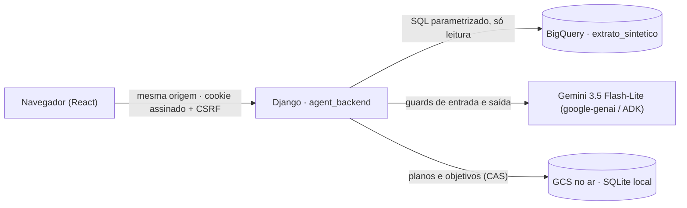

# i-agora — agente de educação financeira contextual (Itaú · Batalha de Agentes, Time 2)

O i-agora é um app mobile web em que a **i.ai** conversa com a pessoa cliente sobre o seu momento financeiro. Mostra
o fluxo do mês a partir de dados sintéticos do BigQuery, propõe compromissos para janeiro, confirma-os no servidor,
gera um card partilhável e acompanha o plano.

É um **protótipo de hackathon**: não é um canal oficial do Itaú, não movimenta dinheiro nem contrata produtos, e
usa só a base sintética `batalha-time-02-lxof.hackathon_dados.extrato_sintetico`.

Desde 2026-09-27 este repositório é a **estrutura única da entrega**: tem o front (`src/`), o backend
(`agent_backend/`), o deploy (`deploy/`) e toda a documentação (`docs/`). O front é o `47ee715` de
`mobile-front-agente` (o `1f66e6a` no ar + cronômetro da primeira consulta + erro de abertura), importado com a história
por merge de subárvore; o `mobile-front-agente` fica **arquivado por inteiro**, incluindo o branch
`feat/i-agora-gcp-integrado` do Henrique. Limitações do protótipo: [docs/LIMITACOES.md](docs/LIMITACOES.md) (resumo no
"i" fixo do app).

> **Integração local desde 2026-09-27 (repo `batalha-agente-frontend`, `c4a9ff3`):** o front fala com **um só backend**,
> o Django DRF de `../backend` (`batalha-agente-backend`, `84ead9b`) em `127.0.0.1:8000`. O `agent_backend/` daqui
> continua no repositório (imagem do Cloud Run e testes pytest), mas **não sobe junto** na integração local: seriam
> dois processos na `:8000`. Passo a passo e validação: [§5](#5-executar-localmente) e a skill
> [`skills/integracao-front-back/`](skills/integracao-front-back/SKILL.md).

---

## 1. Estado medido

Cada linha traz o valor, a fonte e a data. O que não foi medido está marcado `NAO_MEDIDO`.

| Parte | Estado | Evidência |
| --- | --- | --- |
| Chat integrado ao backend único (`definir/` + `X-Sessao-Id`) | funciona até o provedor | Pela `:3000`, 27/09 12:31 BRT: `definir` 201 / `sessao` 200 / `perfil` 200 / `abertura` 201 / `plano` 200; chat **503 por provedor** (generate `flash-lite` falhou em 515 ms, contingência `gemini-3.5-flash` timeout 15 s), sem rejeição determinística. 11:52 BRT: "O que eu faço com as sobras?" → 200 `needs_clarification` em 14,5 s |
| Identidade só por UUID | guardada | `definir/` recebe `{"usuario": "<id_usuario UUID>"}` (índice → 400 desde 10:32); guard `src/services/idUsuario.test.ts`: 12 pedidos, `usuario` só em `definir/` e só UUID, prova negativa com `'1'` reprova · 27/09 12:30 BRT |
| Testes do front (atual) | **40/40 passam**, `tsc` 0 erros | `npm test` e `npm run lint`, 27/09 12:30 BRT, `c4a9ff3` |
| Skill `integracao-front-back` | nota **100** (não existia antes) | avaliador Organizesee, `relatorios/skills/mapa-2026-09-27T1249.md`; gate 9/9 casos, 6/6 provas negativas · 27/09 12:49 BRT |
| Serviço no ar (Cloud Run `i-agora`) | funciona | `GET /` 200; `/api/health/` 200 em 0,57 s (`gemini-3.5-flash-lite`, `gcs-cas`, `synthetic`). Revisão `i-agora-00004-zhd`, 27/09 08:15–08:19 BRT ([histórico](docs/archive/2026-09-27/README-entrega-0916.md)) |
| Sessão, perfil BigQuery, abertura, plano, conversa Gemini (no ar) | funciona | Mesma verificação: perfil com selo `jobId`; conversa 200 em 4,8 s; Acompanhe sem meta dá 404, como desenhado |
| Integração local front ↔ Django ↔ BigQuery | funciona | `sessao` 200, `perfil` 200, `abertura` 201, pelo proxy do Vite `:3000` com CSRF. Medido neste repositório unificado, 27/09 09:25 BRT |
| Contrato de cada chamada do front, via localhost | **9 OK, 5 BLOQUEADO, 4/4 negativas falham como devem** (demo) | `scripts/validar_contrato_local.py` pelo proxy `:3000`; confirmar/progresso sem `commitmentCase`; conversa Gemini local `NAO_MEDIDO` (sem chave). [validação](docs/validacao-front-back.md), `agent_backend/evidence/contrato-local-2026-09-27T0947.json`, 27/09 09:47 BRT |
| Telas Início e Conversa (intro e carrossel), no navegador | validadas | Chrome, 27/09 09:05–09:20 BRT ([docs/interface](docs/interface/README.md)) |
| Carregamento do perfil (esqueleto, novas tentativas, refresh só em 401/403) | validado | Navegador, com 401 simulado, e `src/services/loading.test.ts`, 27/09 09:20 BRT |
| Testes do front (histórico) | 34/34 passavam | `npm test`, 27/09 10:54 BRT, branch `feat/front-consolidado-2026-09-27`; atual na primeira tabela |
| Typecheck e build do front | passam | `npm run lint` e `npm run build`, 27/09 10:54 BRT |
| Protótipo local ponta a ponta com `agent_backend` (Django `:8011` + Vite `:3011`), histórico | funcionava, chat em modo demo | perfil 200, clique no ia.i → `POST i-agora/sessao/abertura/` 201 com orientação do perfil, `conversas/mensagens/` 200 (resposta fixa com selo), erro forçado 503 legível. Prints no scratchpad da sessão, 27/09 10:54 BRT |
| Imagem Docker | `NAO_MEDIDO` | Docker não instalado nesta máquina, 27/09 10:54 BRT |
| Testes do backend | **106 passam, 2 falham** (WinError 32, só Windows) | `pytest agent_backend/tests`, Windows, Python 3.12, 27/09 10:54 BRT. As falhas estão na §6 |
| Confirmação de meta ponta a ponta no navegador | `NAO_MEDIDO` | Coberta só por teste (`test_integrated_planning.py`) |
| Telas Acompanhe, folhas, compromissos, card e fim, no navegador | `NAO_MEDIDO` | Sem evidência de render |
| Encaminhamento de extremos a humano ou segurança | **não existe no runtime** | [fluxo de atendimento](docs/regras-de-negocio/fluxo-de-atendimento.md) |
| Medição da revisão em produção depois desta consolidação | `NAO_MEDIDO` | Nenhum deploy foi feito nesta consolidação |

---

## 2. Arquitetura e frameworks



| Camada | Tecnologia (versões do lock ou do `package.json`) | Onde |
| --- | --- | --- |
| Front | React 19, Vite 8 (rolldown), Tailwind CSS 4, TypeScript 7, lucide-react; testes com `node:test` + `tsx` | `src/`, `index.html`, `vite.config.ts`, `public/` |
| Backend | Django 5.2.17, google-genai 2.25.0, google-adk 2.10.0, pydantic 2.13.5, google-auth 2.58.1; prompts em Liquid | `agent_backend/` (`requirements.lock`) |
| Dados | BigQuery (ADC), base sintética do evento, com selo de fonte, `measuredAt` e `jobId` | `agent_backend/planning/bigquery.py` |
| Estado | SQLite local; no ar, objetos em GCS com `ifGenerationMatch` (Firestore bloqueado pela política da organização) | `agent_backend/planning/store.py`, `gcs_store.py` |
| Servidor e deploy | gunicorn (1 worker, 4 threads) → Cloud Build → Artifact Registry `agentes/i-agora` → Cloud Run `i-agora` (`us-central1`), por **digest**; o front compilado vai em `front_dist/` | `deploy/` |

Cada mensagem passa por este pipeline: guard de entrada → contexto com evidência normativa (BCB RC 08/2023 e
20/2026, com integridade por sha256) → modelo → guard de saída → resposta com fontes e limitações. O detalhe está
em [docs/i-agora.md](docs/i-agora.md).

---

## 3. Estrutura do repositório

```
agente-app-mobile/
├── src/                      front (i.ai / i.agora): 47ee715 de mobile-front-agente + identidade por id_usuario + limitações
│   ├── components/home/      Início "Meu Itaú": saldo, atalhos, Acompanhe, botão ia.i
│   ├── components/chat/      conversa: intro, carrossel, convite, compromissos, card, fim
│   ├── components/follow-up/ Acompanhe (compromissos confirmados)
│   ├── components/sheets/    folhas (recomeçar, áreas sem conexão, plano confirmado)
│   ├── components/ui/        Button, Toast, ModalSheet, PrototypeLimits ("i" das limitações), ErrorBoundary…
│   ├── hooks/                usePlanConversation (estado, carregamento do perfil, chamadas)
│   ├── services/             backend.ts (cliente da API, CSRF), errorScreen.ts (telaDeErro), identity.ts, testes
│   └── archive/              protótipo das 3 telas, histórico do repositório do front
├── agent_backend/            Django: conversation/ (pipeline, guards, prompts, evidência), planning/ (BigQuery, planos),
│                             harness/ (settings locais), tests/ (pytest), evidence/ (execuções gravadas), smoke.py
├── deploy/                   Dockerfile, settings Cloud Run, middleware, urls (health e estáticos), guia de operação
├── docs/                     documentação (§8): front/, backend-32/ (cópia datada), regras-de-negocio/, ambientes/, LIMITACOES.md: front/, backend-32/ (cópia datada), regras-de-negocio/, ambientes/, LIMITACOES.md
├── i-agora-codigo/           protótipo de desenho (referência visual, só leitura)
├── archive/                  código fora de uso, com índice; front-legado/ = src/ anterior (de7ff9d + 5f4fd75); front-legado/ = src/ anterior (de7ff9d + 5f4fd75)
├── relatorios/               mapas de estrutura e de skills (datados)
├── skills/                   skills versionadas (fora de .claude/): integracao-front-back
└── scripts/                  secret_scan.py (segredos antes de commit), validar_chat_ponta_a_ponta.py (E2E pela :3000)
```

---

## 4. Telas e validação

| Tela | Pasta | O que faz | Validada por |
| --- | --- | --- | --- |
| Início "Meu Itaú" | `src/components/home/` | Saudação, atalhos, Visão da conta (fluxo, entradas e saídas do mês de referência), card Acompanhe depois de confirmar, botão ia.i | Navegador (27/09) |
| Carregamento do perfil | `src/components/home/BalanceCard.tsx`, `src/services/profileLoad.ts` | Cronômetro e esqueleto enquanto a primeira consulta carrega; teto curto; erro legível com "Tentar de novo" | Navegador (27/09 10:54 BRT) e `profileLoad.test.ts` |
| Limitações do protótipo | `src/components/ui/PrototypeLimits.tsx` | "i" fixo abre a folha "Protótipo — limitações" | Navegador (27/09 10:54 BRT) e `PrototypeLimits.test.ts` |
| Conversa i.ai / i.agora | `src/components/chat/` | Intro e carrossel → convite 50-30-20 → compromissos → card → fim; texto livre | Navegador (intro e carrossel); `StageActions.test.ts`; o resto `NAO_MEDIDO` |
| Acompanhe | `src/components/follow-up/` | Compromissos confirmados; progresso `NAO_MEDIDO` até haver novos movimentos | `NAO_MEDIDO` |
| Folhas e aviso | `src/components/sheets/`, `ui/Toast.tsx` | Recomeçar, áreas ainda sem conexão, plano confirmado | `NAO_MEDIDO` |

A chamada que cada tela faz e o estado que a leva à tela seguinte estão em
[docs/rota-integrada-batalha-agentes-front.md](docs/rota-integrada-batalha-agentes-front.md).

---

## 5. Executar localmente

**Um só backend** (27/09): o Django DRF de `../backend` na `:8000`, e o Vite na `:3000`.

```powershell
# 1) backend do time — pasta Nova pasta/backend (detalhes, ADC e Gemini: README de lá)
.venv\Scripts\python.exe manage.py runserver 127.0.0.1:8000
# 2) front — esta pasta
npm ci
npm run dev                  # http://127.0.0.1:3000 ; proxy /api/v1 -> DJANGO_URL (padrão http://127.0.0.1:8000)
# 3) validar ponta a ponta, na ordem do front (definir -> sessao -> perfil -> abertura -> mensagens -> plano)
python scripts/validar_chat_ponta_a_ponta.py --saida <scratchpad>/e2e.json
node skills/integracao-front-back/tools/gate.mjs --evidencia <scratchpad>/e2e.json
```

- Backend noutra porta: `$env:DJANGO_URL='http://127.0.0.1:<porta>'; npm run dev`. Porta ocupada por outra sessão não
  se derruba.
- **Não** rode `python -m agent_backend.manage runserver` junto: o `agent_backend/` não tem `perfil-usuario/definir/`,
  e o front cai em identidade por cookie. As instruções antigas (agent_backend na `:8000`/`:8011`) estão em
  `docs/archive/2026-09-27/README-antes-backend-unico-1231.md`.
- Usuário (desde 27/09 14:35): **uma pessoa sorteada da base a cada carga da página** e a cada "Testar próximo perfil".
  O front manda `definir/` `{"usuario":"aleatorio"}` (próximo perfil: `+ "excluir":"<uuid atual>"`); o backend `94287d0`
  sorteia entre os 1.000 de `backend/data/usuarios_verdade.csv` (todos com 12 meses) e devolve o `usuario.codigo`.
  Na expiração da sessão (404 no chat) a mesma pessoa é mantida. Backend sem `aleatorio` (400) → sorteio pelo front em
  `usuario-real/?limite=1&offset=<aleatório>`; sem lista → `00108ccd-…` (Maria) com `origem:'padrao'`.
  `VITE_IAGORA_USUARIO` fixa uma pessoa. Índice posicional ("1") dá 400.
- Armadilha no Git Bash: corpo com acento mandado por `curl` chega fora de UTF-8 e dá 400 — use o script Python.

Validar e compilar:

```powershell
npm run lint        # tsc --noEmit
npm test            # node --import tsx --test (todos os *.test.ts de src/)
npm run build       # dist/ -> vira front_dist/ na pasta de release (§7)
$env:PYTHONUTF8='1'; .venv\Scripts\python -m pytest agent_backend/tests -q
$env:PYTHONUTF8='1'; .venv\Scripts\python -m unittest tests.test_artefatos_padrao
```

**`agent_backend` isolado (imagem do Cloud Run; não é a integração local). Ligar o Gemini (chamadas pagas — só com
autorização do dono):**

```powershell
$env:IAGORA_MODE='live'            # ou demo_live
$env:IAGORA_ALLOW_PAID_CALLS='yes'
$env:IAGORA_MAX_CALLS='12'         # teto por processo (0–60)
$env:GEMINI_API_KEY='<chave do Secret Manager, nunca em ficheiro do repo>'
.venv\Scripts\python -m agent_backend.manage runserver 127.0.0.1:8000 --noreload
```

Sem isso o chat responde com o texto fixo do modo demo, marcado na tela como "Resposta fixa de demonstração — Gemini
desligado neste servidor".

- **Variáveis de ambiente:**
  - `DJANGO_URL` troca o alvo do proxy `/api/v1` (padrão `http://127.0.0.1:8000`).
  - `IAGORA_DEV_ORIGINS` define em que origens do front o Django confia para CSRF (padrão `:3000`). Uma porta fora
    da lista dá 403 no `POST`.
  - A lista completa está em [docs/ambientes/variaveis-de-ambiente.md](docs/ambientes/variaveis-de-ambiente.md).
- **Perfil do BigQuery:** exige ADC (`gcloud auth application-default login`). Sem ADC, o perfil devolve 503 e o
  front mostra o erro, sem inventar valores.
- **Gemini real:** `IAGORA_MODE=demo_live IAGORA_ALLOW_PAID_CALLS=yes IAGORA_MAX_CALLS=12`. O padrão é `demo`,
  com resposta fixa e identificada.

---

## 6. Testes e estratégia de cobertura

| Suite | Comando | Resultado (27/09) | Estratégia |
| --- | --- | --- | --- |
| Front | `npm test` | 40/40 (27/09 12:30 BRT, `c4a9ff3`) | Unitário e de contrato do cliente de API: CSRF, id estável, sem `customer_id`, falha da fonte sem valores inventados, perfil incompleto rejeitado, refresh só em auth; `idUsuario.test.ts` intercepta 12 pedidos e só aceita `usuario` em `definir/` como UUID (prova negativa com `'1'`) |
| Front, tipos e build | `npm run lint`, `npm run build` | `tsc` 0 erros (27/09 12:30 BRT) | TypeScript estrito sobre `src/` (exclui `src/archive`) |
| Integração ponta a ponta | `scripts/validar_chat_ponta_a_ponta.py` + `node skills/integracao-front-back/tools/gate.mjs` | ver §1 (12:31 BRT) | Mesma ordem do front pelo proxy `:3000`; 503 do chat classificado por `conversas/status/` (PROVEDOR × DETERMINISTICO); gate com 9 evals, 6 provas negativas |
| Backend | `.venv\Scripts\python -m pytest agent_backend/tests -q` | 94 passam, 3 falham | Unitário e de contrato com dublês explícitos (`FakeGateway`, nunca Gemini real): guards, privacidade, fairness, projeções, planos, idempotência e 409, isolamento por dono (401/404), CSRF e origens, regressões de deploy |
| Smoke | `python -m agent_backend.smoke` (`--live` é pago) | Evidências em `agent_backend/evidence/` | HTTP real local e Gemini real, gravados com data |
| Navegador | manual, com o Chrome | ver §4 | Sem e2e automatizado; a proposta de CI ([docs/ci/conversation.yml](docs/ci/conversation.yml)) está inativa |

**As 3 falhas do backend (medidas a 27/09 09:28 BRT):**
- 2 são exclusivas do Windows: `PermissionError [WinError 32]` ao apagar o SQLite temporário no teardown, com o
  ficheiro ainda aberto.
- 1 é deriva do teste `test_prompts.py::test_liquid_is_static_strict_and_has_core_partials`: espera o texto
  `PENDENTE` num prompt que já não o contém.

**Armadilha no Windows:** com `core.autocrlf=true`, os JSON de `agent_backend/conversation/knowledge/` podem ficar em
CRLF, o sha256 de integridade deixa de bater e 18 testes caem com 503. O `.gitattributes` evita isto em novos
checkouts. Numa cópia antiga, reescreva esses ficheiros a partir do índice do Git (`git cat-file blob :<ficheiro>`).

---

## 7. Deploy

O processo está em [deploy/README.md](deploy/README.md):
1. Correr `npm run build`.
2. Copiar `dist/` para `front_dist/` numa pasta de release, com `agent_backend/` e `deploy/`.
3. Cloud Build publica em `agentes/i-agora`; o Cloud Run usa o digest.

Os segredos vêm do Secret Manager (`i-agora-gemini`, `i-agora-signing`) e nenhuma credencial pessoal vai na imagem.
O caminho completo, com rollback, está em [docs/ambientes/ci-cd.md](docs/ambientes/ci-cd.md).

---

## 8. Onde está a documentação de funcionamento

| Tema | Documento |
| --- | --- |
| Índice de tudo | [docs/INDICE.md](docs/INDICE.md) |
| Regras de negócio: perfis, fluxo de atendimento, interações manipuláveis, memória, falas | [docs/regras-de-negocio/](docs/regras-de-negocio/README.md) |
| Contrato e pipeline do agente (guards, evidência, limites) | [docs/i-agora.md](docs/i-agora.md) |
| Rota integrada: chamada por tela, estado → tela, divergências | [docs/rota-integrada-batalha-agentes-front.md](docs/rota-integrada-batalha-agentes-front.md) |
| Validação front ↔ back por localhost: status, forma e latência por chamada, provas negativas, encaixe | [docs/validacao-front-back.md](docs/validacao-front-back.md) |
| Skill versionada: subir ambiente, sequência de chamadas, validar ponta a ponta, classificar 503 | [skills/integracao-front-back/SKILL.md](skills/integracao-front-back/SKILL.md) |
| Front: arquitetura, contrato de API do front, pontos de conexão, normas BCB | [docs/front/](docs/front/INDICE.md) |
| Interface: layout de referência, observação no navegador, ajustes | [docs/interface/README.md](docs/interface/README.md) |
| Ambientes, provedores, variáveis, Docker, CI/CD | [docs/ambientes/](docs/ambientes/README.md) |
| Deploy e operação no Cloud Run | [deploy/README.md](deploy/README.md) |
| Evidências de execução | [agent_backend/evidence/](agent_backend/evidence/) |
| Histórico (READMEs anteriores, front legado) | [docs/archive/INDICE.md](docs/archive/INDICE.md), [archive/INDICE.md](archive/INDICE.md) |

---

## 9. Backend do time (complemento)

**Desde 2026-09-27 12:31 BRT** o backend do time está em `../backend` = `JonathaCosta10/batalha-agente-backend`
(`84ead9b`) e é o **backend único da integração local** (`:8000`): rotas `i-agora/*` portadas para `apps/i_agora`;
guard de números aceita ponto decimal e fonte negativa (corrigido o falso positivo "fluxo negativo de R$ 1.729,62"
→ 503); `MODELO_CONTINGENCIA = gemini-3.5-flash`; suíte 588 OK (sessão backend-21). Contrato do lado do servidor:
`backend/docs/contrato-api-frontend.md` §5.1–5.5.

Antes disso, o repositório `desafio-itau-batalha-de-agentes-time2` (cópia local em `../backend-agente-conversacional`, fora
deste Git) era o **backend de referência do time**:
- Django com Django REST Framework, páginas próprias em `/app/` e APIs em `/api/v1/`.
- SQLite com 1.000 recomendações e 5 produtos.
- A rota `context-agent/primeira-chamada/`, com Gemini.
- Documentação própria dos fluxos de conversação, do controle da conversa e da rastreabilidade RC 8.

Este repositório reaproveita o desenho de conversa e os estudos desse backend, mas o runtime publicado é o
`agent_backend/` daqui. As divergências por conciliar (D1–D13 e DF1–DF7) estão na
[rota integrada](docs/rota-integrada-batalha-agentes-front.md).

---

## 10. Pendências

1. ~~**Abertura guiada por dados.**~~ Resolvido em 2026-09-27 10:50 BRT: `planning/opening.py` (portado do PR#4) produz
   `state.opening`, e ele cita o perfil da §12.
2. ~~**Primeiro nome.**~~ Resolvido: o id é sorteado e o nome é gerado para esse id (§12).
3. **Encaminhamento de extremos** a humano ou segurança: não existe no runtime.
4. **Validar no navegador** as telas Acompanhe, compromissos, card, fim e as folhas; hoje estão `NAO_MEDIDO`.
5. **Testes do backend:** as 3 falhas da §6 e a ativação do CI.
6. **Deploy desta consolidação**, seguido de nova medição da revisão no ar.
7. **Rota do chat (D-3 / I7).** O `chat()` usa `conversas/mensagens/`, já com `perfil-usuario/definir/` e `X-Sessao-Id`
   (`c4a9ff3`); a rota única decidida é `conversas/interacao/`. Pendente da decisão I7; ver [docs/LIMITACOES.md](docs/LIMITACOES.md).
   A abertura guiada por dados ficou resolvida no `dbb253e` e foi provada no navegador (27/09 10:54 BRT).
8. **503 do chat por provedor (12:31 BRT)** — decisão do dono: repetir o mesmo modelo após timeout (hoje proibido por
   `erros_api-v1.json` `"repetir_mesmo_pedido": false`) e a cota da chave Gemini. Lado do backend.

---

## 11. Histórico

- 2026-09-27 12:31 BRT: chat integrado ao backend do time (`c4a9ff3`, repo `batalha-agente-frontend`).
  - Backend único `../backend` na `:8000`; `definir/` com UUID → `sessao/` → `X-Sessao-Id`; resposta em `RichText.tsx`.
  - Skill versionada `skills/integracao-front-back/` e `scripts/validar_chat_ponta_a_ponta.py`; README anterior em
    `docs/archive/2026-09-27/README-antes-backend-unico-1231.md`.

- 2026-09-27 10:54 BRT: front consolidado (branch `feat/front-consolidado-2026-09-27`).
  - `src/` = `47ee715` de `mobile-front-agente`, por merge de subárvore (história preservada); o `src/` anterior foi para
    [archive/front-legado/](archive/front-legado/README.md).
  - Identidade só por `idUsuario` (UUID), nome só com selo `nome_gerado`, gênero nunca na tela; folha de limitações;
    selo da resposta demo.
  - Docs do backend -32 copiadas para [docs/backend-32/](docs/backend-32/INDICE.md), com data de cópia.

- 2026-09-27 09:30 BRT: consolidação numa estrutura única.
  - O front publicado (`mobile-front-agente@de7ff9d`, branch `feat/i-agora-gcp-integrado`) passou a ser o `src/`.
  - O front legado foi para [archive/](archive/INDICE.md).
  - A documentação do front foi para [docs/front/](docs/front/INDICE.md).
  - O README anterior está em [docs/archive/2026-09-27/README-entrega-0916.md](docs/archive/2026-09-27/README-entrega-0916.md).
- Os READMEs anteriores e o seu motivo estão em [docs/archive/INDICE.md](docs/archive/INDICE.md).

---

## 12. Como o perfil é considerado (modelagem)

Esta seção é o que a abertura do chat cita ao clicar no i-agora: "Na nossa base, seu perfil foi considerado …".

**Fonte.** `batalha-time-02-lxof.hackathon_dados.extrato_sintetico`, uma base **sintética** no BigQuery. O cliente é um
`id_usuario` real dessa base, sorteado por sessão (`planning/http.py`, `session_ref`). O nome exibido é **gerado** por
semente para esse id (`planning/nomes_por_id.json`, `nome_origem: nome_gerado`). O gênero não é usado: o tratamento
é sempre neutro.

**Janela.** É o último mês encerrado com dados do cliente (`reference_month`), somando todos os movimentos do mês
por direção: `tipo = E` são as entradas e `tipo = S` são as saídas (`planning/bigquery.py`, `load_ref`).

**Regra do perfil** (`planning/domain.py`, campo `situation`). É uma comparação observada, não um score de
personalidade:

| Perfil mostrado | Condição no mês de referência |
|---|---|
| saídas acima das entradas | saídas > entradas (`fluxo_negativo`) |
| entradas e saídas equilibradas | saídas = entradas (`fluxo_equilibrado`) |
| com sobra no mês | saídas < entradas (`sobra_observada`) |

**Pergunta que se segue.** A abertura aponta a maior entre duas categorias do mês, "lojas e sites" e "delivery e
refeições fora", e pergunta se o gasto foi pontual ou recorrente, antes de sugerir qualquer ajuste
(`planning/opening.py`).

**Limitações declaradas.**
- Olha um único mês.
- Não considera dívida, atraso nem renda recorrente: são campos `null`, NAO_MEDIDO.
- A base é sintética.
- O nome é gerado, não é o nome real da pessoa.
- A classificação T3 da especificação (Esbanjador, Livre…) vive no `backend-agente-conversacional` e **não** é a
  usada aqui.
