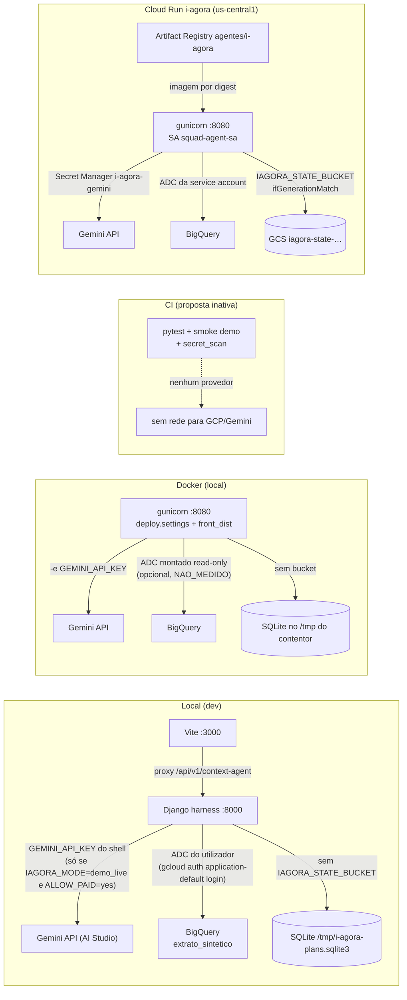

# Ambientes, provedores e variáveis de ambiente

Documentação de **como cada peça se liga a cada provedor** em cada ambiente e das **regras de variáveis de
ambiente**. Só entra aqui o que o código ou a configuração deste repositório mostram, com `ficheiro:linha`.
O que não foi verificado está marcado `NAO_MEDIDO`; o que não existe está marcado `NAO_EXISTE`.

> Levantado a 2026-09-27 sobre o commit `d02b9e1` (branch `docs/entrega-consolidada-2026-09-27`).

| Documento | Conteúdo |
|---|---|
| [variaveis-de-ambiente.md](variaveis-de-ambiente.md) | Todas as variáveis lidas pelo código: quem lê, padrão, obrigatória, segredo, origem por ambiente; regras (nunca versionar, nomes, precedência, rotação); secção **fora do publicado** (`-32` e front arquivado). |
| [provedores.md](provedores.md) | Gemini, BigQuery, armazenamento (SQLite local × GCS `gcs-cas`), Secret Manager, Artifact Registry/Cloud Build, Cloud Run — o que muda por ambiente e o que falha fechado. |
| [docker.md](docker.md) | Como a imagem é montada (`deploy/Dockerfile`, `front_dist`, exclusões), como correr localmente com credenciais montadas sem as pôr na imagem, portas. |
| [ci-cd.md](ci-cd.md) | CI existente (proposta inativa), `scripts/secret_scan.py`, caminho build → Artifact Registry → Cloud Run por digest → rollback; automático × manual. |

## Os quatro ambientes

| Ambiente | Settings Django | Servidor | Front |
|---|---|---|---|
| **Local (dev)** | `agent_backend.harness.settings` (`agent_backend/manage.py:6`) | `runserver 127.0.0.1:8000` | Vite `:3000` com proxy `/api/v1/context-agent` → `127.0.0.1:8000` (`vite.config.ts:16`) |
| **Docker (local)** | `deploy.settings` (`deploy/wsgi.py:2`) | gunicorn `:${PORT}` = 8080 (`deploy/Dockerfile:2,11`) | `front_dist/` servido pelo próprio Django (`deploy/urls.py:5,7-13`) |
| **CI** | `agent_backend.harness.settings` (`agent_backend/tests/conftest.py:4`) | nenhum (testes + smoke em modo `demo`) | `npm test`, `lint`, `build` — **proposta inativa** (`docs/ci/conversation.yml`) |
| **Cloud Run** | `deploy.settings` | gunicorn, 1 worker, 4 threads (`deploy/Dockerfile:11`) | `front_dist/` na imagem |

## Quem fala com quem

Fonte do lado Cloud Run: `deploy/README.md:5-12,36-38`. O mapeamento segredo → variável no serviço
(`i-agora-gemini` → `GEMINI_API_KEY`, `i-agora-signing` → `DJANGO_SECRET_KEY`) **não está versionado**: é inferido do
código que lê essas variáveis e está marcado `NAO_MEDIDO` em [provedores.md](provedores.md).
