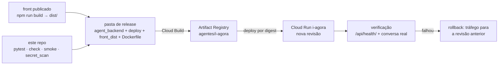

# CI/CD

## Estado hoje

| Etapa | Existe? | Onde | Automático? |
|---|---|---|---|
| Workflow de CI ativo | **NAO_EXISTE** | não há `.github/` no repositório | — |
| Proposta de CI | sim, **inativa** | `docs/ci/conversation.yml` | não corre (fora de `.github/workflows/`) |
| Varredura de segredos | sim | `scripts/secret_scan.py` | manual (e passo da proposta de CI) |
| Build do front (`front_dist`) | este repositório: `npm ci && npm run build` → `dist/` | `src/` (front `47ee715`, importado a 2026-09-27) | manual |
| Montagem da pasta de release | descrita, não versionada | `deploy/README.md:36` | manual |
| Cloud Build → Artifact Registry `agentes/i-agora` | sim (descrito) | `deploy/README.md:36`; `cloudbuild.yaml` **NAO_EXISTE** | manual (`NAO_MEDIDO` quanto ao comando) |
| Deploy Cloud Run por digest | sim (descrito) | `deploy/README.md:36,48` | manual |
| Verificação pós-deploy | descrita | `deploy/README.md:46-48`; `README.md` §15 | manual |
| Rollback | descrito | `deploy/README.md:48` | manual |
| IaC (Terraform etc.) | **NAO_EXISTE** | — | — |

## A proposta de CI (`docs/ci/conversation.yml`)

- Dispara em `pull_request` e em `push` para `feat/i-agora-conversation` (`:2-5`); permissões `contents: read` (`:6-7`).
- Passos (`:12-27`): `npm ci` → `npm test && npm run lint && npm run build` → Python 3.11 →
  `pip install -r agent_backend/requirements.lock` → `pytest agent_backend/tests -q` → `manage check` →
  `smoke --output /tmp/http-demo.json` (modo `demo`, sem chamada paga) → `python scripts/secret_scan.py` →
  `git diff --check`.
- **Não usa nenhum segredo nem provedor**: nada de Gemini, BigQuery ou GCS. Não constrói imagem nem faz deploy.
- Para ativar: mover para `.github/workflows/` com uma credencial que tenha permissão `workflow` (`README.md` §15).
  O ramo do `push` precisa de ser atualizado para o ramo em uso.

## `scripts/secret_scan.py`

- Varre ficheiros versionados **e** não versionados não ignorados (`git ls-files -co --exclude-standard`, `:8`).
- Padrões (`:9`): chave Google `AIza…`, tokens GitHub `gh[pousr]_…`, cabeçalhos de chave privada, `sk-…`; e caminhos
  pessoais `/home/<utilizador>/` (`:18-19`).
- Imprime só nomes de ficheiro, **nunca o valor** (`:17`); sai com código ≠ 0 se encontrar algo (`:21`).
- Limites: é conservador, "não é certificado de auditoria" (`:1`); não deteta `DJANGO_SECRET_KEY` nem JSON de
  service account sem cabeçalho de chave privada; ficheiros ignorados (`.secrets`, `.env`) não são lidos — por
  desenho.

## Caminho de publicação (manual)

1. **Verificar** (`deploy/README.md:46`): `python -m pytest agent_backend/tests -q`; `python scripts/secret_scan.py`;
   no front `npm run lint`, `npm run build` e o teste do serviço.
2. **Montar a release** e construir a imagem — ver [docker.md](docker.md).
3. **Cloud Build → Artifact Registry** `agentes/i-agora`.
4. **Deploy Cloud Run por digest** (`@sha256:…`), nunca por tag mutável; segredos via Secret Manager
   (`i-agora-gemini`, `i-agora-signing`); `IAGORA_STATE_BUCKET`, `IAGORA_HOSTS`, `IAGORA_RELEASE` como variáveis do
   serviço (valores e comando `NAO_MEDIDO`).
5. **Verificar em produção** (`deploy/README.md:48`): conversa real → confirmação → gravação → Acompanhe → refresh →
   nova revisão; sessão diferente, CSRF ausente/origem inválida, replay, base adulterada, erros de fonte.
   **Registar o digest e a revisão exatos.**
6. **Rollback** (`deploy/README.md:48`): direcionar tráfego para a revisão Cloud Run anterior. O estado (planos no GCS,
   orçamento diário) fica separado da imagem e sobrevive ao rollback; um rollback que atravesse mudança de
   `DJANGO_SECRET_KEY` invalida as sessões.

## Lacunas

- Sem CI ativa: nenhum PR é verificado automaticamente.
- Sem CD: build, push e deploy são comandos manuais não versionados; o digest em produção só é conhecido por
  `/api/health/` (`release`, se `IAGORA_RELEASE` foi definido) ou pela consola.
- Sem `.dockerignore` nem script de montagem da release: a exclusão de segredos e testes da imagem depende do operador.
- O `front_dist` é o `dist/` de `npm run build` deste repositório (desde 2026-09-27). Falta o script que monta a pasta de release.
