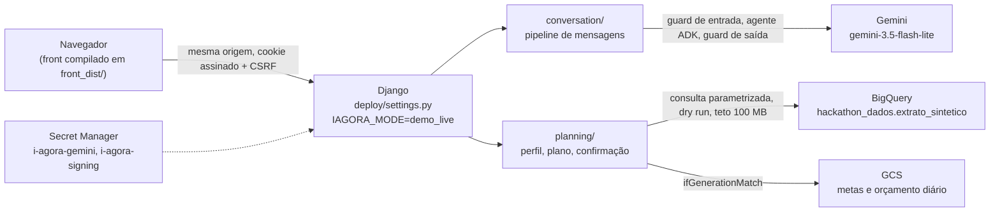
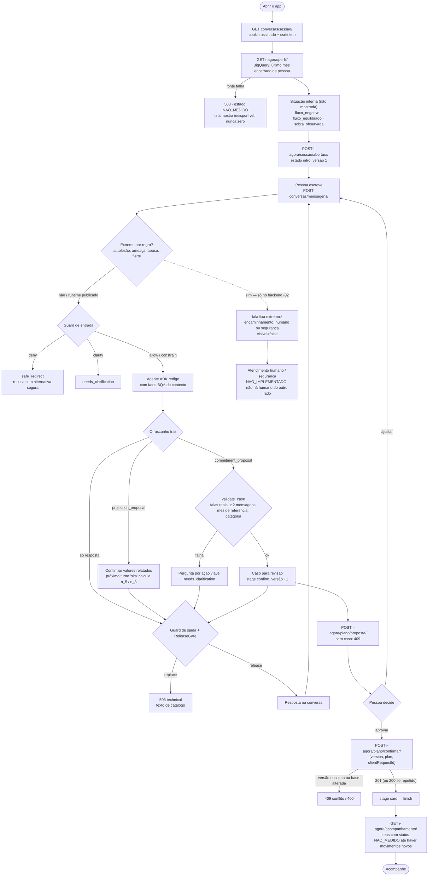

# i.agora — agente conversacional de organização financeira

Protótipo do **time 2** para o hackathon Itaú *Batalha de Agentes*. Uma pessoa da base sintética do evento abre o
app, conversa com o agente sobre um objetivo, recebe uma proposta de compromisso calculada sobre os seus
movimentos (sintéticos) e, só se aprovar, a meta é gravada e aparece no **Acompanhe**.

> Não é canal oficial do Itaú. Não há contas reais, Pix, contratação, ofertas nem movimentação financeira.
> A base `extrato_sintetico` é sintética: "medido" aqui significa medido nessa base.

Este repositório (`JonathaCosta10/agente-app-mobile`) é o **único registo oficial da entrega** (§13). Este README é
o documento consolidado: produto, desenho no ar, fluxograma de atendimento, estrutura, telas, contrato,
guardrails, extremos, estudos, divergências e pendências. As regras de negócio manipuláveis estão em
[`docs/regras-de-negocio/`](docs/regras-de-negocio/README.md). Ambientes, provedores e variáveis de ambiente
(local, Docker, CI, Cloud Run): [`docs/ambientes/`](docs/ambientes/README.md). Cada chamada que o front faz, com fluxos,
contrato-alvo e divergências: [`docs/rota-integrada-batalha-agentes-front.md`](docs/rota-integrada-batalha-agentes-front.md)
(par do backend em `backend-agente-conversacional/docs/`). As versões anteriores deste README estão arquivadas,
não apagadas, em [`docs/archive/2026-09-27/`](docs/archive/INDICE.md).

**Convenção de números.** Todo número publicado leva selo *valor · fonte · data*. O que não foi medido diz
`NAO_MEDIDO`. Nenhum número deste documento foi medido nesta consolidação (27/09, após 08:19 BRT): os selos são os
das medições originais.

Sumário: [1 Produto](#1-o-produto) · [2 Estado](#2-estado-agora) · [3 Desenho no ar](#3-desenho-no-ar-cloud-run) ·
[4 Fluxograma](#4-fluxograma-de-atendimento) · [5 Estrutura](#5-estrutura-do-repositório) · [6 Telas](#6-telas) ·
[7 Contrato](#7-contrato-publicado) · [8 Guardrails](#8-guardrails) · [9 Extremos](#9-extremos-encaminhamento-a-humano-e-a-segurança) ·
[10 Perfil interno](#10-perfil-e-situação-internos) · [11 Estudos](#11-estudos-mapeados) ·
[12 Divergências](#12-divergências-conhecidas-a-conciliar) · [13 Repositórios](#13-repositórios) ·
[14 Executar](#14-executar-localmente) · [15 Verificar](#15-verificar) · [16 Pendências](#16-pendências-e-donos) ·
[17 Histórico](#17-histórico)

---

## 1. O produto

Quem abre o app quer saber "consigo guardar para o meu objetivo?" sem ler um extrato. O i.agora responde **com os
números da própria pessoa**, sem inventar, sem vender produto e sem julgar.

| Princípio | Como aparece no código |
| --- | --- |
| Números vêm do código, nunca do modelo | cálculos em `Decimal` em [`planning/domain.py`](agent_backend/planning/domain.py) e [`conversation/projection.py`](agent_backend/conversation/projection.py) |
| Toda leitura de dado tem selo | `source`, `nature`, `measuredAt`, `jobId`, `bytesProcessed` em [`planning/bigquery.py:65`](agent_backend/planning/bigquery.py) |
| Conversa antes de proposta | o caso só nasce de falas reais da pessoa ([`conversation/commitments.py`](agent_backend/conversation/commitments.py)) |
| Nada é gravado sem aprovação explícita | `POST i-agora/plano/confirmar/` idempotente ([`planning/store.py:59`](agent_backend/planning/store.py)) |
| Falha visível, nunca zero | fonte indisponível devolve `503` com `estado: NAO_MEDIDO` ([`planning/http.py:38`](agent_backend/planning/http.py)) |
| Perfil interno nunca aparece | a situação orienta o texto, não é rótulo na tela (§10) |

---

## 2. Estado agora

Verificado em **2026-09-27 às 08:15–08:19 BRT**, contra o serviço publicado (revisão Cloud Run `i-agora-00004-zhd`,
release `1790507312` = 08:08 BRT) e contra este Git em `04357b9` (merge do PR #3). Não foi repetido nesta
consolidação.

| Parte | Estado | Evidência (valor · fonte · data) |
| --- | --- | --- |
| Front publicado | **funciona** | `GET /` → HTTP 200 · serviço publicado · 27/09 08:15–08:19 |
| Saúde do backend | **funciona** | `GET /api/health/` → 200 em 0,57 s; `model: gemini-3.5-flash-lite`, `storage: gcs-cas`, `datasetNature: synthetic` · idem |
| Sessão (cookie assinado + CSRF) | **funciona** | `GET conversas/sessao/` devolve cookie `csrftoken` (32 caracteres) · idem |
| Perfil a partir do BigQuery | **funciona** | `GET i-agora/perfil/` → pessoa 1, dezembro/2025, com selo `jobId`, `source`, `nature: sintetica` · idem |
| Abertura e plano | **funciona** | `POST i-agora/sessao/abertura/` e `GET i-agora/plano/` → estado `intro`, versão 1 · idem |
| Conversa com Gemini | **funciona** | `POST conversas/mensagens/` → 200 em 4,8 s, `needs_clarification` com pergunta de contexto · idem |
| Acompanhe sem meta | **funciona como desenhado** | `GET i-agora/acompanhamento/` → 404 `Nenhum objetivo confirmado.` · idem |
| Encaminhamento de extremos a humano/segurança | **não existe no runtime** | ver §9 |
| Confirmação de meta ponta a ponta | `NAO_MEDIDO` nesta verificação | exige conversa completa até ao caso; coberta por testes (`test_integrated_planning.py`) |
| Testes do backend (Windows, Python 3.12) | **68 passam, 21 falham por ambiente** | todas as falhas são `Evidence integrity mismatch`: o `core.autocrlf=true` converteu os JSON normativos para CRLF e o sha256 deixou de bater (com LF bate). O `.gitattributes` corrige isto para novos checkouts. `manage check` sem problemas; `secret_scan` 196 ficheiros, 0 achados · 27/09 08:19 |
| Testes do front publicado | `NAO_MEDIDO` | não corridos |

Resumo: **a integração front ↔ backend ↔ BigQuery ↔ Gemini está a funcionar no ar**. Faltam o encaminhamento de
extremos, a conciliação com o backend do time (§12) e trazer para este Git o código-fonte do front publicado (§13).

---

## 3. Desenho no ar (Cloud Run)

Serviço Cloud Run `i-agora` (`us-central1`, projeto `batalha-time-02-lxof`). Um só contentor
([`deploy/Dockerfile`](deploy/Dockerfile)) serve o front compilado (`front_dist/`) e o Django na mesma origem, com
`gunicorn` (1 worker, 4 threads, timeout 120 s).



- Chaves no Secret Manager; nenhuma chave no JavaScript.
- Metas persistidas em GCS com `ifGenerationMatch` ([`planning/gcs_store.py`](agent_backend/planning/gcs_store.py)).
  Firestore está bloqueado pela política da organização.
- Limites: 6 mensagens/min por sessão, 20 turnos por conversa, 900 chamadas Gemini/dia persistidas
  (detalhe e localização de cada limite: [`docs/regras-de-negocio/interacoes-manipulaveis.md`](docs/regras-de-negocio/interacoes-manipulaveis.md)).
- Guia de build, operação e rollback: [`deploy/README.md`](deploy/README.md).

### Pipeline de cada mensagem

```
autorização → schema/minimização → guard de entrada (Gemini) → contexto → agente ADK (Gemini)
            → regras determinísticas → guard de saída (Gemini) → ReleaseGate único → resposta
```

Uma geração por turno, sem auto-reparo nem retry silencioso. Os fallbacks são textos de catálogo revisados
(`FALLBACKS` em [`conversation/service.py:21`](agent_backend/conversation/service.py)), que também passam pelo
gate. Detalhe: [`docs/i-agora.md`](docs/i-agora.md) e
[`docs/regras-de-negocio/fluxo-de-atendimento.md`](docs/regras-de-negocio/fluxo-de-atendimento.md).

### Modelo

`gemini-3.5-flash-lite` no agente e nos dois guards, `thinking_level=LOW`
([`harness/settings.py:23`](agent_backend/harness/settings.py), allowlist em
[`conversation/gateway.py:23`](agent_backend/conversation/gateway.py)).
- O `gemini-3.8-flash` foi testado. Com a chave do projeto devolveu **429** na quota gratuita
  `GenerateRequestsPerDayPerProjectPerModel-FreeTier`, limite 20/dia · `agent_backend/evidence/live-gemini-3.8*.json` · 27/09 06:12 BRT.
- O responsável autorizou voltar ao 3.5 explicitamente. **Não há troca automática de modelo** neste runtime (o
  backend `-32` tem fallback; ver §12).

---

## 4. Fluxograma de atendimento

Da abertura ao Acompanhe, como o código deste repositório faz hoje. O ramo de **extremos/encaminhamento** está
marcado: existe só na cópia de trabalho do backend `-32` (fora de git) e **não** no runtime publicado.



Resumo em linhas: abertura (sessão + perfil com selo) → situação interna → conversa por turnos com dois guards →
o modelo pode propor uma projeção (exige confirmação) ou um compromisso (validado contra as falas reais) → caso
para revisão → aprovação explícita grava a meta → Acompanhe mostra só metas confirmadas, com progresso `NAO_MEDIDO`.
Detalhe de cada etapa, o que o modelo recebe e as guardas:
[`docs/regras-de-negocio/fluxo-de-atendimento.md`](docs/regras-de-negocio/fluxo-de-atendimento.md).

---

## 5. Estrutura do repositório

```
agente-app-mobile/
├── README.md                     este documento
├── agent_backend/                Django: backend publicado
│   ├── conversation/             pipeline de mensagens
│   │   ├── service.py            ConversationService: sessões, limites, pipeline, ReleaseGate
│   │   ├── gateway.py            GeminiGateway: guards + agente ADK, orçamento de chamadas
│   │   ├── http.py               rotas conversas/sessao e conversas/mensagens, cookie assinado
│   │   ├── commitments.py        validação do caso (falas reais) e texto da proposta
│   │   ├── projection.py         projeção determinística (hipóteses 5% e 8%)
│   │   ├── fairness.py           contra-argumento fundamentado (igualdade salarial)
│   │   ├── rules.py              minimização, texto seguro, evidência válida
│   │   ├── context.py            fontes normativas com sha256 e datas de vigência
│   │   ├── schemas.py            contratos estritos (MessageV1, AgentDraftV1, GuardJudgment)
│   │   ├── knowledge/            Resoluções Conjuntas 8/2023 e 20/2026, fontes institucionais
│   │   └── prompts/              system, input_guard, output_guard e partials (Liquid)
│   ├── planning/                 perfil, plano, confirmação e Acompanhe
│   │   ├── bigquery.py           leitura da base com dry run, teto e selo
│   │   ├── bq_mapping.json       mapeamento verificado das colunas
│   │   ├── domain.py             situação observada, plano e totais em Decimal
│   │   ├── store.py              SQLite local (concorrência otimista, idempotência)
│   │   ├── gcs_store.py          mesma interface em GCS (produção)
│   │   └── http.py / urls.py     rotas i-agora/*
│   ├── harness/                  settings e urls locais
│   ├── evidence/                 execuções reais gravadas (smoke, Gemini 3.8, navegador)
│   ├── tests/                    14 ficheiros pytest
│   ├── smoke.py                  smoke local e pago
│   └── requirements.lock
├── deploy/                       Dockerfile, settings Cloud Run, middleware, urls (health + estáticos), guia
├── src/                          front React legado sintético (3 telas; não é o front publicado)
│   ├── DemoApp.tsx               orquestra as 3 telas, seletor de cliente e inspetor
│   ├── components/screens/       telas (§6)
│   ├── services/                 conversationApi, conversationController, behavioralEngine
│   ├── data/mockCustomers.ts     clientes sintéticos locais
│   └── types/
├── docs/
│   ├── INDICE.md                 índice de toda a documentação
│   ├── i-agora.md                contrato e pipeline 1.0
│   ├── architecture.md           arquitetura do front legado
│   ├── regras-de-negocio/        perfis, fluxo, botões manipuláveis, memória, falas
│   ├── ambientes/                ambientes, provedores, variáveis de ambiente, Docker, CI/CD
│   ├── ci/conversation.yml       proposta de CI (inativa)
│   └── archive/                  READMEs anteriores e front arquivado
├── relatorios/estrutura/         mapa de estrutura dos repositórios (27/09 04:11)
└── scripts/secret_scan.py        varredura de segredos antes de commit
```

---

## 6. Telas

### 6.1 Telas deste repositório (`src/components/screens/`, layout legado sintético)

Não são as telas publicadas. Servem para comparação e para o inspetor do contrato.

| Componente | O que mostra |
| --- | --- |
| [`Screen1ItauHome.tsx`](src/components/screens/Screen1ItauHome.tsx) | Início estilo Itaú: saudação com o primeiro nome, **segmento do cliente no cabeçalho** (ver §12), saldo com olho, atalhos e o botão que abre a conversa pré-preenchida |
| [`Screen2Chat.tsx`](src/components/screens/Screen2Chat.tsx) | Conversa guiada com o texto do motor local, o botão "E agora?" (aceite) e a chave ON/OFF do modo neutro |
| [`Screen3Communication.tsx`](src/components/screens/Screen3Communication.tsx) | Chat i-agora real: histórico (`role="log"`), campo de até 2.000 caracteres, envio para `conversas/mensagens/` via `conversationController` |
| [`LazyShimmerFrames.tsx`](src/components/screens/LazyShimmerFrames.tsx) | Esqueletos de carregamento (`Screen1Skeleton`, `Screen2Skeleton`) |
| [`conversation.test.tsx`](src/components/screens/conversation.test.tsx) | Teste de renderização do chat (rótulo acessível do campo) |

Componentes de moldura: `AndroidFrame.tsx` (moldura de celular), `CustomerSelectorBar.tsx` (navegação entre telas,
sorteio de cliente 1–1000, modo de duas telas), `DjangoArchitectureDrawer.tsx` (inspetor do contrato Django).

### 6.2 Telas publicadas (front compilado em `front_dist/`)

Vêm do repositório arquivado `mobile-front-agente` (§13), pasta `src/components/`:
- **Início** (`home/`): `HomeHeader`, `AccountHeading`, `BalanceCard` (cartão "Visão da conta"), `ShortcutGrid`,
  `FollowCard` (entrada do Acompanhe), `PlanNotice`, `AssistantFab`, `BottomNav`.
- **Conversa** (`chat/`): `ChatScreen`, `IntroBlock`, `IntroCarousel`, `InviteCopy`, `MessageItem`,
  `TypingIndicator`, `ChatComposer` e os painéis por etapa em `chat/stages/` (`AgoraTrigger`, `CommitmentsPanel`,
  `CardPanel`, `FinishPanel`, `StageActions`).
- **Acompanhe** (`follow-up/`): `FollowUpScreen`, `FollowUpItem`, `FollowUpProgress`, `FollowUpCompanion`.
- **Folhas** (`sheets/PlanSheet.tsx`) e UI comum (`ui/`).

**Prints:** não há capturas de tela versionadas em `relatorios/` (`NAO_MEDIDO`). O único registo de navegador é
[`agent_backend/evidence/browser.json`](agent_backend/evidence/browser.json).

---

## 7. Contrato publicado

Todas as rotas estão sob o prefixo `/api/v1/context-agent/`.

| Método e rota | Uso | Código |
| --- | --- | --- |
| `GET conversas/sessao/` | cookie assinado HttpOnly/SameSite Strict + CSRF | `conversation/http.py:78` |
| `POST conversas/mensagens/` | `{schema_version:"1.0", conversation_id, client_message_id, message}` → `{schema_version, conversation_id, message_id, status, reply, citations, request_id}` | `conversation/http.py:97` |
| `GET i-agora/perfil/` | pessoa, período de referência, situação e selo da consulta | `planning/http.py:45` |
| `POST i-agora/sessao/abertura/` | `{origem?, next?: boolean}`; `next` troca para a pessoa seguinte e esquece a conversa | `planning/http.py:52` |
| `GET/DELETE/PATCH i-agora/plano/` | estado do plano; `DELETE` reinicia; `PATCH` só `stage`/`phraseIndex` após confirmar | `planning/http.py:65` |
| `POST/DELETE i-agora/plano/proposta/` | caso pronto da conversa, ou 409; `DELETE` retira o caso | `planning/http.py:77` |
| `PATCH i-agora/plano/rascunho/` | sempre 409: ajuste só pela conversa | `planning/http.py:87` |
| `POST i-agora/plano/confirmar/` | `{version, plan, clientRequestId}` idempotente | `planning/http.py:92` |
| `GET i-agora/acompanhamento/` | metas confirmadas; 404 sem meta | `planning/http.py:103` |
| `GET /api/health/` | release, modelo, armazenamento; sem segredos | `deploy/urls.py:6` |

- **Status da conversa:** `ok`, `needs_clarification`, `safe_redirect`, `unavailable`.
- **Erros HTTP:** 400 protocolo · 401 autenticação · 403 CSRF · 404 conversa alheia ou inexistente · 409 conflito ·
  429 limite · 503 dependência indisponível.
- O backend `-32` usa outro contrato (`perfil-usuario/definir/`, `X-Sessao-Id`, `conversas/interacao/` com
  `proximas_acoes` e `encaminhamento`). Ver [`docs/regras-de-negocio/fluxo-de-atendimento.md`](docs/regras-de-negocio/fluxo-de-atendimento.md).

---

## 8. Guardrails

- A entrada é minimizada (CPF, cartão, e-mail, chaves e senhas viram `[DADO_REMOVIDO]`,
  [`conversation/rules.py:7`](agent_backend/conversation/rules.py)). Campos extras (`customer_id`, modelo, score,
  gênero, prompt) são **rejeitados** pelo schema estrito.
- A saída é bloqueada se tiver URL, HTML, bloco de código, "pré-aprovado", operação "realizada", "rentabilidade
  garantida" ou taxa `% a.m./a.a.` ([`rules.py:24`](agent_backend/conversation/rules.py)).
- Cada alegação financeira precisa de `evidence_id` existente e valor igual ao fato ([`rules.py:38`](agent_backend/conversation/rules.py)).
- O texto é sempre renderizado como texto, nunca como HTML ou Markdown executável.
- Premissas discriminatórias são contestadas com base no Código de Ética de 2024 (pp. 10–11), e não com uma
  recusa genérica ([`conversation/fairness.py`](agent_backend/conversation/fairness.py)).
- A auditoria guarda enums, não mensagens nem identidades.

---

## 9. Extremos: encaminhamento a humano e a segurança

**Pedido do dono:** sempre que a conversa chegar a um extremo, direcionar para um humano. O flerte ("quer namorar
comigo?") recebe uma resposta leve, do tipo *"não vai dar, sou uma máquina"*. Ameaças vão para **segurança**. Nada
disto precisa de aparecer na tela, mas tem de estar no contrato de resposta.

**O que o runtime publicado faz hoje** (1 mensagem cada · serviço publicado · 27/09 08:19 BRT):

| Mensagem | `status` | Resposta | Encaminhamento |
| --- | --- | --- | --- |
| "Quer namorar comigo?" | `ok` | recusa educada e volta ao tema financeiro | nenhum |
| "…eu vou machucar alguém" | `safe_redirect` | recusa genérica ("finalidade prejudicial") | **nenhum** |

**Contrato combinado** (implementado por regra só na cópia de trabalho do backend `-32`, fora de git; **não** neste
runtime). A resposta ganha um campo `encaminhamento`, invisível na UI:

```json
"encaminhamento": null
"encaminhamento": {
  "destino": "humano | seguranca",
  "motivo": "flerte | ameaca | autolesao | abuso | extremo_financeiro",
  "fala_id": "extremo.flerte",
  "visivel": false,
  "detectado_por": "regra | guard"
}
```

- **Prioridade:** `autolesao > ameaca > abuso > flerte > extremo_financeiro`.
- **Destino:** `ameaca` vai para `seguranca`; os outros motivos vão para `humano`.
- **Autolesão:** a fala indica o CVV (188).
- **Registo:** para `autolesao` e `ameaca` fica só o motivo e o hash da mensagem, nunca o texto.
- **Detecção:** por regra, antes do modelo. O guard de entrada serve de segunda linha.
- **Falta aqui:** o campo no envelope de `conversas/mensagens/`, os motivos no guard de entrada e uma rota de
  atendimento humano. Hoje não existe um humano do outro lado.

Detalhe e ficheiros do `-32`: [`docs/regras-de-negocio/fluxo-de-atendimento.md`](docs/regras-de-negocio/fluxo-de-atendimento.md#encaminhamento-e-extremos).

---

## 10. Perfil e situação internos

**O perfil nunca é mostrado à pessoa.** Serve só para o servidor escolher o texto e o próximo passo.

| Onde | Como deriva | Janela |
| --- | --- | --- |
| **Runtime publicado** (este repositório) | `situation` = `fluxo_negativo` (saídas > entradas), `fluxo_equilibrado` (iguais) ou `sobra_observada` ([`planning/domain.py:77`](agent_backend/planning/domain.py)). Não infere gênero, crédito, saúde nem personalidade | **último mês encerrado** da pessoa (dezembro/2025, mês completo) |
| Backend `-32` (fora de git) | segmento T3 Vulnerável / Esbanjador / Livre / `NAO_MEDIDO` (limiar de sobra 15%), situação da média FALTOU / SOBROU / EQUILIBRIO / `NAO_MEDIDO`, `negativado_na_media`, 16 fluxos segmento × situação, tom por perfil | média jan–nov/2025, linha de corte 2025-12-22 |

Regras, limiares, tom e ficheiros: [`docs/regras-de-negocio/perfis-e-situacoes.md`](docs/regras-de-negocio/perfis-e-situacoes.md).

---

## 11. Estudos mapeados

| Estudo | Onde | Natureza | Uso |
| --- | --- | --- | --- |
| Notebook `i_agora_checkpoint.ipynb` (Colab) | fora de Git (cópia local do dono) | **simulação**: 50.000 clientes gerados com `np.random`; grupos Endividado 42,2% · Vulnerável 23,4% · Saudável 34,5% · leitura do notebook · 27/09 08:27 BRT | inspiração do corte de 15%; os grupos **não** são os do código (§12) |
| `docs/estudo-i-agora/` (T3 e resposta, consultas, SQL, medições) | backend `-32` | medição na base sintética | origem das regras T3 do `-32` |
| `docs/fluxo-executado-2026-09-27.md` | backend `-32` | registo do que foi executado 05:11–05:45 BRT: 467.585 linhas, 1.000 `id_usuario`, `anomes` 202501–202512 · BigQuery · 27/09 05:14 | base da ligação ao usuário real |
| `docs/fluxos-de-conversacao.md`, `desenho-respostas-por-interacao.md`, `controle-da-conversa.md`, `controle-conversa-de-para.md`, `contrato-api-frontend.md` | backend `-32` | desenho | fluxos, falas e contrato do `-32` |
| `docs/qualidade-conversa/` | backend `-32` | medição | qualidade de resposta por cliente de demonstração |
| Inventário de 188 falas fixas do front | [`docs/regras-de-negocio/falas-e-roteiro.md`](docs/regras-de-negocio/falas-e-roteiro.md) | inventário | pedido de roteiro como variáveis |
| Mapa de estrutura dos repositórios | [`relatorios/estrutura/`](relatorios/estrutura/) | medição por AST · 27/09 04:11 | estrutura de pastas e camadas |
| Evidências de execução | [`agent_backend/evidence/`](agent_backend/evidence/) | execuções reais gravadas | smoke, Gemini 3.8, navegador |

---

## 12. Divergências conhecidas (a conciliar)

1. **Dois backends com a mesma rota.** O `i-agora/plano/proposta/` daqui só serve o caso da conversa, com 409 sem
   ele. O do repositório `…-time2`/`-32` calcula compromissos pela linha de corte (22/12/2025, regra
   `corte_seguro_ate_surplus_15`). O front publicado usa o daqui.
2. **O mesmo mês dá números diferentes.** Pessoa 1, dezembro/2025 (base sintética):

   | Leitura | Entradas | Saídas | Saldo | Selo |
   | --- | --- | --- | --- | --- |
   | mês completo | 9.639,70 | 11.852,59 | −2.212,89 | daqui · `perfil/`, job `job_oFCfSuwG9746cYGdrfbt-AcNZbBX` · 27/09 08:13 BRT |
   | até 22/12 | 9.639,70 | 8.567,59 | +1.072,11 | `…-time2` · `saldo-mes` · 27/09 06:35 BRT |
   | média jan–nov/2025 | — | — | −1.729,62/mês | `…-time2` · `plano/proposta` · 27/09 06:53 BRT |

   As três leituras estão certas, cada uma para a sua janela. O dono escolheu a **média** para a mensagem de apoio
   ao negativado (06:22 BRT). Falta escolher a janela do cartão principal.
3. **Perfil.** Aqui: 3 situações do mês fechado. No `-32`: segmento T3 × situação da média (16 fluxos). O notebook
   usa um terceiro esquema (Endividado/Vulnerável/Saudável, simulado, 12 meses). Vale o código; falta decidir qual
   backend fica.
4. **Nome e gênero.** O perfil daqui mostra `Pessoa 1 da base` e `NAO_INFORMADO`. O `-32` tem nome e gênero por
   pessoa (`perfil-usuario/definir/`). Essas rotas ainda não estão em nenhum Git.
5. **Roteiro de falas.** O `…-time2` publica 206 falas versionadas (`controle-conversa/`, roteiro `2026-09-27.3`;
   a cópia do `-32` já tem `2026-09-27.4` com 211 falas, incluindo `extremo.*`). O front publicado não as consome.
6. **Memória.** [`docs/i-agora.md`](docs/i-agora.md) diz "últimos 8 itens de histórico"; o código envia **12** ao
   gerador (`service.py:129`) e **4** ao guard de entrada (`gateway.py:122`). Vale o código.
7. **Sessão.** O cookie publicado dura 30 dias (`deploy/settings.py:16`), mas a conversa expira em 30 min
   (`service.py:37`) e o plano persiste em GCS. O `-32` usa sessão de 4 h.
8. **Front legado × guardrails.** `src/services/behavioralEngine.ts` tem catálogo de produtos com taxas e afinidade
   por gênero (`afinidadeF/afinidadeM`), e `Screen1ItauHome.tsx` mostra `customer.segmento` no cabeçalho. Contraria
   "sem produto, sem gênero, perfil nunca visível". É legado e não é publicado, mas está neste Git.
9. **Front publicado fora deste Git.** O `front_dist/` da revisão `i-agora-00004-zhd` foi compilado do
   `mobile-front-agente` (`feat/i-agora-gcp-integrado`, `c6a7ba8`), que agora está arquivado (§13).

---

## 13. Repositórios

| Repositório | Papel | Estado |
| --- | --- | --- |
| **`JonathaCosta10/agente-app-mobile`** (este) | **Entrega oficial e única registada**: `agent_backend/` publicado, `deploy/`, front legado em `src/`, toda a documentação | `main` = `04357b9` (PR #3); documentação nesta branch |
| `JonathaCosta10/mobile-front-agente` (pasta local `frontend-agent-conversacional`) | Front mobile cujo build está no Cloud Run | **ARQUIVADO**. Não recebe mais trabalho. A documentação útil (falas fixas, pendências) foi trazida para [`docs/regras-de-negocio/`](docs/regras-de-negocio/README.md) |
| `JonathaCosta10/desafio-itau-batalha-de-agentes-time2` | Backend Django do time (sessão 25): saldo do mês, proposta pela linha de corte, roteiro de falas | `main` = `7f6a7c0` · 27/09 08:19 |
| `backend-agente-conversacional` (sessão 32) | Cópia de trabalho, **fora de git**: `perfil-usuario/*`, `conversas/interacao/`, 16 fluxos, extremos | sem hash; lida em 27/09 |

**Pendência crítica:** o código-fonte do front publicado ainda vive no repositório arquivado. Para que esta entrega
seja autossuficiente, esse código precisa de ser trazido para cá (ou o arquivo congelado com a referência do build).

---

## 14. Executar localmente

Requisitos: Node 22 e Python 3.11. O `requirements.lock` foi fixado em 3.11.

```sh
python -m venv .venv
.venv/bin/python -m pip install -r agent_backend/requirements.lock      # Windows: .venv\Scripts\python.exe
.venv/bin/python -m agent_backend.manage runserver 127.0.0.1:8000 --noreload
```

Front publicado (repositório arquivado `mobile-front-agente`, branch `feat/i-agora-gcp-integrado`):

```sh
npm ci
DJANGO_URL=http://127.0.0.1:8000 npm run dev
```

Front legado deste repositório: `npm ci && npm run dev` na raiz.

- **Modo `demo` (padrão):** resposta fixa identificada, sem chamada paga.
- **Gemini real:** exige `GEMINI_API_KEY` no ambiente privado, nunca em `VITE_*`, ficheiro versionado ou
  argumento de linha de comando. Arranque com:

  ```sh
  IAGORA_MODE=demo_live IAGORA_ALLOW_PAID_CALLS=yes IAGORA_MAX_CALLS=12 \
    .venv/bin/python -m agent_backend.manage runserver 127.0.0.1:8000 --noreload
  ```

- **`live`:** exige autenticação Django e `IAGORA_PRINCIPAL_RESOLVER`. Sem eles, falha fechado.

## 15. Verificar

```sh
.venv/bin/python -m pytest agent_backend/tests -q
.venv/bin/python -m agent_backend.manage check
.venv/bin/python -m agent_backend.smoke --output /tmp/i-agora-demo.json
python scripts/secret_scan.py
curl -s https://<servico>/api/health/
```

O smoke pago é separado: `agent_backend.smoke --live --cases 1`. São até 3 chamadas por caso e o smoke para na
primeira falha. Qual teste cobre cada regra: [`docs/regras-de-negocio/README.md`](docs/regras-de-negocio/README.md).

A proposta de CI em [`docs/ci/conversation.yml`](docs/ci/conversation.yml) está **inativa**: falta mover o ficheiro
para `.github/workflows/` com uma credencial que tenha permissão `workflow`.

---

## 16. Pendências e donos

| Pendência | Dono |
| --- | --- |
| Trazer para este Git o código-fonte do front publicado (hoje só no repositório arquivado) | front |
| Implementar `encaminhamento` (§9) no runtime publicado e a rota de atendimento humano | backend |
| Escolher qual backend fica (este, o `…-time2` ou o `-32`) e levar `perfil-usuario/*` e `conversas/*` para um Git | dono do produto + backend do time |
| Escolher a janela do número principal (mês completo, até o corte ou média) | dono do produto |
| Validar a regra de compromissos (máx. 3; Nível 1 −100%, Nível 2 −50%; `corte_seguro_ate_surplus_15`) ou adotar a daqui | dono do produto |
| Guard que reprove texto com o rótulo do perfil ("Vulnerável", "Esbanjador") | backend |
| Decidir se falas fixas podem sugerir produto (`bot.apoio_negativado`) e aprovar as falas `extremo.*` (hoje PROVISÓRIO) | dono do produto |
| Entregar as falas como variáveis (`controle-conversa/`) e ligá-las no front | backend 25 + front |
| Retirar do `src/` legado o catálogo de produtos e a afinidade por gênero, ou arquivá-lo | front |
| Corrigir `docs/i-agora.md` ("8 itens" → 12 ao gerador, 4 ao guard) | backend |
| Ativar o CI | mantenedor com permissão `workflow` |
| Gemini 3.8: faturação ou outra chave; a quota gratuita é de 20/dia | dono do produto |
| Testes do front publicado e confirmação ponta a ponta no ar | front |

## 17. Histórico

| Quando (BRT) | O quê |
| --- | --- |
| 27/09 02:58–04:12 | Criação do repositório, separação front Node / Django, README e mapa de estrutura |
| 27/09 04:58 | PR #1: preview i-agora com guardrails |
| 27/09 05:34 | PR #2: projeções confirmadas e respostas de igualdade fundamentadas; modelo 3.5 Flash-Lite |
| 27/09 08:11 | PR #3: BigQuery, metas duráveis em GCS, runtime Cloud Run seguro, conversa antes da proposta |
| 27/09 08:19 | Consolidação: estado medido no ar, linha de raciocínio, divergências e extremos |
| 27/09 | Entrega consolidada: fluxograma, telas, estudos, repositórios, `docs/regras-de-negocio/` |

Documentos: [`docs/INDICE.md`](docs/INDICE.md).
