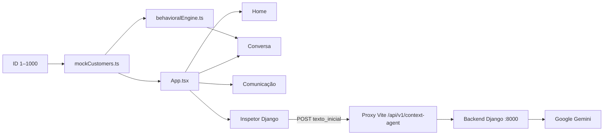

# Arquitetura do front `agente-app-mobile`

Este documento descreve o comportamento implementado no repositório Node/React. O
backend Django é outro Git, montado localmente em `desafio-itau-batalha-de-agentes-time2/`.

## Fluxos em execução



### Estado e dados

- [`src/App.tsx`](../src/App.tsx) guarda `activeScreen`, ID do cliente, chave
  ON/OFF, modo de duas dinâmicas e abertura do inspetor em `useState`. Não há
  biblioteca de rotas nem persistência de estado no navegador.
- [`src/data/mockCustomers.ts`](../src/data/mockCustomers.ts) gera os 1.000
  perfis por ID. IDs pares são F, ímpares são M; nome, score, saldo e limite
  são valores determinísticos de demonstração. Essa função não busca o Django.
- [`src/services/behavioralEngine.ts`](../src/services/behavioralEngine.ts)
  define o texto da Variável 1, contexto e matriz de produtos locais. A chave
  ON/OFF muda a tag e o título da variante; as três variantes usam o mesmo
  `textoCompleto` na implementação atual.
- [`src/components/screens/Screen3Communication.tsx`](../src/components/screens/Screen3Communication.tsx)
  mantém mensagens apenas no estado React e escolhe respostas por palavras da
  entrada e pelo score, após um `setTimeout` de 650 ms. Não faz `fetch`.
- [`src/components/DjangoArchitectureDrawer.tsx`](../src/components/DjangoArchitectureDrawer.tsx)
  exibe trechos de código ilustrativos e uma descrição local do fluxo. Seu
  botão **Chamar Gemini** é o único ponto do front que executa `fetch`.

`calculateAgentContext` e `generateTemplate3Response` existem no serviço do
front, mas nenhuma tela as chama hoje. O backend mantém cálculos e templates
próprios; não há sincronização automática entre as duas implementações.

## Contrato da primeira chamada

O inspetor faz `POST /api/v1/context-agent/primeira-chamada/` com JSON:

```json
{"texto_inicial":"Olá!"}
```

O sucesso contém `sucesso: true`, `modelo` e `resposta`. O erro contém `erro`,
com HTTP 400 para entrada inválida ou 503 para falha da chave/provedor. O front
exibe o erro em vez de produzir uma resposta substituta. O limite da entrada é
de 2.000 caracteres. O contrato JSON Schema vive no Git do backend em
`docs/inteirações-cloud/27-09-2026/`.

O retorno inclui `tempo_resposta_ms`, medido dentro da view Django. O inspetor
mostra também o tempo total observado pelo navegador; ambos ficam
`NAO_MEDIDO` quando a respectiva medição não está disponível. Esses tempos
não avaliam a qualidade factual do texto do modelo.

[`vite.config.ts`](../vite.config.ts) encaminha essa rota a
`http://127.0.0.1:8000` apenas no servidor de desenvolvimento. Uma publicação
estática do `dist/` precisa de roteamento equivalente no servidor ou gateway.
A chave Google é lida pelo Django e não deve ser incluída no bundle do front.

## Estrutura e comandos

| Caminho | Responsabilidade |
| --- | --- |
| `index.html`, `src/main.tsx` | Montagem do React. |
| `src/App.tsx`, `src/components/screens/` | Navegação e telas da demonstração. |
| `src/components/AndroidFrame.tsx` | Moldura visual de telefone. |
| `src/components/CustomerSelectorBar.tsx` | Escolha de ID, modos de tela e inspetor. |
| `src/components/DjangoArchitectureDrawer.tsx` | Integração HTTP da primeira chamada. |
| `src/data/`, `src/services/` | Dados e regras locais de demonstração. |
| `vite.config.ts` | Plugins React/Tailwind e proxy de desenvolvimento. |

`npm run lint` executa TypeScript sem emitir arquivos. `npm run build` gera
`dist/`; esses dois comandos não verificam a conexão com o Gemini. Para testar
a chamada real, suba o backend na porta 8000 com uma chave válida do projeto
Google desejado e use o botão no inspetor.

## Limites observáveis

- Home, Conversa e Comunicação permanecem funcionais sem backend; isso não
  comprova que a API esteja disponível.
- O front não consome as rotas Django de clientes, score ou Template 3.
- O painel de código do inspetor é uma prévia estática; confirme contratos e
  comportamento no Git do backend.
- Não há autenticação nem controle de consumo no front para a primeira chamada.
  Antes de exposição pública, o backend precisa de proteção adequada à cota.
