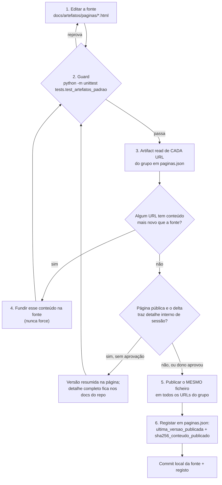

# Artefatos publicados (páginas claude.ai)

A página consolidada do i.agora ("Batalha de Agentes", time 2) é publicada como artefato claude.ai em mais de um
URL. Todos os URLs mostram a mesma fonte e seguem o mesmo padrão visual. **O template é a fonte da verdade do
padrão**, e um guard de testes impede que uma página nova ou editada saia dele.

| Ficheiro | Papel |
| --- | --- |
| [`template/pagina-base.html`](template/pagina-base.html) | Template: esqueleto (padrão do título, tokens `:root` claro/escuro, cabeçalho e nav, secções pela ordem e com os seus ids) e **um exemplo canónico de cada componente**. Não tem imagens base64 nem dados de conteúdo. |
| [`template/componentes.json`](template/componentes.json) | Regras que o guard lê: prefixo do título, ids obrigatórios por ordem, classes permitidas por componente, prefixos controlados (`c-`, `s-`), estado → classe, tokens CSS obrigatórios, strings proibidas e limites. |
| [`paginas.json`](paginas.json) | Registo das páginas: id, URL, fonte no repositório, versão do template, última versão publicada, sha256 do conteúdo publicado, grupos que têm de ser iguais e dívida conhecida. |
| [`paginas/batalha-agentes-unificado.html`](paginas/batalha-agentes-unificado.html) | Fonte da página publicada (≈ 642 KB, com 15 miniaturas JPEG em base64). Guardada como está publicada em A v11. |
| [`../../tests/test_artefatos_padrao.py`](../../tests/test_artefatos_padrao.py) | Guard (stdlib `unittest` + `html.parser`). |
| [`../../tests/fixtures/artefatos/pagina-ruim.html`](../../tests/fixtures/artefatos/pagina-ruim.html) | Página ruim sintética: a prova negativa. |

## Páginas registadas (lidas a 27/09/2026 09:48 BRT)

| Id | URL | Última versão | Estado |
| --- | --- | --- | --- |
| A | <https://claude.ai/artifact/98dNfUXcSrCzcudqDwpTcX> (público, qualquer pessoa com o link) | `1790513132-5921` (v11) | Conteúdo = fonte do repositório (sha256 `6b9d8931…`). |
| B | <https://claude.ai/artifact/Su18p6bHUYKcGKgfSvd4Qz> | `1790512819-9e81` | **DIVERGENTE de A.** O conteúdo publicado (sha256 `50fef64f…`) não tem a secção completa `perfil-sessao`, o carimbo da versão 9, o item da conclusão sobre a Pessoa 1 nem o CSS v9. Falta republicar a fonte em B. Declarado em `paginas.json` como dívida `conteudo_publicado_difere`. |

Medição: `Artifact read` com `path: index.html` de cada URL, retirando o invólucro que a plataforma acrescenta
(prefixo `<!doctype…>` de 537 bytes e o runtime do mermaid, iguais nos dois) e comparando com a fonte.

## Criar uma página nova a partir do template

1. Copie `template/pagina-base.html` para `paginas/<nome>.html`.
2. Troque o título mantendo o prefixo: `Hackathon Itaú i.agora` ou `Hackathon Itaú i.agora · <assunto>`.
3. Preencha as secções **sem mudar os ids nem a ordem**. Pode acrescentar secções extra entre elas; não pode
   tirar nenhuma. Uma secção sem conteúdo fica com a frase `NAO_MEDIDO` e o motivo, não é apagada.
4. Use só os componentes do template, com as classes da lista em `componentes.json`:
   - chips `chip` + `c-ok` / `c-bad` / `c-nt` / `c-info` / `c-div` / `c-warn` / `c-plan` / `c-pos`;
   - os cinco estados usam sempre a mesma classe: `OK`=`c-ok`, `FALHA`=`c-bad`, `NAO_TESTADO`=`c-nt`,
     `NAO_MEDIDO`=`c-info`, `DIVERGENTE`=`c-div`;
   - selo `seal` / `sl` / `stamp` (valor · fonte · data), `card`, tabela `div.tbl > table`, mermaid
     `div.diagram > pre.mermaid`, cartão de tela `article.scr`, gráficos `span.bar`, `div.stack` e `svg.lat`.
   Precisa de uma variante nova? Acrescente-a primeiro ao template **e** a `componentes.json`, suba
   `versao_template` e só depois use-a na página.
5. Cores só por token (`var(--x)`). Um token novo entra em `:root` e nos dois blocos escuros.
6. Registe a página em `paginas.json` (id, URL, fonte, `versao_template`) e corra o guard.

## Correr o guard

```bash
python -m unittest tests.test_artefatos_padrao -v
# ou, com o venv do repositório
.venv/Scripts/python -m pytest tests/test_artefatos_padrao.py -q
```

Medido a 27/09/2026 09:57 BRT: 13 testes OK (58 subtestes no pytest), em 0,2 s.

O guard verifica, para cada página de `paginas.json` e para o próprio template:

| Verificação | Reprova quando |
| --- | --- |
| `titulo` | falta `<title>` ou não começa pelo prefixo (o `<title>` dentro de `<svg>` não conta) |
| `secoes_presentes` / `secoes_ordem` | falta um id obrigatório, ou os ids não seguem a ordem do template |
| `ids_unicos` | um id aparece duas vezes |
| `navegacao` | não há `nav.toc`, ou um link `#id` não tem alvo |
| `classes` | um componente conhecido leva uma classe fora da lista, está numa tag diferente, ou aparece uma classe `c-*` / `s-*` desconhecida |
| `estados` | um chip `OK`/`FALHA`/`NAO_TESTADO`/`NAO_MEDIDO`/`DIVERGENTE` usa a classe errada |
| `tokens_claro` / `tokens_escuro` | um token obrigatório falta em `:root`, no `@media (prefers-color-scheme:dark)` ou em `:root[data-theme="dark"]` |
| `proibidas` | aparece em texto, atributo ou comentário `organizesee`, `@gmail`, `C:\Desenvolvendo` ou um padrão de chave (`AIza…`, `ghp_…`, `sk-…`, chave privada) |
| `tamanho` | a fonte passa de 16 MB |
| grupos iguais | páginas do mesmo grupo têm fontes com sha256 diferente, ou conteúdo publicado registado diferente |

**Prova negativa.** `pagina-ruim.html` tem um defeito plantado para cada verificação do DOM, e o teste exige
que cada uma reprove. Chave de API, tamanho, dívida caducada e grupo com sha diferente são provados com casos
sintéticos montados em memória, para não pôr uma chave falsa no repositório.

**Dívida conhecida.** Um defeito que já está publicado entra em `divida_conhecida` da página. O guard aceita
exatamente esse conjunto: um defeito novo reprova, e uma dívida declarada que desapareceu também reprova (a
entrada tem de sair). Hoje a fonte tem três dívidas:

- `ids_duplicados: ["perfil-sessao"]`: duas secções com o mesmo id, a resumida e a completa;
- `chips_de_estado_fora_do_padrao`: `NAO_TESTADO` com `c-info` em `#conclusao` e `NAO_MEDIDO` com `c-bad` em
  `#memoria`;
- B: `conteudo_publicado_difere` (ver a tabela acima).

## Fluxo de publicação



Regras do fluxo:

- **Nunca `force`.** Se a publicação for recusada por conflito, leia a versão mais nova, funda-a na fonte e
  volte ao guard.
- **O mesmo ficheiro para todos os URLs.** Um URL só fica fora quando o dono o decide, e isso fica registado como
  `conteudo_publicado_difere`, com o motivo.
- **Registe logo a seguir.** O sha256 registado é o do conteúdo lido de volta, sem o invólucro da plataforma.

## Caso de 27/09/2026: publicação em A recusada como "delta sensível"

1. **O que aconteceu.** A publicação da página com a secção completa "Perfil Pessoa 1 e registro da sessão" em A
   foi recusada pelo classificador de permissões como *delta sensível numa página partilhada ao vivo*. A é
   pública: qualquer pessoa com o link a abre. O delta trazia três coisas:
   - os nomes dos cookies de sessão;
   - as flags desses cookies (HttpOnly, SameSite, Secure, Max-Age);
   - o caminho dos planos no GCS.
2. **Opções postas ao dono:**
   - (a) aprovar explicitamente o conteúdo completo na página pública;
   - (b) publicar em A uma versão resumida (causa, efeito e recomendação, sem nomes de cookies nem caminho do
     bucket) e manter o detalhe completo nos docs do repositório.
3. **Decisão.** O dono aprovou o conteúdo completo às **09:44 BRT**. A v11 (`1790513132-5921`) foi publicada com a
   mesma fonte que está neste repositório.
4. **Medição posterior (09:48 BRT).** A leitura de volta mostra que A v11 é igual à fonte, mas a versão atual de B
   (`1790512819-9e81`) **não** é: B não tem a secção completa. O objetivo "A igual a B" fica por cumprir até B
   ser republicado com a mesma fonte. A fonte tem ainda a secção resumida e a completa com o mesmo id
   (`ids_duplicados`).

**Regra que fica.** Numa página pública ("qualquer pessoa com o link"), detalhe interno de sessão (nomes e flags
de cookies, caminhos de bucket, nomes de secrets, identificadores de projeto) só entra com **aprovação explícita
do dono**, registada com a hora. Sem essa aprovação publica-se a versão resumida, e o detalhe completo fica nos
docs do repositório: [perfil-e-registro-da-sessao.md](../regras-de-negocio/perfil-e-registro-da-sessao.md).
