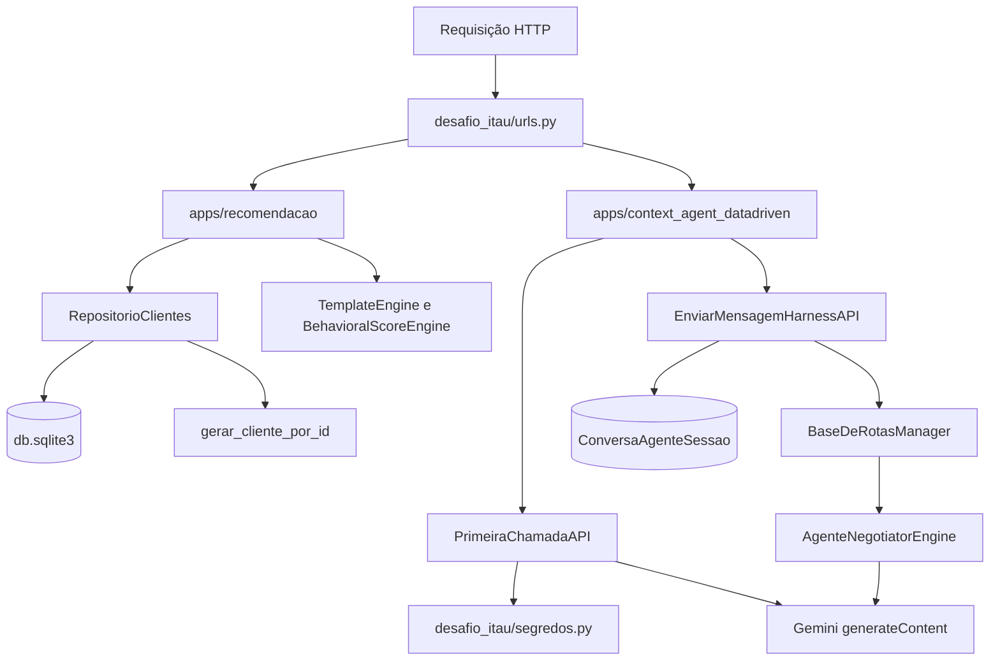
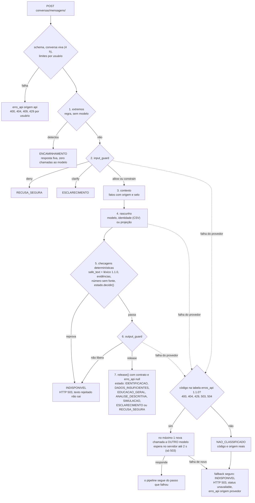

> **Origem:** copiado de backend-agente-conversacional (fora de git) em 2026-09-27 10:50 BRT, de `docs/architecture.md` (modificado na origem a 2026-09-27 10:28 BRT). Cópia só de leitura: a fonte continua a ser a pasta -32 até entrar em git (decisão I7).

# Arquitetura do Projeto: Desafio Itaú - Batalha de Agentes (Time 2)

## 1. Visão Geral
Esta solução usa dois repositórios. Este Git contém o Django; o front Node/React
fica no Git `agente-app-mobile`. O fluxo apresentado ao usuário tem duas frentes:
1. **Front mobile simulado** (no outro Git): interface React em modo telefone com 3 telas:
   - **Tela 1**: Interface minimalista padrão Itaú com acionador floating action button (FAB) em formato de **estrela** no canto inferior direito.
   - **Tela 2**: Conversa pré-preenchida (**Variável 1**) para IDs de 1 a 1.000. A chave ON/OFF escolhe tag e título; o corpo do texto permanece igual nas variantes atuais. Ao final, conta com o botão **"E agora?"**.
   - **Tela 3**: Interface de comunicação acionada por "E agora?". As respostas são simuladas no React por palavras-chave e score local. O Template 3 e o Ponto de Índice também existem no backend, mas não são consumidos por essa tela.
2. **Back-End Django (`desafio-itau-batalha-de-agentes-time2`)**:
   - Módulo com separação clara de templates (`templates/recommendations/`)
   - Documentação de templates (`docs/templates/`)
   - Configuração de redirecionamento do projeto raiz para o aplicativo (`RedirectView`)
   - Roteamento organizado de URLs RESTful e Views de renderização server-side
   - SQLite local para as tabelas de recomendação e sessão; o repositório de
     clientes gera perfis determinísticos quando não encontra um registro.
   - Espaço para notebooks de regras (`notebooks/regras_batalha_agentes.ipynb`)

---

## 2. Mapa de Rotas e URLs

| Método | Rota | Descrição |
| :--- | :--- | :--- |
| `GET` | `/` | Redirecionamento automático para `/app/` |
| `GET` | `/app/` | Dashboard central com visão geral do Time 2 |
| `GET` | `/app/chat/<id>/` | Renderização do template HTML de chat para o cliente |
| `GET` | `/app/comunicacao/<id>/` | Renderização da interface de comunicação com a matriz fixa |
| `GET` `POST` | `/api/v1/chave-interacao-tela-iai/` | Consulta ou alterna a chave ON/OFF (texto neutro × F/M) |
| `GET` | `/api/v1/cliente/random/` | Retorna um cliente entre os 1.000 IDs (`?genero=F\|M`); pode usar geração determinística sem base populada. |
| `GET` | `/api/v1/cliente/<id>/` | Retorna dados completos do cliente por ID (1..1000) |
| `GET` | `/api/v1/grupos-fixos/` | Estatísticas e amostras dos grupos fixos de clientes |
| `GET` | `/api/v1/chat/variavel-1/<id>/` | Retorna o texto pré-preenchido ativo (neutro, F ou M, conforme a chave) |
| `GET` `POST` | `/api/v1/comunicacao/e-agora/<id>/` | Disparo do "E agora?" com Template 3 e contexto do agente |
| `GET` | `/api/v1/contexto-score/<id>/` | Retorna o Ponto de Índice e diretriz comportamental do agente |
| `GET` | `/api/v1/planilha-fixa/` | Retorna os itens brutos da planilha fixa de produtos |
| `GET` | `/context-agent/` | Painel HTML do agente contextualizado |
| `GET` | `/api/v1/context-agent/status-harness/` | Auditoria: rotas YAML, provedores, status da chave (mascarada), tese e evals |
| `POST` | `/api/v1/context-agent/enviar-mensagem/` | Descontinuada (410), use `conversas/interacao/` (Decisão D-3, 2026-09-27) |
| `POST` | `/api/v1/context-agent/primeira-chamada/` | Envia só `{texto_inicial}` ao Gemini; única rota chamada pelo front |
| `POST` | `/api/v1/context-agent/conversas/sessao/` · `conversas/mensagens/` | (atualizado 2026-09-27 09:25) Conversa com pipeline de guards, `contrato.estado` e `erro_api`; ver "Atualização 2026-09-27" no fim deste documento |
| `POST` `GET` | `/api/v1/context-agent/conversas/interacao/` · `conversas/avaliacoes/resumo/` | (atualizado 2026-09-27 09:25) Conversa guiada por etapa e resumo do ledger de avaliações (contrato §5.3) |
| `GET` | `/api/v1/context-agent/conversas/status/` | (atualizado 2026-09-27 09:25) Estado do harness: modelo configurado × `modelVersion` observado, orçamento, limites; sem texto (contrato §5.5) |

> (atualizado 2026-09-27 09:25) A frase "única rota chamada pelo front" descreve o front demo da raiz da solução. O front do `agente-app-mobile` consome `conversas/` e `perfil-usuario/` (ver `docs/contrato-api-frontend.md` §5).

> As rotas de `apps.recomendacao` respondem em `/app/` e em `/api/v1/`; as de `apps.context_agent_datadriven` em `/context-agent/` e em `/api/v1/context-agent/`. O proxy do Vite encaminha só `/api/v1/context-agent`. Fluxos entre telas: [`fluxos-de-conversacao.md`](fluxos-de-conversacao.md). Contratos: [`inteirações-cloud/27-09-2026/INDICE.md`](inteirações-cloud/27-09-2026/INDICE.md).

---

## 3. Recorte de Clientes & Regras de Negócio (1.000 Perfis)
- **Login Randômico**: Permite simular interações dinâmicas selecionando qualquer um dos 1.000 clientes.
- **Derivação de Gênero pelo ID**:
  - `ID % 2 == 0` $\rightarrow$ **Feminino (F)**
  - `ID % 2 != 0` $\rightarrow$ **Masculino (M)**
- **Ponto de Índice de Corte (Score 0 a 1.000)**:
  - $\ge 750$: Alta Propensão (`CTX-750-ALPHA`) $\rightarrow$ Tom executivo, consultivo e proativo.
  - $450$ a $749$: Média Propensão (`CTX-450-BETA`) $\rightarrow$ Tom orientador e equilibrado.
  - $< 450$: Baixa Propensão (`CTX-150-GAMMA`) $\rightarrow$ Tom acolhedor e focado em controle básico de despesas.

`BehavioralScoreEngine` produz os códigos `CTX-*` desta seção. O registro do
cliente em `RepositorioClientes` usa rótulos diferentes no campo `indice_corte`
(`ALTA_PROPENSAO`, `MEDIA_PROPENSAO`, `BAIXA_PROPENSAO`); os dois campos não
devem ser tratados como o mesmo identificador.

---

## 4. Fluxos de execução do backend

> (atualizado 2026-09-27 09:25) Este diagrama omite o app `apps/conversas` (montado em
> `/api/v1/context-agent/conversas/`), que tem o pipeline extremos → input_guard → contexto → rascunho →
> checagens determinísticas → output_guard → `release()`. O diagrama dele está na seção
> "Atualização 2026-09-27" no fim deste documento.

**Recomendação.** [`customer_repository.py`](../apps/recomendacao/services/customer_repository.py)
consulta `db.sqlite3` diretamente com `sqlite3`. Se a tabela, linha ou arquivo
não estiver disponível, gera o perfil pelo ID e mantém cache em memória do
processo. [`init_database.py`](../init_database.py) aplica as migrações e popula
auditoria do fluxo, 1.000 clientes, matriz de cinco produtos e chave ON/OFF. As views REST e
HTML reutilizam `TemplateEngine` e `BehavioralScoreEngine`; o front React não
consome essas views hoje.

**Primeira chamada.** `PrimeiraChamadaAPI` valida que o JSON contém apenas
`texto_inicial` não vazio, até 2.000 caracteres. `primeira_chamada.py` lê a
chave por `segredos.py`, envia somente uma entrada `contents` ao Google
`gemini-3.5-flash-lite` e retorna texto ou erro. Essa é a rota usada pelo
inspetor do front. Nenhuma sessão ou histórico é gravado nesse fluxo.

**Harness com sessão.** `EnviarMensagemHarnessAPI` recebe `mensagem` e campos
de cliente, cria ou reutiliza `ConversaAgenteSessao`, lê até oito registros da
sessão e chama `AgenteNegotiatorEngine`. O motor escolhe categoria por
palavras-chave, monta um prompt de sistema com data de corte fixa
`2025-12-22`, tenta o modelo Google primário e depois
`gemini-3.5-flash-lite`. Se ambos falham, produz texto local de contingência
com HTTP 503, `sucesso: false` e `origem_resposta: contingencia`. Os adaptadores `antropic` e `openIa` estão registrados,
mas essa função não os chama. O front atual não usa esse endpoint.

> (atualizado 2026-09-27 09:25) Este fallback (tenta o primário, depois o 3.5-flash-lite, depois texto
> local com 503) vale só para `enviar-mensagem/`. Em `conversas/mensagens/` a regra é outra: tabela
> `erros_api` 1.1.0, no máximo 1 nova chamada a outro modelo, código fora da tabela como
> `NAO_CLASSIFICADO`, e fallback seguro `INDISPONIVEL` com bloco `erro_api`. Ver o fim deste documento.

## 5. Fontes de configuração e persistência

| Fonte | Uso efetivo |
| --- | --- |
| `desafio_itau/settings.py` | Django, SQLite, CORS, DRF e apps instalados. |
| `desafio_itau/segredos.py` | `API_KEY_SECRECT` do ambiente, `.secrets` na pasta pai ou variáveis legadas. |
| `rotas/templates/rotas_base.yaml` | Referência documental da base de rotas. |
| `rotas/manager.py` | Categorias efetivas codificadas em Python; apenas verifica que o YAML existe. |
| `db.sqlite3` | Dados locais de recomendação e tabelas de sessão; ignorado pelo Git. |
| `apps/*/migrations/` | Esquema Django versionado; `init_database.py` aplica antes de popular. |

O código chama `parse_simple_yaml`, mas essa função retorna um dicionário fixo
e não interpreta o conteúdo do YAML. Alterar somente `rotas_base.yaml` não
altera o roteamento. Um banco criado antes das migrações atuais pode ter
colunas ausentes; o HTTP 500 observado em 2026-09-27 está registrado em
[`fluxos-de-conversacao.md`](fluxos-de-conversacao.md). Para uma instalação nova,
o esquema vem das migrações. A primeira chamada não depende dessas tabelas.

## 6. O que o status e os evals comprovam

`status-harness` sem `?validar=1` relata apenas `AUSENTE` ou `CONFIGURADA`; com
esse parâmetro, testa a chave na Google e informa `VALIDADA`, `INVALIDA` ou
`NAO_MEDIDO`. A validação não mede a cota do projeto. Em `evals_google_agent.py`,
`groundedness_score` é `null` e `eval_status` diz `NAO_MEDIDO` porque a resposta
não é confrontada com evidências. O filtro de vazamento procura apenas algumas
cadeias de texto. `tempo_resposta_ms` mede a duração da view para as rotas de
conversa; `sla_latencia_max_ms` continua sendo um valor configurado. O HTML em `/context-agent/`
mostra o estado local da chave e não deve ser usado como prova de conexão.

(atualizado 2026-09-27 09:25) Para `conversas/`, o estado do harness está em `GET conversas/status/`
(modelo configurado × `modelVersion` observado, orçamento do processo, limites), sem texto nem
identificador; a cota restante do provedor continua NAO_MEDIDO.

Sem variáveis de ambiente, `DEBUG=True` e `ALLOWED_HOSTS=['*']` (o CORS já é restrito a `FRONT_ORIGENS`, D-5) e DRF sem autenticação tornam a
configuração adequada apenas para demonstração local. Antes de disponibilizar
uma chave com cota paga em ambiente público, é necessário restringir acesso,
origens e consumo no servidor.

## 7. Qualidade factual e latência

O fluxo do cliente ID 1 foi medido nas três rotas da demo, com controles de
coerência entre respostas. A consulta BigQuery separada usa `id_usuario` UUID;
o literal `"1"` não tem linhas, e nenhum vínculo com o ID da demo foi medido.
Tempos, pergunta, resposta e limites da avaliação estão em
[`qualidade-conversa/INDICE.md`](qualidade-conversa/INDICE.md). O agente atual
não consome a base BigQuery. (atualizado 2026-09-27 09:25: vale para `enviar-mensagem/`; o contexto de
`conversas/mensagens/` usa fatos com origem `bigquery_extrato` e só os libera com dados MEDIDO.) O teste factual da demo é separado do `eval_harness`
geral, que declara a fidelidade sem medição.

---

## Atualização 2026-09-27: estados, contrato e tratamento de erros

> (atualizado 2026-09-27 09:25) Esta seção descreve a rota de conversa que hoje concentra as regras:
> `POST /api/v1/context-agent/conversas/mensagens/` (`apps/conversas/service.py`, `_pipeline`). As seções
> anteriores continuam válidas para as rotas legadas (`enviar-mensagem/`, `primeira-chamada/`), que não
> seguem este pipeline. Fontes: `docs/relatorio-migracao-politica-2026-09-27.md` §3, §5 e §7-A;
> `docs/contrato-api-frontend.md` §5.4 e §5.5; leitura de `apps/conversas/service.py` e `apps/conversas/estado.py`.

### Pipeline, estados e ramo de erro

Ordem real no código (`_pipeline`): extremos, input_guard, contexto, rascunho, checagens determinísticas,
output_guard, `release()`. O `estado.decidir()` é calculado **dentro** das checagens determinísticas,
junto com `numeros_sem_fonte()`, e por isso roda antes do output_guard. O estado calculado só é liberado
depois que o output_guard aprova. Número em R$ ou % sem fonte no contexto reprova ali mesmo, antes do
output_guard (relatório §5, exemplo "Bloqueado").

### Os 9 estados de `contrato.estado`

| Estado | Como se chega (`estado.decidir()`) |
|---|---|
| `ENCAMINHAMENTO` | rota `extremo`: detector por regra, antes do modelo |
| `RECUSA_SEGURA` | input_guard `deny`, ou rascunho `safe_redirect` |
| `ESCLARECIMENTO` | input_guard `clarify`, rascunho `needs_clarification` ou pedido de confirmação da projeção |
| `IDENTIFICACAO` | pergunta do titular sobre a própria identidade; resposta sai do CSV da verdade |
| `DADOS_INSUFICIENTES` | dados do titular não MEDIDO e o rascunho declara faltar `dados_financeiros_do_titular` |
| `EDUCACAO_GERAL` | resposta sem fato do extrato; também o modo demo (sem gateway) |
| `ANALISE_DESCRITIVA` | o rascunho cita fato com origem `bigquery_extrato` e os dados estão MEDIDO; sem MEDIDO, `TransicaoInvalida` |
| `SIMULACAO` | confirmação de uma projeção proposta antes |
| `INDISPONIVEL` | rota técnica, reprova determinística, output_guard que não libera, ou falha do provedor; nenhuma ação permitida |

**O front decide a tela por `contrato.estado` e `contrato.acoes_permitidas`, nunca pelo texto** (contrato §5.4).
`regras_aplicadas` traz `rule_id@versao` de `desafio_itau/politica/operacional-v1.json`, com aprovação
**PENDENTE**.

### Tratamento de erros (`erro_api`, tabela `desafio_itau/politica/erros_api-v1.json` 1.1.0)

- **Com nova chamada:** 400, 404, 429, 503 e 504 (inclui timeout local). O servidor faz no máximo 1 nova
  chamada, sempre a outro modelo, nunca repete o mesmo pedido ao mesmo modelo. Só no 503 espera, e no
  máximo 2 s. Se a nova chamada falhar, sai o fallback seguro (`INDISPONIVEL`, HTTP 503).
- **Só da nossa API, sem nova chamada:** 401 (`reiniciar_sessao`), 403 e 405 (`nao_repetir`), 409
  (`enviar_como_nova`).
- **`NAO_CLASSIFICADO`:** status fora da tabela, exceção sem status ou código que só vale para a API vindo
  do provedor (um 401 do Gemini é chave inválida). Sai com o código real (ou null) e a origem verdadeira.
- Com `origem: "provedor"` o HTTP ao front continua 503, e o código do Gemini vai em `erro_api.codigo`.
- `encaminhar_humano: true` só sinaliza. A rota de handoff humano é **NAO_IMPLEMENTADO**.

### Outras mudanças do dia que afetam o fluxo

- **Conversa vive 4 h**, igual à sessão de usuário (`ttl_conversa_s` 14400 · `GET conversas/status/`,
  contrato §5.5 · 2026-09-27). Antes eram 30 min.
- **429 de pedido concorrente é por usuário.** Antes era global (correção D11).
- **Léxico 1.1.0:** reprova promessa, julgamento, pressão e o rótulo interno T3 (Vulnerável, Esbanjador,
  segmento Livre, `perfil_t3`) no texto ao cliente, sem exceção para negação ou citação.
- **Comunicação e produtos:** `desafio_itau/politica/comunicacao-v1.json` e `desafio_itau/politica/produtos-v1.json`
  (`SEM_CATALOGO_APROVADO`; ausência de taxa é NAO_MEDIDO, nunca custo zero).
- **`GET conversas/status/`:** modelo configurado × `modelVersion` observado, orçamento do processo e
  limites, sem texto nem identificador. Orçamento diário: NAO_IMPLEMENTADO. Cota restante do provedor:
  NAO_MEDIDO.
- **Média mensal:** expõe `cobertura` COMPLETA/LACUNA e `meses_faltantes`, sem imputar e sem mudar os números.
- **Extremos:** recall 3/12 → 7/12 · `datasets/corpus-intencao-gemini-2026-09-27T0857.jsonl` ·
  medido 2026-09-27 ~09:15. Recall num corpus de 60 frases rotulado pelo Gemini não é garantia de produção.
- **Modelo em uso:** `gemini-3.5-flash-lite` · `GET conversas/status/` `modelo_configurado` · 2026-09-27.
  O pedido citava o 3.8; a divergência está registrada e não houve troca.
- **Suíte:** 365 OK + 3 expected failures · `unittest discover` · 2026-09-27 ~09:20.

### Parcial ou não feito (relatório §7-A)

- Handoff humano: NAO_IMPLEMENTADO (só o sinal `encaminhar_humano` e o estado `ENCAMINHAMENTO`).
- Avaliação da LLM 30×5: NÃO EXECUTADA (até 450 chamadas contra uma cota compartilhada).
- Fatura × compras de cartão (contagem dupla): NAO_VERIFICADO.
- Transferência própria como renda: não separada, o dado não identifica contas do mesmo titular.
- Aprovação institucional de política, comunicação e textos de extremos: pendente, não é decisão de engenharia.
- ~~`interacao/` com `schema_version` 1.1 no 200 e 1.0 nos erros (D9)~~: resolvido na 3ª rodada de 2026-09-27, com "1.1" em toda resposta (seção abaixo).

### Persistência da conversa e histórico do turno livre (3ª rodada, 2026-09-27)

- **Conversa (`conversas/mensagens/`, I4 / D-4):** `ConversationService` grava cada conversa por `apps/conversas/persistencia.py`, com o cache do Django sobre banco, na tabela `conversas_sessao_cache`. Guarda o histórico minimizado, `criada` e a proposta pendente, sem prompt. O TTL é de 4 h em relógio de parede, conferido na leitura. Um processo novo restaura a conversa no primeiro pedido com o `conversation_id`. Outro `principal` recebe 404. Rate limit, idempotência e bloqueio concorrente ficam só no processo.
- **Turno livre (`conversas/interacao/`, I5 / D-14):** o servidor guarda os últimos 4 turnos livres por `X-Sessao-Id`, em memória, com TTL de 4 h. Eles vão ao modelo em `data.HISTORICO_NAO_CONFIAVEL` e ao input_guard em `history`. São dados não confiáveis: não mudam situação, fluxo, cenário, regras nem números, e os guards de saída continuam os mesmos. Extremo, fora do contexto, recusa e contra-discurso não entram no histórico.
- **`schema_version` (D-15 / D9):** vale "1.1" em toda resposta de `interacao/`. `mensagens/` mantém o envelope "1.0".
- Provas: `tests/test_fechamento_i4_i5_d15.py`. O contrato está em `docs/contrato-api-frontend.md` §5.2 a §5.4.
