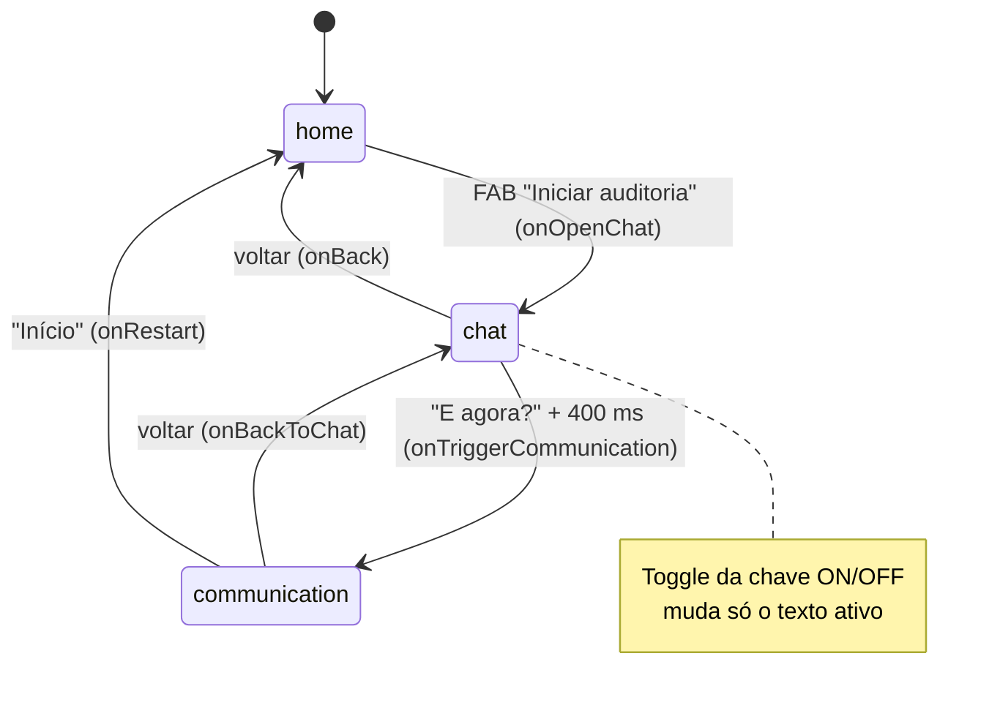
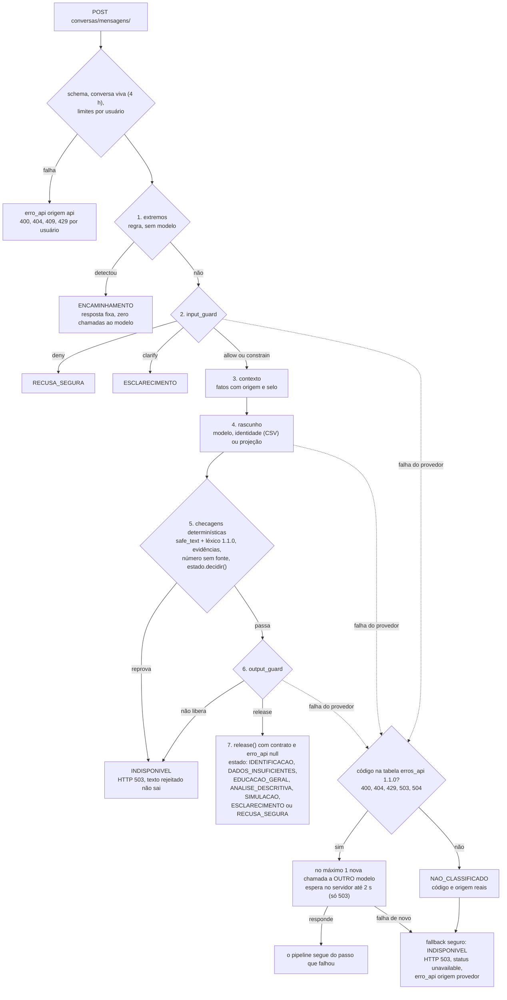

> **Origem:** copiado de backend-agente-conversacional (fora de git) em 2026-09-27 10:50 BRT, de `docs/fluxos-de-conversacao.md` (modificado na origem a 2026-09-27 09:56 BRT). Cópia só de leitura: a fonte continua a ser a pasta -32 até entrar em git (decisão I7).

# Fluxos de Conversação entre Telas

Documento de referência das etapas e da "conversação" entre as telas do app demo (front Vite/React na raiz da solução) e o backend Django deste repositório.

> Mapeado a partir do código em 2026-09-27. Onde o fluxo é **simulado no navegador** e não chega ao Django, isso está dito explicitamente — ver §7.

> (atualizado 2026-09-27 09:25) §1 a §7 descrevem o front demo da raiz da solução e as rotas legadas
> (`primeira-chamada/`, `enviar-mensagem/`). A conversa com estados explícitos, contrato e tratamento de
> erros é `conversas/mensagens/`, descrita na seção "Atualização 2026-09-27" no fim deste documento.

---

## 1. Máquina de Estados das Telas

Não há router. A navegação é um `useState<ScreenType>` em `src/App.tsx`:

```ts
type ScreenType = 'home' | 'chat' | 'communication'   // src/types/index.ts
```

| Estado global (`src/App.tsx`) | Padrão | Papel |
| :--- | :--- | :--- |
| `activeScreen` | `'home'` | Tela visível |
| `customerId` | `42` | Cliente (1..1000); o perfil vem de `getCustomerById` em `src/data/mockCustomers.ts` |
| `isChaveAtiva` | `true` | Chave ON/OFF da interação na Tela 2 (ver §4) |
| `isDualDynamics` | `false` | Modo "Duas Dinâmicas em Tela": Tela 1 e Tela 2 lado a lado |
| `isLazing` | `false` | Animação de *skeleton* de 600 ms (`LazyShimmerFrames.tsx`) disparada em **toda** troca de tela ou de cliente |
| `isDjangoDrawerOpen` | `false` | Abre o inspetor Django (`DjangoArchitectureDrawer.tsx`) |

Os únicos dados que passam de tela para tela são `customer` (objeto `Customer`) e `isChaveAtiva`.

---

## 2. Etapas por Tela

### Tela 1 · Home Itaú — `src/components/screens/Screen1ItauHome.tsx`
- **Mostra:** home bancária simulada (saldo ocultável, Pix/Pagar/Transferir, cartão, extrato) e um FAB laranja de estrela "Iniciar auditoria".
- **Ações:** FAB → `onOpenChat` → `activeScreen = 'chat'`.
- **API:** nenhuma.

### Tela 2 · Conversa pré-preenchida ("Auditoria Itaú") — `src/components/screens/Screen2Chat.tsx`
- **Mostra:** uma bolha do assistente gerada por `generateChatVariable1(customer, isChaveAtiva)` (`src/services/behavioralEngine.ts`):
  saudação `Que bom ter você aqui, {primeiroNome}!`, a tag ativa (§4), dois parágrafos fixos e a pergunta de prosseguimento. O rodapé "Status" mostra o toggle da chave e id/nome/camada esmaecidos.
- **Ações:**
  - **"E agora?"** → "Processando…" por 400 ms → `onTriggerCommunication` → `activeScreen = 'communication'`.
  - Seta voltar → `onBack` → `'home'`.
  - Toggle → `onToggleChave` → inverte `isChaveAtiva`.
- **API:** nenhuma (o texto é gerado no navegador).

### Tela 3 · Especialista Itaú (chat livre) — `src/components/screens/Screen3Communication.tsx`
- **Mostra:** histórico local `{id, papel: 'user' | 'model', texto, horario}`, abrindo com "Olá, {primeiroNome}! …". Rodapé com a data de corte fixa (22/12/2025) e o "horário casado" derivado do ID do cliente.
- **Ações:**
  - Enviar → adiciona a mensagem do usuário e, após 650 ms, uma resposta **escolhida no navegador** por palavras-chave (`invest`/`guardar`, `limite`/`cartão`) e pelo `scoreComportamental` (≥ 700).
  - Voltar → `onBackToChat` → `'chat'`; "Início" → `onRestart` → `'home'`.
  - `onNextCustomer` é recebido mas nenhum botão o chama.
- **API:** nenhuma — **não** chama `enviar-mensagem` (ver §5.2).

### Componentes de apoio
- `CustomerSelectorBar.tsx`: troca de cliente (aleatório ou digitado), atalhos diretos para as três telas, toggle "Duas Dinâmicas", replay do shimmer, botão do inspetor Django.
- `AndroidFrame.tsx`: moldura de telefone ou web; os seus botões voltar/home também mudam `activeScreen`.
- `DjangoArchitectureDrawer.tsx`: o **único** ponto do front que chama o backend (§5.1).

---

## 3. Diagrama de Transições



Toda seta dispara `triggerLazingAnimation()` (600 ms). No modo **Duas Dinâmicas**, Tela 1 e Tela 2 aparecem lado a lado; "E agora?" sai desse modo (`isDualDynamics = false`) e abre a Tela 3.

---

## 4. Chave ON/OFF (Interação Tela IAI)

| `isChaveAtiva` | Tag ativa na Tela 2 |
| :--- | :--- |
| `true` (padrão) | `TEXTO_1[NEUTRO]` |
| `false`, cliente masculino | `TEXTO_2[MASCULINO]` |
| `false`, cliente feminino | `TEXTO_3[FEMININO]` |

O gênero vem da paridade do ID (`src/data/mockCustomers.ts`). Hoje os parágrafos das três variantes são **idênticos**; só a tag muda.
No Django a mesma chave existe em `GET|POST /api/v1/chave-interacao-tela-iai/`, mas o front não a consulta — o estado vive só em `App.tsx`.

---

## 5. Conversa com o Agente (Django)

### 5.1 Primeira chamada — única integração real do front
```
DjangoArchitectureDrawer ─POST {texto_inicial}─▶ Vite proxy /api/v1/context-agent
   ─▶ Django primeira-chamada ─▶ services/primeira_chamada.chamar_gemini
   ─▶ Gemini gemini-3.5-flash-lite (header x-goog-api-key)
   ◀─ 200 {sucesso, modelo, resposta} | 400/503 {erro}
```
- Chave: `desafio_itau/segredos.obter_api_key()` → env `API_KEY_SECRECT` → `.secrets` na raiz da solução → legado `GEMINI_API_KEY`/`GSCONSOLE_SECRET`/`GOOGLE_API_KEY`.
- Sem chave: 503 `{"erro": "Defina API_KEY_SECRECT no arquivo .secrets da raiz da solução."}`. Nunca simula resposta.
- Contrato: `docs/inteirações-cloud/27-09-2026/padrao-envio.json` / `padrao-retorno.json`.

### 5.2 Conversa contextualizada — `POST /api/v1/context-agent/enviar-mensagem/`
Existe no Django, **sem consumidor no front**.

> Medido em 2026-09-27 no banco anterior às migrações: **HTTP 500** por falta das colunas `data_corte_fixa`, `horario_casado` e `horario_registro`. Para uma instalação nova, `init_database.py` aplica as migrações antes de popular os dados.

Etapas (`apps/context_agent_datadriven/views.py` → `agentes/agente.py`):
1. Recebe `{mensagem, cliente_id?, cliente_nome?, score?, indice_corte?, segmento?, contexto?}`.
2. Obtém ou cria `ConversaAgenteSessao`.
3. `rotas/manager.BaseDeRotasManager.identificar_categoria` classifica por palavra-chave: investimentos / crédito / reserva / geral (`rotas/templates/rotas_base.yaml`).
4. `AgenteNegotiatorEngine.distribuir_chamada` monta o prompt de sistema (data de corte 2025-12-22, horário derivado do ID, "nunca exibir o score") + até 8 mensagens de histórico e chama o modelo da categoria.
5. Falha → tenta `gemini-3.5-flash-lite`; nova falha → texto local de contingência, `sucesso: false` e HTTP 503. (atualizado 2026-09-27 09:25: só nesta rota legada; `conversas/mensagens/` usa a tabela `erros_api` 1.1.0, com no máximo 1 nova chamada a outro modelo e `erro_api` em toda falha.)
6. `executar_eval_harness` avalia a resposta. Só quando `origem_resposta` é `modelo` as duas mensagens (user e model) são gravadas em `MensagemAgenteRegistro`; na contingência nada é gravado, porque o histórico é reenviado ao modelo e um texto fixo com papel `model` o poluiria, e a mensagem do usuário sem resposta duplicaria na nova tentativa.
7. Devolve `{sessao_id, cliente_id, mensagem_enviada, resposta_agente, origem_resposta, categoria_negociada, protocolo_negociacao, temporalidade, eval_harness, sucesso}` e `erro` na contingência.

Contratos: `docs/inteirações-cloud/27-09-2026/enviar-mensagem/` e o índice `INDICE.md` da mesma pasta.

### 5.3 Auditoria — `GET /api/v1/context-agent/status-harness/`
Estado das rotas YAML, provedores, chave (`status`, `variavel_identificada` = origem real, `secret_mascarado`), tese e métricas de eval. Sem `?validar=1`, só informa `AUSENTE` ou `CONFIGURADA`; com o parâmetro, consulta a Google e informa `VALIDADA`, `INVALIDA` ou `NAO_MEDIDO`. O drawer lista a rota, mas não a chama.

---

## 6. Fluxo Paralelo Renderizado pelo Django

O Django serve o mesmo percurso em HTML próprio (prefixos `/app/` e `/api/v1/` incluem as mesmas rotas):

```
/app/?cliente_id=N  ──▶  /app/chat/<id>/  ──▶  /app/comunicacao/<id>/
dashboard.html         chat_neutro.html        template_3_matrix.html
                       (chave ON) ou            (Template 3 · Planilha Fixa)
                       chat_f / chat_m (OFF)
```

As APIs de dados equivalentes (`chat/variavel-1/<id>/`, `comunicacao/e-agora/<id>/`, `contexto-score/<id>/`) só servem este fluxo; o proxy do Vite encaminha apenas `/api/v1/context-agent`.

---

## 7. Lacunas: Simulado × Servido

| Etapa | Onde acontece hoje | Backend disponível |
| :--- | :--- | :--- |
| Perfil do cliente | navegador (`mockCustomers.ts`) | `GET /api/v1/cliente/<id>/` |
| Texto da Tela 2 | navegador (`generateChatVariable1`) | `GET /api/v1/chat/variavel-1/<id>/` |
| Chave ON/OFF | navegador (`App.tsx`) | `GET|POST /api/v1/chave-interacao-tela-iai/` |
| "E agora?" / Template 3 | só troca de tela; a planilha não é renderizada no React | `GET|POST /api/v1/comunicacao/e-agora/<id>/` |
| Respostas da Tela 3 | navegador (palavras-chave, 650 ms) | `POST /api/v1/context-agent/enviar-mensagem/` |
| Chamada ao Gemini | **servido** (drawer → Django) | `POST /api/v1/context-agent/primeira-chamada/` |

Ligar uma etapa ao backend exige também acrescentar o prefixo ao `server.proxy` de `vite.config.ts`.

> (atualizado 2026-09-27 09:25) Para as respostas da conversa, o backend disponível hoje é
> `POST /api/v1/context-agent/conversas/mensagens/` (já coberto pelo prefixo `/api/v1/context-agent` do
> proxy). Quem consome essa rota decide a tela por `contrato.estado`, nunca pelo texto.

---

## Atualização 2026-09-27: estados, contrato e tratamento de erros

> (atualizado 2026-09-27 09:25) Esta seção descreve a rota de conversa que hoje concentra as regras:
> `POST /api/v1/context-agent/conversas/mensagens/` (`apps/conversas/service.py`, `_pipeline`). As seções
> anteriores continuam válidas para as rotas legadas (`enviar-mensagem/`, `primeira-chamada/`), que não
> seguem este pipeline. Fontes: `docs/relatorio-migracao-politica-2026-09-27.md` §3, §5 e §7-A;
> `docs/contrato-api-frontend.md` §5.4 e §5.5; leitura de `apps/conversas/service.py` e `apps/conversas/estado.py`.

### Pipeline, estados e ramo de erro



Ordem real no código (`_pipeline`): extremos, input_guard, contexto, rascunho, checagens determinísticas,
output_guard, `release()`. O `estado.decidir()` é calculado **dentro** das checagens determinísticas,
junto com `numeros_sem_fonte()`, e por isso roda antes do output_guard. O estado calculado só é liberado
depois que o output_guard aprova. Número em R$ ou % sem fonte no contexto reprova ali mesmo, antes do
output_guard (relatório §5, exemplo "Bloqueado").

### Os 9 estados de `contrato.estado`

| Estado | Como se chega (`estado.decidir()`) |
|---|---|
| `ENCAMINHAMENTO` | rota `extremo`: detector por regra, antes do modelo |
| `RECUSA_SEGURA` | input_guard `deny`, ou rascunho `safe_redirect` |
| `ESCLARECIMENTO` | input_guard `clarify`, rascunho `needs_clarification` ou pedido de confirmação da projeção |
| `IDENTIFICACAO` | pergunta do titular sobre a própria identidade; resposta sai do CSV da verdade |
| `DADOS_INSUFICIENTES` | dados do titular não MEDIDO e o rascunho declara faltar `dados_financeiros_do_titular` |
| `EDUCACAO_GERAL` | resposta sem fato do extrato; também o modo demo (sem gateway) |
| `ANALISE_DESCRITIVA` | o rascunho cita fato com origem `bigquery_extrato` e os dados estão MEDIDO; sem MEDIDO, `TransicaoInvalida` |
| `SIMULACAO` | confirmação de uma projeção proposta antes |
| `INDISPONIVEL` | rota técnica, reprova determinística, output_guard que não libera, ou falha do provedor; nenhuma ação permitida |

**O front decide a tela por `contrato.estado` e `contrato.acoes_permitidas`, nunca pelo texto** (contrato §5.4).
`regras_aplicadas` traz `rule_id@versao` de `desafio_itau/politica/operacional-v1.json`, com aprovação
**PENDENTE**.

### Tratamento de erros (`erro_api`, tabela `desafio_itau/politica/erros_api-v1.json` 1.1.0)

- **Com nova chamada:** 400, 404, 429, 503 e 504 (inclui timeout local). O servidor faz no máximo 1 nova
  chamada, sempre a outro modelo, nunca repete o mesmo pedido ao mesmo modelo. Só no 503 espera, e no
  máximo 2 s. Se a nova chamada falhar, sai o fallback seguro (`INDISPONIVEL`, HTTP 503).
- **Só da nossa API, sem nova chamada:** 401 (`reiniciar_sessao`), 403 e 405 (`nao_repetir`), 409
  (`enviar_como_nova`).
- **`NAO_CLASSIFICADO`:** status fora da tabela, exceção sem status ou código que só vale para a API vindo
  do provedor (um 401 do Gemini é chave inválida). Sai com o código real (ou null) e a origem verdadeira.
- Com `origem: "provedor"` o HTTP ao front continua 503, e o código do Gemini vai em `erro_api.codigo`.
- `encaminhar_humano: true` só sinaliza. A rota de handoff humano é **NAO_IMPLEMENTADO**.

### Outras mudanças do dia que afetam o fluxo

- **Conversa vive 4 h**, igual à sessão de usuário (`ttl_conversa_s` 14400 · `GET conversas/status/`,
  contrato §5.5 · 2026-09-27). Antes eram 30 min.
- **429 de pedido concorrente é por usuário.** Antes era global (correção D11).
- **Léxico 1.1.0:** reprova promessa, julgamento, pressão e o rótulo interno T3 (Vulnerável, Esbanjador,
  segmento Livre, `perfil_t3`) no texto ao cliente, sem exceção para negação ou citação.
- **Comunicação e produtos:** `desafio_itau/politica/comunicacao-v1.json` e `desafio_itau/politica/produtos-v1.json`
  (`SEM_CATALOGO_APROVADO`; ausência de taxa é NAO_MEDIDO, nunca custo zero).
- **`GET conversas/status/`:** modelo configurado × `modelVersion` observado, orçamento do processo e
  limites, sem texto nem identificador. Orçamento diário: NAO_IMPLEMENTADO. Cota restante do provedor:
  NAO_MEDIDO.
- **Média mensal:** expõe `cobertura` COMPLETA/LACUNA e `meses_faltantes`, sem imputar e sem mudar os números.
- **Extremos:** recall 3/12 → 7/12 · `datasets/corpus-intencao-gemini-2026-09-27T0857.jsonl` ·
  medido 2026-09-27 ~09:15. Recall num corpus de 60 frases rotulado pelo Gemini não é garantia de produção.
- **Modelo em uso:** `gemini-3.5-flash-lite` · `GET conversas/status/` `modelo_configurado` · 2026-09-27.
  O pedido citava o 3.8; a divergência está registrada e não houve troca.
- **Suíte:** 365 OK + 3 expected failures · `unittest discover` · 2026-09-27 ~09:20.

### Parcial ou não feito (relatório §7-A)

- Handoff humano: NAO_IMPLEMENTADO (só o sinal `encaminhar_humano` e o estado `ENCAMINHAMENTO`).
- Avaliação da LLM 30×5: NÃO EXECUTADA (até 450 chamadas contra uma cota compartilhada).
- Fatura × compras de cartão (contagem dupla): NAO_VERIFICADO.
- Transferência própria como renda: não separada, o dado não identifica contas do mesmo titular.
- Aprovação institucional de política, comunicação e textos de extremos: pendente, não é decisão de engenharia.
- ~~`interacao/` com `schema_version` 1.1 no 200 e 1.0 nos erros (D9)~~: resolvido na 3ª rodada de 2026-09-27, com "1.1" em toda resposta (seção abaixo).

### Persistência da conversa e histórico do turno livre (3ª rodada, 2026-09-27)

- **Conversa (`conversas/mensagens/`, I4 / D-4):** `ConversationService` grava cada conversa por `apps/conversas/persistencia.py`, com o cache do Django sobre banco, na tabela `conversas_sessao_cache`. Guarda o histórico minimizado, `criada` e a proposta pendente, sem prompt. O TTL é de 4 h em relógio de parede, conferido na leitura. Um processo novo restaura a conversa no primeiro pedido com o `conversation_id`. Outro `principal` recebe 404. Rate limit, idempotência e bloqueio concorrente ficam só no processo.
- **Turno livre (`conversas/interacao/`, I5 / D-14):** o servidor guarda os últimos 4 turnos livres por `X-Sessao-Id`, em memória, com TTL de 4 h. Eles vão ao modelo em `data.HISTORICO_NAO_CONFIAVEL` e ao input_guard em `history`. São dados não confiáveis: não mudam situação, fluxo, cenário, regras nem números, e os guards de saída continuam os mesmos. Extremo, fora do contexto, recusa e contra-discurso não entram no histórico.
- **`schema_version` (D-15 / D9):** vale "1.1" em toda resposta de `interacao/`. `mensagens/` mantém o envelope "1.0".
- Provas: `tests/test_fechamento_i4_i5_d15.py`. O contrato está em `docs/contrato-api-frontend.md` §5.2 a §5.4.
