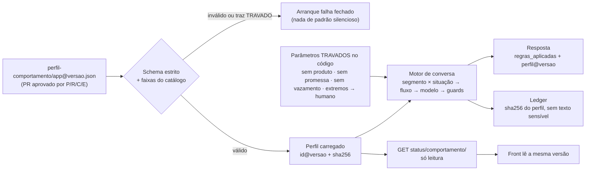

# Conclusão da entrega: i.agora (Batalha de Agentes, time 2)

> **Selo:** redigido em 2026-09-27 às 13:01 BRT, só com leitura de código e documentos. Nenhum commit, push ou deploy foi feito.
> **Fontes:**
> - `agente-app-mobile`, branch `docs/entrega-consolidada-2026-09-27` (head local `054d662`);
> - `origin/pr/4` (`91f9344`), que é a imagem da revisão `i-agora-00006-22d`;
> - `frontend-agent-conversacional`: `1f66e6a` no ar, `de7ff9d` no branch e `51bec4b` com o timer (só local);
>   **atualização 2026-09-27 10:50 BRT:** o front `47ee715` passou a viver em `src/` deste repositório (branch `feat/front-consolidado-2026-09-27`);
> - a cópia `backend-agente-conversacional` (`-32`, fora de git);
> - o fluxo de merge e as revisões do dia (Playwright, auditoria de dados, perfil e sessão).
>
> **Destino:** `agente-app-mobile/docs/conclusao-da-entrega.md`.
>
> Nas referências `ficheiro:linha`, **pub** é o código publicado (PR#4) e **-32** é a cópia local fora de git.

---

## 1. Resumo executivo

- **Está no ar:** o app i.agora na revisão Cloud Run `i-agora-00006-22d`, com 100% do tráfego desde 08:49 BRT.
  - O backend é o **PR#4 aberto** (`91f9344`, Henrique). A comparação foi feita byte a byte em `agent_backend/` e `deploy/`.
  - O front é o `1f66e6a`. O JS é idêntico ao build.
  - O `main` do repositório oficial **não** é o que está no ar.
- **Funciona:** 38 de 45 clicáveis (84,4%) e 9 rotas com sucesso. O chat teve mediana de 5,67 s (n=14), sem 429 nem 503. O `id_usuario` não sai do servidor, e o cookie é HttpOnly com CSRF.
- **Falha:**
  - todo visitante começa na mesma "conta" (Pessoa 1), porque o índice 1 está fixo no código;
  - o CTA "Começar planejamento" não envia nada (A1);
  - houve um trecho em hindi e perguntas em loop (A2);
  - o botão "Testar próximo perfil" fica sob a nav (A3).
- **Está pronto para executar:** um fluxo de merge de 12 passos, com 0 conflitos no backend e nos docs e 0 conflitos no import do front.
- **Bloqueia a entrega (depende do dono):**
  - **I7**, em que repositório entram as rotas `-32`;
  - a **autorização de push**;
  - o **merge do PR#4** com o Henrique;
  - D-8: o deploy exige o dono **e** o Henrique.
- **Comportamento hoje:** já é em parte orientado por dados.
  - No `-32` há uma política versionada (`politica/operacional-v1.json`, validada por pydantic, com sha256 e aprovação `PENDENTE`), fluxos (`2026-09-27.2`) e roteiro (`2026-09-27.4`) versionados.
  - Os perfis de tom, as regras de proposta, a memória e as quotas continuam como **constantes no código**.
  - A proposta da §4 junta tudo num **perfil de comportamento por aplicação**, versionado, validado no arranque, só de leitura na API, com trilha de auditoria e uma lista de parâmetros que **nunca** se ajustam.

---

## 2. Feito, com evidência

| # | Item | Evidência (valor · fonte · data BRT) |
|---|---|---|
| 1 | Serviço publicado no Cloud Run | `i-agora-00006-22d`, imagem `sha256:19823044…12f95`, 100% do tráfego · `gcloud run services describe` · 27/09 09:25 |
| 2 | Imagem = PR#4 | `agent_backend/` + `deploy/` iguais a `91f9344` pela comparação de `git hash-object`; JS `ebac7816…` = build de `1f66e6a` · camadas da imagem no Artifact Registry · 27/09 09:25 |
| 3 | Validação tela a tela | 45 clicáveis: 38 OK, 2 FALHA, 5 NAO_TESTADO; 151 passos · Playwright 1.58.2 · 27/09 08:49–09:17 |
| 4 | Latência do chat | mediana 5,67 s, faixa 4,97–7,10 s, n=14, 0 × 429/503 · Playwright · 27/09 08:49–09:17 |
| 5 | Proteção de dados | `id_usuario` nunca sai do servidor; consulta parametrizada ≤ 100 MB (`planning/bigquery.py:19`, pub); cookie HttpOnly/Strict; 401 sem cookie · auditoria de acesso a dados · 27/09 09:09–09:11 |
| 6 | Base lida de verdade | 467.585 linhas, 1.000 usuários, jan–dez/2025; o CSV da verdade bate 1.000/1.000 · BigQuery (backend -32) · 27/09 manhã |
| 7 | Regras de negócio documentadas | 6 documentos em `docs/regras-de-negocio/`, com a tabela de botões em `interacoes-manipulaveis.md` · commit `d02b9e1` · 27/09 08:51 |
| 8 | Ambientes, provedores e variáveis | `docs/ambientes/*` (5 ficheiros) · commit `c0a71c7` (local, sem push) · 27/09 |
| 9 | Rota integrada, lado front | `docs/rota-integrada-batalha-agentes-front.md`: 12 chamadas, 6 estados de contrato sem tratamento · commit `c7477fc` (local) · 27/09 09:16 |
| 10 | Validação front × back por localhost | `docs/validacao-front-back.md` · commit `64aff8a` (local) · 27/09 |
| 11 | Padrão das páginas de artefato, com guard | `docs/artefatos/template/componentes.json` + `tests/test_artefatos_padrao.py`, com prova negativa (`pagina-ruim.html`) · commit `054d662` · 27/09 ~09:55 |
| 12 | Plano de merge ensaiado | 12 passos; backend+docs com 0 conflitos; import do front com 0 conflitos; `secret_scan` com 0 achados · merge-lab · 27/09 09:18–09:36 |
| 13 | Suíte do backend publicado | PR#4: 91 OK + 2 falhas só no Windows (`WinError 32`, SQLite); Linux `NAO_MEDIDO` · merge-lab · 27/09 09:36 |
| 14 | Suíte do `-32` | 517 OK, 21 falhas esperadas (divergências da especificação registradas) · página B `1790514236-cac1` · 27/09 09:57. Antes: 470 OK e 23 esperadas às 09:26 (`docs/backlog.md`) |
| 14b | D-3, D-4 e D-5 aplicados no `-32` | D-3: 410 `rota_descontinuada`. D-4: sessão de 4 h gravada em SQLite, que no Cloud Run se perde a cada deploy. D-5: CORS e CSRF só em localhost e 127.0.0.1, portas 3000 e 3001 (`FRONT_ORIGENS`). 9 valores de `contrato.estado` em toda resposta; `erros_api` 1.1.0 (no máximo 1 nova chamada a outro modelo) · conferido no código · 27/09 10:03 |
| 15 | D-3 no `-32` | `enviar-mensagem/` responde 410 e aponta para `conversas/interacao/` (`views.py:67-78`); teste `test_d3_rota_unica.py:65` · backlog I1 · 27/09 09:49 |
| 16 | Ordem de modelos corrigida no `-32` | `MODELOS_GOOGLE = [3.5-flash-lite, flash-latest]`. Ledger: flash-latest com 429 em 19/19; 3.5-flash-lite com 32 aprovadas e 2 reprovadas, p50 1250 ms · `desafio_itau/modelos_llm.py` · 27/09 09:35 |
| 17 | Causa de "todos veem a Pessoa 1" | índice 1 literal em `agent_backend/planning/http.py:49,57` (pub); 3/3 sessões novas foram para id=1 · curl ao vivo · 27/09 09:35:31–09:35:48 |
| 18 | Timer da primeira consulta (front) | cronômetro e esqueleto enquanto o perfil carrega; 13 ficheiros (+145/−39), teste `profileLoad.test.ts` · `51bec4b` (local) · 27/09 09:47. **Não está no ar** |
| 19 | Encaminhamento por extremos (`-32`) | deteção por regra ANTES do modelo; 5 motivos, destino e prioridade fixos (`apps/conversas/extremos.py:24-27`) · testes `test_conversas_extremos.py`, `test_extremos_recall.py` · 27/09 07:30 |

---

## 3. Falta fazer, na ordem do fluxo de merge

| Passo | O quê | Dono | Bloqueio | Próxima ação |
|---|---|---|---|---|
| 0 | Congelar deploys até o passo 11 | dono | — | nenhuma alteração no Cloud Run (D-8) |
| 1 | Pôr em git tudo o que é local, incluindo `commitments.py` | **Henrique** | confirmar que não há nada além do PR#4 | `git status` limpo; rever `git diff 91f9344..<novo>` |
| 2 | Push dos commits locais de docs (`c0a71c7`, `c7477fc`, `64aff8a`, `054d662` e este documento) | **dono** | **autorização de push** | G-secret; `git push` sem `--force` |
| 3 | Merge do PR#4 no `main` | **Henrique abre, dono aprova** | passo 1; CI Linux ou as 2 falhas conhecidas do Windows | merge commit; `main` = árvore da imagem `00006-22d` |
| 4 | Merge de `docs/entrega-consolidada` e remoção de `docs/consolidacao` | dono | passo 3; D-2 (grep por 316 / 89,6 sem selo = 0) | `merge-tree` com 0 conflitos |
| 5 | `.gitattributes` + CI mínimo (G-back, G-front, G-secret) | backend | passo 4 | CI verde num PR de teste |
| 6 | Import do front `1f66e6a` em `src/`; legado em `archive/` | front, com revisão do Henrique | passo 5 | G-front 6/6; paridade do JS `ebac7816…`. Depois, decidir se `de7ff9d` e `51bec4b` entram |
| 7 | Correções F1–F11. ALTA: F1 CTA, F2 idioma/loop/memória do objetivo. MÉDIA: F3 nav, F4 histórico, F5 rede, F6 Voltar, F7 404 pós-TTL, F8 Reiniciar, F9 `contrato.estado`, F10 "Visão da conta", F11 `context.py:51` | front / Henrique / backend | passo 6 | gate de cada achado + G-E2E sem FALHA |
| 7b | Pessoa por sessão, não fixa (estratégia `demo.estrategia_pessoa`, §4.2) | Henrique | passo 6 | aleatória por sessão guardada no GCS + rótulo "Perfil de demonstração N de {total}" |
| 8 | Portar as rotas do `-32` (`conversas/interacao/`, `perfil-usuario/*`, `politica/*`), TTL de 4 h persistente (D-4), CSRF 3000/3001 (D-5) | backend + Henrique | **I7 (dono)** | testes do `-32` portados verdes; contrato §5.4 |
| 9 | O front migra `chat()` para `interacao/` e trata `contrato.estado` e o 410 | front | passo 8 | teste de contrato com um caso por estado |
| 10 | Tag `v1.0.0-batalha` | dono | passos 3–9 | gates no commit exato da tag |
| 11 | Deploy por digest, com revisão `--no-traffic`, G-SMOKE com 6 usuários e G-E2E | Henrique executa, dono aprova | **D-8** | rollback: `update-traffic … i-agora-00006-22d=100` |
| 12 | Arquivar `mobile-front-agente` e o repositório antigo do time | dono | passo 11 | README de arquivo + tag |

**Pendências de documentação que este levantamento encontrou:**

- `interacoes-manipulaveis.md` está defasado em dois pontos:
  - `COMPLEMENTO_TOM` está hoje em `interacao.py:481-483`, e o documento diz `:427-429`;
  - a ordem de modelos do `-32` foi invertida às 09:35, e o documento ainda diz `flash-latest → 3.5`.
- O branch do front `feat/i-agora-gcp-integrado` está em `de7ff9d` (09:20), à frente do `1f66e6a` que está no ar.
- A página publicada B estava atrás de A (v8 contra v11). Foi igualada na publicação deste documento.

---

## 4. Seções futuras: parâmetros funcionais de comportamento

### 4.1 (a) A abordagem que já está no código

O agente não tem "personalidade livre". O comportamento sai de **quatro camadas determinísticas**, e o modelo só redige dentro delas:

```
dados medidos (BigQuery, com selo) -> perfil interno T3 x situação -> fluxo + regras + roteiro -> Gemini redige -> guards reprovam ou aprovam -> roteiro como contingência
```

1. **Perfil interno e situação.**
   - **Segmento T3** (Vulnerável / Esbanjador / Livre / NAO_MEDIDO): `classificar_t3` compara a sobra com o limiar, primeiro sem e depois com o discricionário (`-32 estudos/i_agora/t3.py:96-106`).
   - **Situação**: o sinal do **saldo médio** da janela. SOBROU, FALTOU ou EQUILIBRIO quando |saldo| < 1% das entradas; NAO_MEDIDO quando a fonte falha (`interacao_dados.py:29`; regra do dono às 06:22).
   - O cruzamento dá os **16 fluxos** (4 segmentos × 4 situações) em `apps/conversas/fluxos_comportamento.json`, versão `2026-09-27.2`. Cada fluxo tem `id`, `proximo_passo`, `regras`, `mensagem_base` e `chave` (termo obrigatório, verificado pelo guard `fluxo`). Exemplo: `VUL-FALTOU → renegociar_compromissos`.
   - O fluxo é **escolhido por código, nunca pelo modelo**.
   - No publicado (pub), a situação é mais simples: saídas contra entradas do último mês fechado, em `fluxo_negativo`, `fluxo_equilibrado` ou `sobra_observada` (`planning/domain.py:77`).
2. **Limiares financeiros.**

   | Limiar | Valor | Onde vive (-32) | Tipo |
   |---|---|---|---|
   | Sobra do Livre | 15% | `operacional-v1.json` `t3.limiar_surplus`, lido em `t3.py:24` | dado |
   | Equilíbrio | 1% | `situacao.equilibrio` | dado |
   | Dívida relevante | 10% das entradas ou multa | `divida.relevante` | dado |
   | Inclinação de gasto | 3 meses, ±15%, ≥ R$ 30, média ≥ R$ 50 | `gasto.inclinacao` | dado |
   | Referência 50-30-20 | 50 / 30 / 20 | `orcamento.referencia_50_30_20` | dado |
   | Hipóteses de redução | 5% e 8% | `projecao.hipoteses_reducao` | dado |
   | Regra de proposta | `corte_seguro_ate_surplus_15` | `services/plano_proposta.py:24` | **constante** |
   | Máximo de compromissos | 3 | `plano_proposta.py:25` | **constante** |
   | Corte por nível | Nível 1 = 100%, Nível 2 = 50%, Nível 3 = 0% | `plano_proposta.py:27` | **constante** |
   | Reserva do Livre | 20% | `plano_proposta.py:26` | **constante** |

3. **Janela de dados.** É a média de jan–nov/2025, com registros até **2025-12-22**.
   - O corte vem de `DATA_CORTE` em `desafio_itau/settings.py:155`.
   - Há um fallback literal `'2025-12-22'` em `interacao.py:232,235`.
   - O mês do plano, "janeiro de 2026", também é literal (`interacao.py:126,293,392`; guard `interacao_avaliacao.py:320`).
4. **Roteiro e falas com versão.**
   - O roteiro `2026-09-27.4` tem 211 falas e 14 estágios (`conversa/roteiro.json:2`). Serve de **contingência avaliada** quando o modelo é reprovado (`interacao.py:451-478`).
   - O publicado usa Liquid estático (`conversation/prompts/*.liquid`) e textos de contingência em `service.py:21-31`.
5. **Tom por perfil.** `t3.PERFIS_DE_RESPOSTA` (`t3.py:113-138`) define `tom`, `foco`, `exclamacoes_max` (0 para Vulnerável), `proibidos` e `exigidos_um_de`.
   - Quando falta o termo exigido, entra a frase `COMPLEMENTO_TOM` (`interacao.py:481-483`).
   - Os registros de comunicação têm extensão máxima de 600, 500 e 900 caracteres (`politica/comunicacao-v1.json`). A regra declarada é: *"o perfil muda extensão, vocabulário e exemplos. NÃO muda permissões, fatos, números nem estado da conversa"*.
6. **Guards.**
   - Os guards determinísticos ficam em `interacao_avaliacao.py`:
     - promessa (`:56`);
     - produto financeiro (`:284`);
     - normativo;
     - âncora temporal (`:320`);
     - tom;
     - fluxo;
     - situação.
   - Há um guard de entrada pelo modelo (`INTERACAO_GUARD_ENTRADA_MODELO`, `views_interacao.py:63`, **sem teste**).
   - Os extremos são detectados por regra **antes** do modelo (`extremos.py:24-37`): autolesão > ameaça > abuso > flerte > extremo financeiro. O destino é humano ou segurança.
   - O catálogo de produtos está `SEM_CATALOGO_APROVADO` (`politica/produtos-v1.json`).
   - No publicado: filtros `BLOCK_MEDIUM_AND_ABOVE` (`gateway.py:24-26`), guards Liquid de entrada e de saída, e a contra-fala de igualdade salarial (`fairness.py:14-21`).
7. **Modelo, contingência, quotas e tempos.**
   - Publicado:
     - `AGENT_MODEL`/`GUARD_MODEL` com allowlist de 2 modelos (`harness/settings.py:23-24`; `gateway.py:23`);
     - **sem fallback**; uma falha devolve o texto `technical` (503);
     - turno de 45 s; Gemini com 15 s e 1 tentativa (`service.py:35`; `gateway.py:76`);
     - 6 mensagens por minuto, 5 conversas e 20 turnos (`service.py:37`);
     - 900 chamadas por dia (`deploy/settings.py:17`).
   - `-32`:
     - ordem `MODELOS_GOOGLE` (`modelos_llm.py`) e depois o roteiro como contingência;
     - `CONVERSAS_MAX_CHAMADAS` 300 (`settings.py:164`).
8. **Janelas de memória.**
   - Publicado: conversa de 30 min em memória (`service.py:37`); 12 entradas para o gerador (`:129`); 4 para o guard (`gateway.py:122`); cookie de 30 dias (`deploy/settings.py:16`).
   - `-32`: sessão do titular de 4 h (`perfil_usuario.py:28`); 4 turnos livres como `HISTORICO_NAO_CONFIAVEL` (`interacao.py:46-50`).
9. **Flags de ambiente.** `IAGORA_MODE` (`demo` / `demo_live` / `live`), `IAGORA_ALLOW_PAID_CALLS`, `IAGORA_MAX_CALLS`, `IAGORA_DAILY_CALLS`, `IAGORA_BQ_MAX_BYTES`, `IAGORA_SESSION_AGE`, `CONVERSAS_MAX_CHAMADAS`, `INTERACAO_GUARD_ENTRADA_MODELO`. Lista completa em `docs/ambientes/variaveis-de-ambiente.md`.

**Separação entre o que vem de dados e o que está no código:**

| Orientado por dados, versionado (hoje) | Constante no código (hoje) |
|---|---|
| `-32 desafio_itau/politica/operacional-v1.json` v1.0.0: 6 regras com `rule_id@versao`; validação pydantic estrita, sem `eval`, ausente = NAO_MEDIDO (`politica/__init__.py:133-170`); `aprovacao.status = PENDENTE` | `t3.PERFIS_DE_RESPOSTA` (`t3.py:113-138`) |
| `comunicacao-v1.json` v1.0.0 (3 registros de linguagem) | `plano_proposta.py:24-27` (regra, 3 compromissos, cortes por nível, reserva de 20%) |
| `lexico-v1.json` v1.1.0; `erros_api-v1.json` v1.1.0; `produtos-v1.json` (sem catálogo) | `interacao.py:228` (`limiar_livre_pct: 15.0` repetido, em vez de ler a política); `:515,525` (15% nos textos de regra) |
| `fluxos_comportamento.json` `2026-09-27.2` (16 fluxos) | `interacao.py:232,235` (fallback `2025-12-22`); "janeiro de 2026" (`:126,293,392`) |
| `roteiro.json` `2026-09-27.4` (211 falas) | `COMPLEMENTO_TOM` (`interacao.py:481-483`); `TURNOS_HISTORICO = 4` (`:46`) |
| Variáveis de ambiente (modelo, quotas, modo, bucket) | `extremos.py:24-37` (prioridade, destinos, falas `PROVISORIO`) |
| Liquid (`prompts/*.liquid`, pub): texto versionado com o código | pub: `service.py:35-37` (quotas, TTL, timeout); `gateway.py:23-26,76,104,144` (allowlist, segurança, tokens); `planning/http.py:49,57` (**pessoa 1 fixa**); `bigquery.py:105` (rótulo "Pessoa N da base"); `context.py:32` (revalidação das normas em 2027-07-01); `projection.py:26` (5% e 8% repetidos) |

**Conclusão (a):** o padrão certo já existe no `-32`, na forma da política operacional: ficheiro JSON com `schema_version`, `versao`, `rule_id@versao` citado nas respostas (`regras_aplicadas`), sha256 e aprovação. Falta estendê-lo aos perfis de tom, às regras de proposta, à memória e às quotas, e levá-lo para o backend publicado, que ainda não tem nada disso.

### 4.2 (b) Catálogo de parâmetros por aplicação (proposta)

Quem muda:

- **P** = produto;
- **R** = risco;
- **C** = compliance;
- **E** = engenharia.

**TRAVADO** = nunca ajustável por aplicação. Só muda por release de código, com revisão de C e R.

| # | Id do parâmetro | Domínio | Tipo | Padrão | Faixa permitida | Quem muda | Onde vive hoje | Onde deve viver | Teste / guard |
|---|---|---|---|---|---|---|---|---|---|
| 1 | `tom.registro_por_perfil` | tom/linguagem | mapa segmento → registro | Vul = acolhimento_sereno; Esb/Livre = explicação_objetiva | 3 registros de `comunicacao-v1` | P + C | `comunicacao-v1.json` (-32) | `perfil.tom.registros` | `test_spec_tom_por_perfil.py` |
| 2 | `tom.extensao_max_caracteres` | tom/linguagem | int por registro | 600 / 500 / 900 | 200–1200 | P | `comunicacao-v1.json` | `perfil.tom.registros[*].extensao_max` | a criar (limite de `max` da etapa) |
| 3 | `tom.exclamacoes_max` | tom/linguagem | int por segmento | Vul 0 · Esb 1 · Livre 1 | 0–1; Vul **fixo em 0** | P + C | `t3.py:117,125,133` | `perfil.tom.segmentos` | guard `tom`; `texto_roteiro` troca `!` por `.` |
| 4 | `tom.termos_exigidos` | tom/linguagem | lista por segmento | ver `t3.py:120,128,136` | ≥ 1 termo; sem nome de perfil | P | `t3.py` (código) | `perfil.tom.segmentos` | guard `tom` + `COMPLEMENTO_TOM` |
| 5 | `tom.termos_proibidos_extra` | guardrails | lista | ver `t3.py:119,127,135` | **só acrescenta** à base travada | C | `t3.py` (código) | `perfil.tom.segmentos` | guard `tom`/`PROMESSA` |
| 6 | `tom.complemento_por_perfil` | roteiro | texto por segmento | `interacao.py:481-483` | tem de conter termo exigido | P | código | roteiro versionado | `test_conversas_interacao.py` |
| 7 | `linguagem.concordancia_genero` | tom/linguagem | enum | `por_cadastro` (campo do CSV sintético) | `por_cadastro` / `neutra` | P + C | `interacao.py:385,396`; `perfil_usuario.py:98` | `perfil.linguagem` | a criar: o gênero **nunca** é inferido do texto nem dos gastos |
| 8 | `limiar.t3_sobra_livre` | limiares financeiros | fração decimal | 0.15 | 0.10–0.20 (5 pp mudam 16–19% da base, P6) | R | `operacional-v1.json` + literal `interacao.py:228` | `politica.t3.limiar_surplus` (fonte única) | `test_politica_operacional.py::Equivalencia` |
| 9 | `limiar.equilibrio_pct` | limiares financeiros | pct | 1.0 | 0.5–5.0 | R | `operacional-v1.json` | idem | `test_politica_operacional.py` |
| 10 | `limiar.divida_relevante` | limiares financeiros | pct + contagem | 10% das entradas; 1 multa | 5–30%; ≥ 1 | R | `operacional-v1.json` | idem | `test_conversas_interacao_cenarios.py` |
| 11 | `limiar.inclinacao_gasto` | limiares financeiros | objeto | 3 meses; 15%; R$ 30; R$ 50 | meses 2–6; 10–30% | R + P | `operacional-v1.json` | idem | `test_conversas_interacao_cenarios.py` |
| 12 | `orcamento.referencia_50_30_20` | limiares financeiros | 3 pct | 50/30/20 | soma = 100 | P | `operacional-v1.json` | idem | validação de schema (soma) a criar |
| 13 | `projecao.hipoteses_reducao` | limiares financeiros | lista de frações | 0.05, 0.08 | 0.01–0.15; rotuladas "hipótese" | R | `operacional-v1.json` (-32); `projection.py:26` (pub) | `politica.projecao` | `test_politica_operacional.py` |
| 14 | `proposta.regra` | limiares financeiros | enum | `corte_seguro_ate_surplus_15` | catálogo de regras aprovadas | R | `plano_proposta.py:24` | `politica.proposta.regra` | testes do plano: **NAO_MEDIDO** nesta leitura |
| 15 | `proposta.max_compromissos` | limiares financeiros | int | 3 | 1–5 | P + R | `plano_proposta.py:25` | `politica.proposta` | P7: regra não validada |
| 16 | `proposta.corte_por_nivel` | limiares financeiros | mapa nível → fração | N1 1.0 · N2 0.5 · N3 0.0 | N1 0.5–1.0; N2 0–0.5; **N3 travado em 0** (essencial) | R | `plano_proposta.py:27` | `politica.proposta` | a criar: N3 ≠ 0 reprova no carregamento |
| 17 | `proposta.reserva_livre_pct` | limiares financeiros | pct das entradas | 20 | 5–30 | R | `plano_proposta.py:26` | `politica.proposta` | a criar |
| 18 | `janela.data_corte` | janela de dados | data | 2025-12-22 | ≤ último dado carregado | E + R | `settings.py:155`; literal `interacao.py:232,235` | `perfil.janela` | a criar: fallback literal proibido |
| 19 | `janela.meses_media` | janela de dados | intervalo | jan–nov/2025 (meses completos) | 3–12 meses completos | R | `t3.py:8-9` | `perfil.janela` | D-13 aberta (dezembro × média) |
| 20 | `janela.mes_do_plano` | janela de dados | ano-mês | 2026-01 | ≥ mês seguinte ao corte | P | `interacao.py:126,293,392`; guard `interacao_avaliacao.py:320` | `perfil.janela` | guard de âncora temporal |
| 21 | `roteiro.versao` | roteiro | id de versão | `2026-09-27.4` | versão publicada e aprovada | P + C | `roteiro.json:2` | `perfil.roteiro.versao` (pino) | o roteiro também passa pelos guards |
| 22 | `fluxos.versao` | roteiro | id de versão | `2026-09-27.2` | versão com os 16 fluxos | P + R | `fluxos_comportamento.json` | `perfil.fluxos.versao` (pino) | guard `fluxo` (termo `chave`) |
| 23 | `normas.revalidar_em` | guardrails | data | 2027-07-01 | ≤ 12 meses à frente | C | `conversation/context.py:32` (pub) | `perfil.normas` | fontes `requires_revalidation` |
| 24 | `guard.entrada_modelo` | guardrails | bool | ligado | ligado em produção; desligar só em `demo` | E + C | env `INTERACAO_GUARD_ENTRADA_MODELO` (`views_interacao.py:63`) | `perfil.guardrails` | **sem teste**: criar |
| 25 | `guard.sem_oferta_de_produto` | guardrails | — | ativo | **TRAVADO** | C | `interacao_avaliacao.py:284`; `produtos-v1.json` | código | guard `PRODUTOS` + D-17 |
| 26 | `guard.sem_promessa` | guardrails | — | ativo | **TRAVADO** | C | `interacao_avaliacao.py:56` | código | guard `PROMESSA` |
| 27 | `guard.sem_vazamento_de_dados` | guardrails | — | `id_usuario` nunca sai; ≤ 1.000 linhas; teto de 100 MB | **TRAVADO** (pode baixar, nunca subir) | C + E | `planning/bigquery.py:19,60,77` | código + `perfil.dados` só para descer | auditoria + `secret_scan` |
| 28 | `encaminhamento.extremos` | encaminhamento humano | mapa motivo → destino | 5 motivos, prioridade fixa | **TRAVADO** | C | `extremos.py:24-27` | código | `test_conversas_extremos.py`, `test_extremos_recall.py` (I8: 3 de 12) |
| 29 | `encaminhamento.falas` | encaminhamento humano | textos | roteiro `extremo.*`; `PROVISORIO` | texto aprovado por C (inclui CVV 188) | C | `extremos.py:30-37`; roteiro | `perfil.roteiro` | a criar: nenhum `PROVISORIO` em produção |
| 30 | `encaminhamento.canal_humano` | encaminhamento humano | enum | `texto` (só mensagem) | `texto` / `fila` / `telefone` | P + C | não existe | `perfil.encaminhamento` | NAO_MEDIDO (sem rota de atendimento) |
| 31 | `modelo.ordem` | modelo/quotas | lista | [3.5-flash-lite, flash-latest] (-32); `AGENT_MODEL` (pub) | só da allowlist | E | `modelos_llm.py`; `gateway.py:23` | `perfil.modelo` | allowlist no arranque (`gateway.py:56`) |
| 32 | `modelo.tempos` | modelo/quotas | segundos | turno 45 s; Gemini 15 s, 1 tentativa | 5–60 s; tentativas 1–2 | E | `service.py:35`; `gateway.py:76` | `perfil.modelo` | a criar |
| 33 | `quota.por_pessoa` | modelo/quotas | ints | 6/min; 5 conversas; 20 turnos | 1–20; 1–10; 5–40 | E + P | `service.py:37` | `perfil.quotas` | 429 nos testes do serviço |
| 34 | `quota.chamadas_dia` | modelo/quotas | int | 900 (pub); 300 (-32) | 0–3000 | E (custo) | env `IAGORA_DAILY_CALLS`; `CONVERSAS_MAX_CHAMADAS` | `perfil.quotas` | `RuntimeError` → 503 |
| 35 | `memoria.ttl_sessao` | memória | segundos | 1800 (pub) → **14400 (D-4)** | 900–14400 | P + E | `service.py:37`; `perfil_usuario.py:28` | `perfil.memoria` | F7 / DF2 |
| 36 | `memoria.historico_ao_modelo` | memória | nº de entradas | 12 (pub); 4 turnos (-32) | 0–12 | E | `service.py:129`; `interacao.py:46` | `perfil.memoria` | histórico marcado como NÃO CONFIÁVEL |
| 37 | `ui.cronometro_primeira_consulta` | apresentação/UI | bool | ligado (`51bec4b`) | on/off | P | `src/services/profileLoad.ts` (local) | `perfil.ui` via `GET` de status | `profileLoad.test.ts` |
| 38 | `ui.rotulo_perfil_demo` | apresentação/UI | modelo de texto | "Pessoa {n} da base" | tem de dizer "demonstração" e o total medido | P + C | `planning/bigquery.py:105` | `perfil.ui` | F10: grep sem "Visão da conta" |
| 39 | `demo.estrategia_pessoa` | dados de demonstração | enum | `fixa` (índice 1) | `fixa` / `aleatoria_por_sessao` / `round_robin` / `hash_da_sessao` | P | `planning/http.py:49,57` | `perfil.demo` | a criar: 3 sessões novas ≠ todas id=1 |
| 40 | `demo.pessoa_fixa_indice` | dados de demonstração | int | 1 | 1–N medido | P | idem | `perfil.demo` (só com `fixa`, para o roteiro do júri) | idem |
| 41 | `demo.modo` | dados de demonstração | enum | `demo_live` (Cloud Run) | `demo` / `demo_live` / `live` (**live exige auth**) | E + C | `deploy/settings.py:12` | env + `perfil.demo` | `live` sem `PRINCIPAL_RESOLVER` falha fechado |

**Contagem:** 41 parâmetros. Destes, **4 são TRAVADOS** (25–28). Outros 3 têm um valor travado dentro da faixa (3: Vul = 0; 16: N3 = 0; 27: teto só desce).

### 4.3 (c) Arquitetura proposta: perfil de comportamento versionado por aplicação

**Princípios:**

1. **Um ficheiro por aplicação ou tenant.** O ficheiro é `perfil-comportamento/<app>@<versao>.json`, e o id segue o padrão `rule_id@versao` que o `-32` já usa.
2. **Validação no carregamento.** Um schema estrito (pydantic, `extra='forbid'`) valida o ficheiro, e cada parâmetro é conferido contra a faixa do catálogo. Um ficheiro inválido **impede o arranque**. Não há fallback silencioso para um padrão.
3. **Parâmetros travados.** Os parâmetros TRAVADOS não aparecem no schema da aplicação. Se o ficheiro trouxer um deles, o carregamento reprova.
4. **Leitura pública, sem escrita pela API.** A rota `GET /api/status/comportamento/` devolve `{id, versao, sha256, aprovado_por, aprovado_em}` e os valores não sensíveis. Nenhuma rota escreve o perfil.
5. **Mudança só por PR.** Cada mudança é um PR com aprovação obrigatória do dono do domínio (tabela do §4.2, via CODEOWNERS). Mudanças de R e de C precisam das duas assinaturas.
6. **Trilha de auditoria.** Cada resposta leva `perfil_comportamento: "<id>@<versao>"` ao lado de `regras_aplicadas`. O ledger guarda o sha256 do perfil. O histórico fica no git (diff + aprovação).
7. **A/B só com selo.** Uma variante é outro perfil versionado. A atribuição segue `hash(sessão)`, e cada braço tem N, janela e métrica no selo. Sem selo (valor · fonte · data), o resultado **não é publicado** (D-2).
8. **Front e back leem a mesma versão.** O front obtém o perfil pela rota de status. Não guarda uma cópia local. Se as versões divergirem, aparece um aviso de versão.



**Exemplo de perfil (ilustrativo; os valores são os padrões de hoje):**

```json
{
  "schema_version": "1.0",
  "id": "i-agora-demo",
  "versao": "1.0.0",
  "aprovacao": {"status": "PENDENTE", "produto": null, "risco": null, "compliance": null},
  "tom": {
    "segmentos": {
      "Vulnerável": {"registro": "acolhimento_sereno", "exclamacoes_max": 0,
                     "termos_exigidos": ["vamos", "juntos", "passo", "organizar", "proteger"],
                     "termos_proibidos_extra": []},
      "Esbanjador": {"registro": "explicacao_objetiva", "exclamacoes_max": 1,
                     "termos_exigidos": ["reduzir", "cortar", "ajustar", "meta", "limite"],
                     "termos_proibidos_extra": []},
      "Livre":      {"registro": "explicacao_objetiva", "exclamacoes_max": 1,
                     "termos_exigidos": ["reserva", "investir", "aplicar", "planejar", "objetivo"],
                     "termos_proibidos_extra": []}
    },
    "concordancia_genero": "por_cadastro"
  },
  "politica_ref": "politica-operacional-i-agora@1.0.0",
  "proposta": {"regra": "corte_seguro_ate_surplus_15", "max_compromissos": 3,
               "corte_por_nivel": {"N1": "1.0", "N2": "0.5", "N3": "0.0"}, "reserva_livre_pct": "20"},
  "janela": {"data_corte": "2025-12-22", "meses_media": ["2025-01", "2025-11"], "mes_do_plano": "2026-01"},
  "roteiro": {"versao": "2026-09-27.4"},
  "fluxos": {"versao": "2026-09-27.2"},
  "encaminhamento": {"canal_humano": "texto"},
  "modelo": {"ordem": ["gemini-3.5-flash-lite", "gemini-flash-latest"], "turno_s": 45, "chamada_s": 15},
  "quotas": {"por_minuto": 6, "conversas": 5, "turnos": 20, "chamadas_dia": 900},
  "memoria": {"ttl_sessao_s": 14400, "historico_ao_modelo": 12},
  "ui": {"cronometro_primeira_consulta": true, "rotulo_perfil_demo": "Perfil de demonstração {n} de {total}"},
  "demo": {"modo": "demo_live", "estrategia_pessoa": "aleatoria_por_sessao", "pessoa_fixa_indice": null}
}
```

Os valores monetários e as frações vão como **texto decimal**, como a política atual já faz (`Decimal`, nunca `float`).

### 4.4 (d) Riscos e limites

- **Personalização excessiva:**
  - quanto mais botões, mais combinações sem teste. Com 16 fluxos × 3 registros × variantes, a suíte deixa de cobrir tudo;
  - mitigação: cada parâmetro só entra no catálogo com teste ou guard (última coluna do §4.2); o A/B só corre com selo; limite de 2 variantes vivas por aplicação;
  - o perfil muda **forma**, nunca fatos, números, permissões nem o estado da conversa (`comunicacao-v1.json`, `regra_dos_perfis`).
- **Equidade:**
  - o deploy **não infere gênero, propensão, crédito, saúde, religião ou personalidade** (`deploy/README.md:20`, pub);
  - o gênero do cadastro sintético só serve para concordância gramatical; o parâmetro 7 permite a forma neutra;
  - nenhum limiar pode usar um atributo sensível como entrada; o schema só aceita indicadores financeiros medidos;
  - o limiar de 15% mexe em 16–19% da base com ±5 pp (P6), por isso muda só com R e com uma medição de impacto por segmento publicada com selo.
- **Consistência entre front e back:**
  - hoje o front tem 188 falas próprias (`falas-e-roteiro.md`) e não consome o roteiro do `-32`;
  - o TTL é de 30 min no back publicado e de 4 h no `-32`;
  - a situação é calculada de duas formas (último mês no pub, média da janela no `-32`);
  - o perfil versionado servido pela rota de status é a única fonte. Até lá, cada divergência fica marcada como `DIVERGENTE` nas páginas.
- **Operação:**
  - uma mudança de perfil é uma mudança de comportamento em produção e segue D-8 (dono + Henrique, deploy por digest);
  - sem aprovação registrada, o perfil fica `PENDENTE` e a rota de status diz isso.

### 4.5 (e) Roadmap por fases

| Fase | Entrega | Pré-requisito | Pronto quando |
|---|---|---|---|
| 0 · agora | Fechar o merge (§3, passos 1–7) e escolher `demo.estrategia_pessoa` (A: aleatória por sessão) | autorização de push; PR#4 | G-back, G-front, G-secret verdes; 3 sessões novas ≠ todas id=1 |
| 1 · consolidar a fonte | Portar `politica/` do `-32` para o backend publicado (após I7). Remover os literais duplicados (`interacao.py:228,232,235`; `projection.py:26`) | I7 | `Equivalencia` verde; grep sem literal 0.15 nem 2025-12-22 fora da política |
| 2 · perfil v1 | Schema `perfil-comportamento` com os parâmetros 1–24 e 31–41; carregamento com falha fechada; rota `GET status/comportamento/`; `perfil@versao` em cada resposta | fase 1 | prova negativa: perfil com N3 ≠ 0, com TRAVADO ou fora da faixa reprova o arranque |
| 3 · governança | CODEOWNERS por domínio; aprovação registrada no próprio ficheiro; ledger com sha256 | fase 2 | PR de mudança de limiar sem R bloqueado |
| 4 · front na mesma versão | O front lê o perfil (UI, cronômetro, rótulo) e mostra o aviso de versão | fase 2; D-3 (`interacao/`) | teste de contrato front × back com a mesma versão |
| 5 · experimentos | A/B por `hash(sessão)` com selo por braço; publicação só do medido (D-2) | fase 3 | relatório com N, janela e métrica por braço |

---

## 5. O que não foi verificado nesta redação

- D-3, D-4 e D-5 foram aplicadas no `-32` (conferidas às 10:03 BRT, segundo a secção "Atualização" da página B). D-8 espera o Henrique e prevê um serviço **novo**, `i-agora-conversacional`. **Nada disso está no ar.** Esta redação não voltou a correr a suíte do `-32`.
- A suíte do backend em Linux: **NAO_MEDIDO**.
- Testes específicos de `plano_proposta` (parâmetros 14–17): **NAO_MEDIDO** nesta leitura.
- O timer `51bec4b` e o front `de7ff9d` não foram medidos no ar.
- A lista de 41 parâmetros é uma proposta. Os números de faixa são recomendações de engenharia, **não** foram aprovados por risco nem por compliance.
