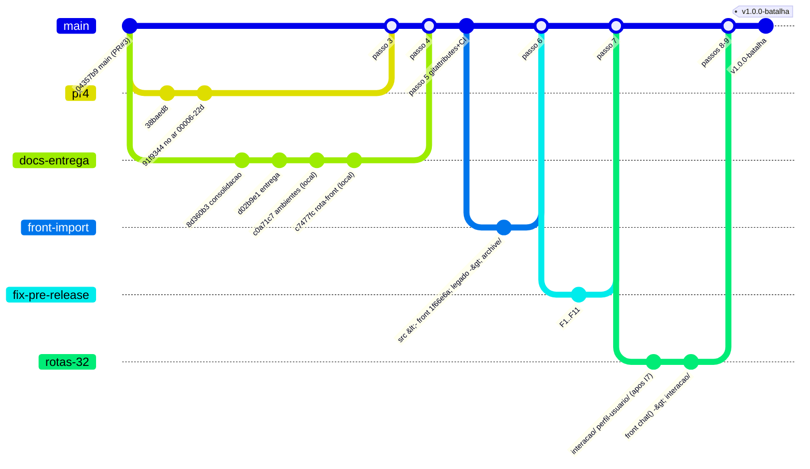
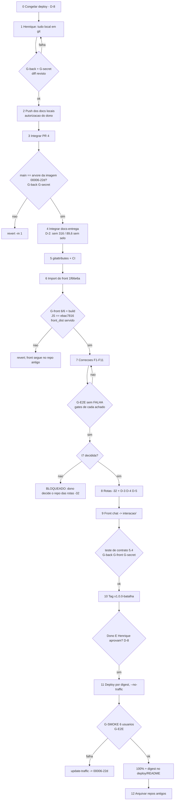

# Fluxo de merge — convergir tudo em `agente-app-mobile@main`

> **Selo:** levantamento feito em 2026-09-27, entre 09:18 e 09:35 BRT, em clones novos (nenhuma cópia de trabalho foi alterada).
> Cloud Run consultado só para leitura: `i-agora`, `us-central1`, projeto `batalha-time-02-lxof`.
> Ponto único de consolidação: **`JonathaCosta10/agente-app-mobile`, branch `main`**.
> Nada foi enviado com push, integrado, publicado ou aberto como PR. Este documento é só o plano.

## 0. Resumo em 8 linhas

1. **O que está no ar foi medido, não inferido.** A revisão `i-agora-00006-22d` usa a imagem `sha256:19823044…12f95` e tem 100% do tráfego desde 08:49 BRT. Em `agent_backend/` e em `deploy/`, a imagem é **idêntica byte a byte** ao PR#4 (`91f9344`). O JavaScript do `front_dist` é **idêntico byte a byte** ao build de `mobile-front-agente@1f66e6a`.
2. Por isso o `commitments.py` "fora de git" **já está em git, no PR#4**. Ele só difere do `main`. Falta o Henrique confirmar que não tem outra alteração local além dessa.
3. O backend integra sem conflito: `main` + PR#4 + `docs/entrega-consolidada` (com os 2 commits locais `c0a71c7` e `c7477fc`) dão **0 conflitos**.
4. O import do front `1f66e6a` em `src/`, com o legado movido para `archive/front-legado/`, também dá **0 conflitos de conteúdo** e passa build, lint, testes, pytest, secret_scan e o smoke do `front_dist` servido pelo Django.
5. Os 10 commits locais de `mobile-front-agente@main` (Jonatha) **conflitam em 8 ficheiros** com `1f66e6a`. Falam com outro backend (o `-32`) e com outro modelo de identidade (`ref = person.id+1`), por isso a resolução é manter o `1f66e6a` e arquivar esses commits.
6. Em Windows faltam 2 testes do backend (`WinError 32`, SQLite aberto no `TemporaryDirectory`). Nenhuma falha é lógica. Em Linux o resultado ficou **NAO_MEDIDO**, porque não havia Docker nem WSL.
7. Correções de front antes da release: 2 ALTA, 4 MÉDIA e mais DF2, DF3 e §5.4. Estão na §7, cada uma com dono, repositório e gate.
8. Precisam do dono: I7 (em que repositório entram as rotas do `-32`), D-3 (a rota `interacao/` **não existe** no `agent_backend` publicado) e o CI do repositório consolidado.

## 1. Inventário

### 1.1 `JonathaCosta10/agente-app-mobile` (base `main` = `04357b9`, merge do PR#3)

| Ref | Head | Autor | Hora (27/09) | à frente/atrás do main | Ficheiros | Propósito |
|---|---|---|---|---|---|---|
| `main` | `04357b9` | Jonatha (merge) | 08:08 | — | — | PR#1+#2+#3 integrados: BigQuery, metas duráveis, Cloud Run seguro |
| PR#1 | `8007d26` | Henrique | 04:51 | 0/8 (integrado) | — | preview sintético (já no main) |
| PR#2 | `e6cef87` | Henrique | 05:23 | 0/6 (integrado) | — | projeções confirmadas (já no main) |
| PR#3 | `3b84543` | Henrique | 08:08 | 0/1 (integrado) | — | ação preservada ao rever valor (já no main) |
| **PR#4** (aberto) | `91f9344` | Henrique | 08:47 | **2/1** | 9 (+125/−10): `conversation/{commitments,http,service}.py`, `prompts/partials/spending_projection.liquid`, `planning/{http,opening}.py`, 2 testes, `deploy/README.md` | abertura proativa com perguntas ancoradas nos dados; valores escolhidos ancorados sem depender do formato do modelo. **É o que está no ar.** |
| `docs/consolidacao-2026-09-27` | `8d360b3` | Jonatha | 08:24 | 1/0 | 4 (`README.md`, `.gitattributes`, `docs/INDICE.md`, arquivo) | README consolidado. **Ancestral** de `entrega-consolidada` |
| `docs/entrega-consolidada-2026-09-27` (remoto) | `d02b9e1` | Jonatha | 08:51 | 2/0 | 12 | regras de negócio (`docs/regras-de-negocio/*`) |
| idem, com os commits **locais** | `c7477fc` | Jonatha | 09:16 | 4/0 | 18 (+2558/−40) | + `c0a71c7` `docs/ambientes/*` (5 ficheiros) + `c7477fc` `docs/rota-integrada-batalha-agentes-front.md`. **Estes 2 commits só existem na cópia local; ainda não foram enviados.** |

### 1.2 `JonathaCosta10/mobile-front-agente` (base `main` = `63f5c6f`, 05:58)

| Ref | Head | Autor | Hora | à frente/atrás | Ficheiros | Propósito |
|---|---|---|---|---|---|---|
| `feat/i-agora-gcp-integrado` = PR#1 | `1f66e6a` | Henrique | 08:47 | 5/0 | 24 (+237/−223) em `src/`, `README`, `index.html`, `tsconfig` | front integrado ao `agent_backend`: sessão assinada, CSRF, metas escolhidas, abertura guiada por dados. **Front no ar.** |
| `main` + 10 commits **locais** | `ba9af91` | Jonatha | 09:17 | 10/0 | 22 (+565/−25): `planApi`, `balanceApi`, `PlanNotice`, `CommitmentsPanel`, docs de integração, banner de arquivo | liga a proposta e o saldo ao backend `-32` (`perfil-usuario/definir`, `usuario-real/<i>/saldo-mes`, `ref=person.id+1`); inventário de 188 falas; aviso de arquivo |

`feat` e `main`+locais **divergem**: os dois partem de `63f5c6f`.

### 1.3 Fora de git e repositórios antigos

- `old/desafio-itau-batalha-de-agentes-time2`: git com `origin` = `JonathaCosta10/desafio-itau-batalha-de-agentes-time2`. Só tem o branch `main`, `7f6a7c0` (06:47), sincronizado com `origin/main` (0/0) e sem alterações locais. `old/batalha-de-agentes-time2` **não é git**.
- **Cópia `-32`** (`backend-agente-conversacional`, sem git). Foi comparada com `desafio-itau…@7f6a7c0`, que é a sua origem. Há **222 ficheiros só no `-32`**: 94 em `.claude/`, que não devem ir para o repositório, e 128 de produto:
  - `apps/conversas/**` (37): o motor `conversas/` com `interacao`, `estado`, `extremos`, `fairness`, `projection`, prompts `.liquid` e `urls` (`mensagens/`, `sessao/`, `status/`, `interacao/`, `avaliacoes/resumo/`).
  - `apps/context_agent_datadriven`: +2 rotas (`perfil-usuario/definir/`, `perfil-usuario/pergunta/`) e `services/{metricas_fluxo,perfil_usuario}.py`, `views_perfil_usuario.py`.
  - `desafio_itau/politica/**` (8): léxico, erros de API, política operacional e comunicação, em JSON versionado.
  - `data/usuarios_verdade.csv` + `.selo.json`; `datasets/` (4: amostra de prints, bateria de valor, corpus de intenção Gemini).
  - `scripts/` (6): `avaliar_llm`, `baixar_usuarios_verdade`, `conferir_rc8_oficial`, `gemini_trabalho_pesado`, `verificar_base_lida` e `contratos_corpos.json`.
  - `tests/` (25 novos: conversas, interação, extremos, léxico, política, specs T3/tom/scores/open finance, `status_harness`).
  - `docs/` (6, entre eles `rota-integrada-batalha-agentes-backend.md` e `backlog.md`); `relatorios/` (4).
  - `skills/extracao-comportamental-iai/evidencias/**` (29). Contém **SQLite temporários** (`tmp*/base.sqlite3`) que **não** devem ir para o git.
  - Há ainda **14 ficheiros alterados** em relação a `7f6a7c0` (`settings`, `urls`, `roteiro.json`, `consultas.py`, `t3.py`, `contrato-api-frontend.md`, `requirements.txt`…).
  - Por outro lado, o `-32` **não tem** `agent_backend/` (41 ficheiros), `scripts/secret_scan.py` nem `docs/{ci/conversation.yml,estrutura.md,i-agora.md}`, que existem em `7f6a7c0`.
  - O repositório onde isto entra é decisão do dono (**I7**).

## 2. Verificação de build por head

Condições: Node 24.19 / npm 11.17 e Python 3.12.10, num venv novo com `agent_backend/requirements.lock` + pytest. Tempos de parede. O `package-lock.json` é **idêntico** (`0c08041`) nos dois repositórios e em todos os heads.

| Head | `npm ci` | lint (`tsc --noEmit`) | build | `node --import tsx --test` | pytest `agent_backend/tests` | `secret_scan.py` |
|---|---|---|---|---|---|---|
| front `feat` `1f66e6a` | ok 30 s | ok 5 s | ok 11 s | **6/6** ok 3 s (backend, opening, StageActions) | — | — |
| front `main`+locais `ba9af91` | ok 30 s | ok 5 s | ok 11 s | não há testes neste head | — | — |
| front `main` `63f5c6f` | ok 30 s | ok 5 s | ok 11 s | não há testes neste head | — | — |
| back `main` `04357b9` (front legado) | ok 30 s | ok 5 s | ok 11 s | 6/6 ok 2 s | **87 ok / 2 falham** (4 s)¹ | 195 ficheiros, 0 achados |
| back PR#4 `91f9344` | = main | = main | = main | = main | **91 ok / 2 falham** (4 s)¹ | 197 ficheiros, 0 achados |
| docs `c7477fc` | = main | = main | = main | = main | **87 ok / 2 falham** (5 s)¹ | 210 ficheiros, 0 achados |
| **consolidado de ensaio** `7b87b2b` (PR#4 + docs + import do front) | ok 12 s | ok 1 s | ok 9 s | **6/6** ok 1 s | **91 ok / 2 falham** (3 s)¹ | 327 ficheiros, 0 achados |

¹ As 2 falhas restantes são `test_integrated_planning::test_gcs_survives_new_instance_without_shared_disk_and_isolates` e `::test_persistent_budget_survives_runtime_reset`. Ambas dão `PermissionError [WinError 32]` ao apagar o `state.sqlite3` ainda aberto, o que só acontece em Windows. Em Linux (CI ou imagem) ficou **NAO_MEDIDO**. Em Windows também é preciso:
- **checkout LF**: com `core.autocrlf=true` havia 21 falhas por `Evidence integrity mismatch`. O `.gitattributes` do branch de docs só protege `knowledge/*.json`, e a PR#4 ainda não o tem;
- **`PYTHONUTF8=1`**: sem ele, `test_prompts` falha por ler `.liquid` em cp1252.

## 3. O que está no ar (medido às 09:25 BRT)

| Item | Valor | Como foi medido |
|---|---|---|
| Revisão com 100% | `i-agora-00006-22d`, criada 11:49:57Z (08:49 BRT) | `gcloud run services describe` |
| Imagem | `…/agentes/i-agora@sha256:198230440475fb9457c8762e467627f716a61675113bca7a8ae92d8470d12f95` | idem |
| Anterior (rollback) | `i-agora-00005-s9v` @ `sha256:a1469294…` (08:17 BRT) | `gcloud run revisions list` |
| `agent_backend/` + `deploy/` | **iguais a PR#4 `91f9344`** em todos os ficheiros presentes. `tests/` e `evidence/` não entram na imagem, como manda o `deploy/README` | camadas 7 e 8 da imagem, obtidas pela API do Artifact Registry (só leitura), e comparação de `git hash-object` |
| `front_dist/` JS | `assets/index-*.js` com sha256 `ebac7816…`, **igual** ao build local de `1f66e6a` | camada 9 |
| `front_dist/` CSS | os mesmos seletores do build de `1f66e6a`. Os bytes diferem só no arredondamento de `oklab` (build em Linux vs Windows) | comparação de seletores |
| `IAGORA_HOSTS` padrão | `i-agora.hsoares.com.br` | `deploy/settings.py:5` |

## 4. Ensaios de merge (dry-run) e conflitos

### 4.1 Backend e docs (`agente-app-mobile`)
- `git merge-tree --write-tree origin/main origin/pr/4` → árvore `942744f`, **0 conflitos**.
- `git merge-tree --write-tree origin/pr/4 <c7477fc>` → árvore `e0f250d`, **0 conflitos**.
- `docs/consolidacao-2026-09-27` é ancestral de `docs/entrega-consolidada-2026-09-27`: integrar só a segunda e **apagar a primeira** depois.

### 4.2 Front `1f66e6a` × `ba9af91` (`mobile-front-agente`): 8 conflitos
Os dois lados partem de `63f5c6f`. `ba9af91` fala com o backend `-32`; `1f66e6a` fala com o `agent_backend` (o publicado).

| Ficheiro | Blocos / linhas | Natureza | Resolução proposta |
|---|---|---|---|
| `src/services/planApi.ts` | 1 / 87 | local: `POST plano/proposta {ref: person.id+1}` e apresentação com linha de corte; feat: fachada sobre a sessão assinada (`backend.propose()`) | **manter o feat**. Enviar a identidade no corpo (`ref`) é recusado pelo desenho publicado. A lógica de "linha de corte" vira pedido ao backend (campo `apresentacao`), não chamada paralela |
| `usePlanConversation.ts` | 2 / 114 | local: persona Maria + `saldo-mes`; feat: servidor como verdade | **manter o feat** |
| `src/types/plan.ts` | 1 / 12 | `MeasuredBalance`/`saldoMedido` × `CommitmentCase`/`Gender NAO_INFORMADO` | **manter o feat**. `MeasuredBalance` só volta se o `agent_backend` expuser um saldo medido |
| `src/components/home/PlanNotice.tsx` | 1 / 8 | local: aviso de saldo negativo (`LifeBuoy`); feat: aviso simples | manter o feat. O aviso de apoio só entra quando houver `situation='fluxo_negativo'` no estado público (dono: front) |
| `src/components/chat/stages/CommitmentsPanel.tsx` | 1 / 20 | local: rodapé e raciocínio da proposta; feat: caso construído na conversa | **manter o feat** |
| `src/components/chat/ChatComposer.tsx` | 1 / 5 | legenda do rodapé | **manter o feat**. Ele não diz "sem acesso aos dados da conta", portanto a correção de `ba9af91` já está coberta; ver §7, achado F9 |
| `src/data/conversation.ts` | 2 / 10 | textos 50-30-20 × objetivo escolhido | manter o feat |
| `README.md` | 1 / 18 | aviso de arquivo × README integrado | irrelevante no import: o README do front vai para `docs/front/` |

Os 10 commits locais ficam preservados como **tag de arquivo** no repositório do front (`arquivo/front-main-local-2026-09-27`). Os docs deles (`falas-fixas.md`, `pendencias.md`, `contrato-api-i-agora.md`) já estão, reescritos, em `docs/regras-de-negocio/` do consolidado.

### 4.3 Import do front no repositório consolidado (ensaio `lab/consolidado`)

Receita executada:
- `git mv src archive/front-legado/src`;
- `git mv {index.html,vite.config.ts,tsconfig.json,package.json} archive/front-legado/`;
- `git read-tree --prefix=src/ -u <front>:src`, e o mesmo para `public/` e para `docs/` → `docs/front/`;
- cópia de `index.html`, `vite.config.ts`, `tsconfig.json` e `package.json` do front.

O resultado foi 140 ficheiros alterados, **0 conflitos de conteúdo**, e as verificações da §2 passaram.

Caminhos presentes nos dois repositórios, com a decisão tomada para cada um:

| Caminho | Decisão |
|---|---|
| `src/` | front `1f66e6a`. Legado em `archive/front-legado/src/`, já fora do `tsc` porque o `tsconfig` do front tem `include:["src"]` e `exclude:["src/archive"]` |
| `index.html`, `vite.config.ts`, `tsconfig.json` | do front. **Corrigir o `vite.config.ts`**: o proxy vai para `'/api/v1'`, e o comentário cita o backend `-32` e a porta 8001 (ver §9) |
| `package.json` | do front **+ repor o script `test`**: `node --import tsx --test src/**/*.test.ts` (o front não tem) |
| `package-lock.json`, `metadata.json`, dotfiles | idênticos nos dois repositórios |
| `docs/INDICE.md`, `docs/architecture.md`, `docs/archive/INDICE.md`, `README.md` | ficam os do consolidado. Os do front vão para `docs/front/` e o índice passa a apontar para lá |
| `relatorios/skills/serie.jsonl` e mapas | ficam os do consolidado. Os `relatorios/` do front não entram (são do ambiente de trabalho) |
| `i-agora-codigo/` (protótipo, 252 ficheiros) | **não importar**. Fica no repositório do front arquivado, referenciado por commit |

Verificação do `Dockerfile` e do caminho `front_dist`:
- montei a pasta de release descrita no `deploy/README` (`agent_backend/`, `deploy/`, `Dockerfile`, `front_dist/` = `dist/`) e corri o Django com `deploy.settings` e `IAGORA_FRONT_DIST`;
- resultado: `GET /` 200, assets JS/CSS/brand 200, `/api/health/` 200 e `conversas/sessao/` 200;
- `GET /acompanhe` dá 404: não há fallback de SPA. Hoje isso não faz mal, porque o app não usa URL, mas passa a fazer se o F6 (history) usar rotas.

Diferença real encontrada no ensaio: o **CSS muda** (−242 / +12 classes). O Tailwind v4 varre o repositório inteiro:
- no front, apanhava as classes do protótipo `i-agora-codigo/`, sem uso em `src/`;
- no consolidado, apanha as de `archive/front-legado/`.

Correção: em `src/styles/index.css` usar `@import 'tailwindcss' source(none);` + `@source "../";`, ou `@source not "../../archive";`. Gate: build + comparação visual (Playwright) das 3 telas.

## 5. Decisões

| Id | Decisão | Estado | Onde pesa no fluxo |
|---|---|---|---|
| I7 | repositório de destino das rotas do `-32` | **aberta, é do dono** | passo 8 |
| D-2 | só se publica diagnóstico medido; N=316 e 89,6% não aparecem sem selo | informada pela sessão backend d9 (09:28 BRT), **não verificada** | gate de docs, passo 4 (grep por esses números antes de integrar) |
| D-3 | a única rota de conversa passa a ser `POST /api/v1/context-agent/conversas/interacao/`; `enviar-mensagem/` responde 410 `rota_descontinuada` | idem, **não verificada** | passos 8–9. **Atenção:** `interacao/` só existe no `-32` (`apps/conversas/urls.py`); o `agent_backend` publicado tem apenas `conversas/sessao/` e `conversas/mensagens/` |
| D-4 | a sessão sobrevive ao reinício do backend, TTL de 4 h unificado | idem, **não verificada** | passo 8. Hoje: conversa `ttl=1800` em memória (`service.py:37`), cookie de 30 dias (`http.py:59,92`) |
| D-5 | CSRF/CORS aceitam 3000 e 3001, em `localhost` e `127.0.0.1` | idem, **não verificada** | passo 8. Hoje o harness só tem `:3000` (`agent_backend/harness/settings.py:16`) |
| D-8 | nada vai para o Cloud Run sem o dono **e** o Henrique | idem, **não verificada** | passos 10–11 (aprovação dupla) |

### 5.1 Chamadas do front que precisam migrar para `interacao/` (D-3)

| Chamada (`src/services/backend.ts`) | Rota hoje | Migra? |
|---|---|---|
| `chat()` (`:27`), usada em `usePlanConversation.ts:48` | `POST conversas/mensagens/` | **SIM, para `POST conversas/interacao/`**. Tratar a resposta por `contrato.estado`/`acoes_permitidas` (§5.4) e o 410 `rota_descontinuada` como erro de versão ("atualize a página") |
| `bootstrap()` (`:18`) | `GET conversas/sessao/` | não. É sessão, não mensagem; confirmar que continua a emitir cookie e CSRF |
| `profile`, `state`, `open`, `propose`, `confirm`, `progress`, `withdraw`, `reset` (`:19-26`) | `i-agora/*` | não. Não são rotas de conversa |
| legado `archive/front-legado/src/services/*` | `conversas/mensagens/` | não se migra: é arquivo |

## 6. Referências na documentação

Toda doc e todo dado devem apontar para `agente-app-mobile`. O inventário completo por ficheiro está na §9.

## 7. Correções do front antes da release

Base: revisão Playwright de 08:49–09:17 BRT, com 45 clicáveis (38 ok, 2 falhas, 5 não testados). **A revisão medida é a `i-agora-00006-22d`**, no ar desde 08:48–08:49 BRT. O selo do relatório diz `00005-s9v`, e deve ser corrigido para `00006-22d`. Soma-se a auditoria da rota integrada: DF2, DF3 e §5.4.

Os gates usados aqui estão definidos no fim desta secção.

| # | Gravidade | Achado | Onde se corrige (repositório / branch / ficheiro) | Dono | Gate |
|---|---|---|---|---|---|
| F1 | **ALTA** | "Começar planejamento com i.agora" (`button-open-iagora`) some e não envia nada | `agente-app-mobile`, branch `fix/front-pre-release` (a partir do consolidado): `src/components/chat/stages/AgoraTrigger.tsx` + chamador em `ChatScreen`/`usePlanConversation.ts` | front | G-E2E: clique → 1 `POST` de conversa → +2 bolhas em ≤ 15 s; teste unitário do handler |
| F2 | **ALTA** | resposta com trecho em hindi ("बताइए"); perguntas repetidas; objetivo esquecido depois de "Ajustar valores" | `agente-app-mobile`, `fix/back-conversa-pre-release`: `agent_backend/conversation/{service,prompts/*.liquid,gateway}.py` (guard de saída pt-BR, memória do caso ao retirar a proposta: `planning/http.py` DELETE `plano/proposta/` não deve apagar o objetivo) | Henrique (backend f7-d9 apoia) | G-back + teste novo: saída com script ≠ latino é recusada; DELETE da proposta preserva `objective`; G-SMOKE com as 4 mensagens da rodada 4 |
| F3 | MÉDIA | "Testar próximo perfil" fica sob a barra de navegação fixa | `fix/front-pre-release`: `src/App.tsx:79` + CSS (`padding-bottom` ≥ altura da nav) | front | G-E2E: `elementFromPoint` do botão = o próprio botão, em 390×844 e 1366×900 |
| F4 | MÉDIA | o histórico se perde ao recarregar ou reabrir o chat; o card deixa de ser alcançável | backend: expor o histórico da sessão (`GET conversas/sessao/` ou `i-agora/plano/` com `messages`); front: não reabrir com `POST sessao/abertura` se já houver conversa | Henrique (rota) + front | G-E2E: F5 no chat mantém N bolhas; o card continua acessível depois de confirmar |
| F5 | MÉDIA | com a rede caída aparece "Failed to fetch" em inglês e não há reenviar | `fix/front-pre-release`: `src/services/backend.ts` (mapear `TypeError` para mensagem pt-BR) + botão "Tentar enviar de novo" com o mesmo `clientRequestId` | front | G-E2E offline: texto pt-BR; o reenvio gera 1 resposta, sem duplicar |
| F6 | MÉDIA | o botão Voltar do navegador sai do app | `fix/front-pre-release`: `pushState` ao abrir o chat, os sheets e o Acompanhe; `popstate` fecha. Se usar caminhos, o `deploy/urls.py` precisa de fallback para `index.html` | front (+ Henrique se mexer no `deploy/urls.py`) | G-E2E: abrir o chat → Voltar → Home; `GET /acompanhe` 200 se houver rota |
| F7 | MÉDIA (DF2) | o 404 de conversa expirada (TTL de 30 min) trava o chat: `conversation_id` só muda no sucesso | front `usePlanConversation.ts:48` (zerar `cid` em 404 e reenviar com `null`). Com D-4, o TTL passa a 4 h no backend | front + Henrique (D-4) | teste unitário com 404 simulado; G-SMOKE após 31 min (ou TTL reduzido no harness) |
| F8 | MÉDIA (DF3) | "Reiniciar" no chat apaga o plano sem confirmação | `src/components/chat/ChatHeader.tsx:9`, `App.tsx:65`: reutilizar a folha de `PlanSheet.tsx:20-24` | front | G-E2E: reiniciar → folha → cancelar = 0 DELETE |
| F9 | MÉDIA (§5.4) | `contrato.estado` e `acoes_permitidas` não são tratados; o front decide pelo texto de `reply` | front `backend.ts` + `usePlanConversation.ts`, junto com a migração para `interacao/` (D-3). Backend: emitir o envelope no `agent_backend` (nomes: §5.4 diz `regras`, o código `regras_aplicadas`, D5) | front + backend f7-d9 (contrato) + Henrique | teste de contrato: um caso por estado da tabela §5.4; G-E2E |
| F10 | MÉDIA (auditoria de dados) | "Visão da conta" e "suas saídas" num perfil sintético partilhado sugerem uma conta própria | `fix/front-pre-release`: textos em `src/components/home/*` e `src/data/conversation.ts` ("perfil sintético da base do evento") | front | grep sem "Visão da conta"/"suas saídas" fora de contexto + revisão de texto |
| F11 | MÉDIA (auditoria de dados) | `agent_backend/conversation/context.py:51` diz ao modelo "Nenhuma consulta bancária realizada", mas há consulta ao BigQuery sintético, o que gera contradição | `fix/back-conversa-pre-release`: reescrever como "Base sintética do evento consultada (BigQuery); não é conta bancária real" | Henrique | G-back (`test_context`, `test_prompts`) + G-SMOKE: o agente não nega ter lido dados |
| — | BAIXA (B1–B6) | Escape no sheet, feedback do DELETE, `maxlength` 2000, F5 no Acompanhe, backdrop no desktop, período "2026-01" | `fix/front-pre-release` (opcional antes da release) | front | G-E2E |

Os gates:
- **G-back**: `PYTHONUTF8=1 python -m pytest agent_backend/tests -q`, com 0 falhas em Linux;
- **G-front**: `npm ci && npm run lint && npm run build && npm test`;
- **G-secret**: `python scripts/secret_scan.py` com `findings: []`;
- **G-SMOKE**: os 6 usuários da §8.2;
- **G-E2E**: os scripts Playwright da revisão, apontados para uma revisão sem tráfego (`--no-traffic --tag`).

## 8. Fluxo de merge

### 8.1 Passos em ordem

| # | Passo | Precondição | Dono | Gate de verificação | Rollback |
|---|---|---|---|---|---|
| 0 | **Congelar**: nenhum deploy até o passo 11 (D-8) | — | dono | — | — |
| 1 | **Henrique põe em git tudo o que tem local** (inclui `commitments.py`). Medido: a imagem no ar = PR#4, portanto o `commitments.py` publicado **já está no PR#4**. Se houver algo além, vai como commit no próprio PR#4 | acesso do Henrique | Henrique | `git status` limpo na máquina dele; `git diff 91f9344..<novo head>` revisto; G-back; G-secret | revert do commit no branch do PR |
| 2 | Enviar os 2 commits locais de docs (`c0a71c7`, `c7477fc`) para `docs/entrega-consolidada-2026-09-27` | autorização explícita de push do dono | dono | G-secret; `git log origin/docs/entrega-consolidada-2026-09-27` = `c7477fc` | `git push` de revert (sem `--force`) |
| 3 | **Integrar o PR#4** no `main` (merge commit) | passo 1; G-back verde em Linux (CI) ou as 2 falhas conhecidas só em Windows | Henrique abre, dono aprova | G-back, G-secret; `main` = árvore da imagem `00006-22d` (comparação da §3) | `git revert -m 1 <merge>` |
| 4 | Integrar `docs/entrega-consolidada-2026-09-27` e apagar `docs/consolidacao-2026-09-27` | passo 3; D-2: grep por `316`/`89,6` sem selo = 0 | dono | 0 conflitos (ensaio `merge-tree`); G-secret; links internos resolvem (§9) | revert do merge |
| 5 | Adicionar o `.gitattributes` completo (`* text=auto eol=lf`, `*.json -text` em `knowledge/`) e o CI mínimo (G-back + G-front + G-secret) | passo 4 | backend f7-d9 | CI verde num PR de teste | revert |
| 6 | **Importar o front** `1f66e6a` (receita da §4.3) num PR `feat/front-no-consolidado`, com: script `test`, `vite.config.ts` limpo, Tailwind `@source` e tag de arquivo do `main`+locais do front | passo 5 | front (Jonatha), revisão do Henrique | G-front (6/6), G-back, G-secret; release de ensaio: `front_dist` servido (`/`, assets, `/api/health/`); **JS do build = `ebac7816…`** (paridade com o no ar) antes de qualquer correção | revert do merge; o front continua no repositório antigo |
| 7 | **Correções do front e do backend antes da release** (§7: F1–F11), em `fix/front-pre-release` e `fix/back-conversa-pre-release` | passo 6 | front / Henrique / backend f7-d9 (ver §7) | gate de cada achado + G-E2E completo sem FALHA | revert por PR |
| 8 | **Rotas do `-32`** (só **depois de I7**): portar `conversas/interacao/`, `perfil-usuario/*`, `politica/*`, TTL de 4 h persistente (D-4), CSRF 3000/3001 (D-5), `enviar-mensagem/` → 410 (D-3). Sem `.claude/`, sem `tmp*/base.sqlite3` e sem `db.sqlite3` | I7 decidida; passo 7 | backend f7-d9 + Henrique | testes do `-32` portados verdes; G-back; G-secret; contrato §5.4 | revert do PR; a rota antiga continua ativa até o passo 9 |
| 9 | Front migra `chat()` para `interacao/` (§5.1) e trata `contrato.estado` | passo 8 | front | G-front; teste de contrato; G-E2E | feature flag no front ou revert |
| 10 | **Tag/release** `v1.0.0-batalha` no `main` | passos 3–9 verdes | dono | G-back, G-front, G-secret no commit exato da tag | apagar a tag local antes do push; depois de publicada, nova tag |
| 11 | **Deploy por digest** a partir da tag: build → `agentes/i-agora@sha256:…` → revisão `--no-traffic` → G-SMOKE + G-E2E → 100%. Registrar o **digest, a revisão, a tag e o commit** no `deploy/README.md` (secção "Publicado") | passo 10; aprovação do dono **e** do Henrique (D-8) | Henrique (executa), dono (aprova) | G-SMOKE com os 6 usuários; `/api/health/` com `release` = tag | `gcloud run services update-traffic i-agora --to-revisions=i-agora-00006-22d=100` (ou a última boa) |
| 12 | Arquivar `mobile-front-agente` (README de arquivo + tag) e o `desafio-itau-…-time2` com um ponteiro para o consolidado | passo 11 | dono | links da §9 corrigidos | desarquivar |

### 8.2 G-SMOKE: 6 usuários (1, 401, 906, 699, 988, 838)
Para cada `id_usuario`, verificar:
- `i-agora/perfil/` com o selo da fonte;
- a abertura com período e categoria reais;
- uma conversa até a proposta;
- `plano/confirmar/` idempotente (replay = 1 registro);
- `acompanhamento/` com `NAO_MEDIDO` no progresso;
- nenhuma resposta fora do pt-BR;
- nenhum número sem fonte.

**Limitação medida.** A API pública não aceita `id_usuario`: a identidade vem da sessão assinada. A pessoa é o índice `n` da lista `SELECT DISTINCT CAST(id_usuario AS STRING) … ORDER BY ref` (`planning/bigquery.py:75-83`), ordenada **como texto**, e só se avança com `next`. Para usar estes 6 IDs é preciso um comando de harness (dono: backend f7-d9) que resolva `ref → índice` e abra a sessão nesse índice. Até esse comando existir, o G-SMOKE com esses IDs é **NAO_MEDIDO**.

### 8.3 Grafo de branches

### 8.4 Fluxo com os gates

## 9. Referências obsoletas (grep no consolidado de ensaio)

Padrões procurados:
- `mobile-front-agente`, `frontend-agent-conversacional`, `backend-agente-conversacional`, `desafio-itau-batalha`;
- `:3000/:3001`, `8000/8001`, `/api/v1` sem subcaminho;
- `extrato_sintetico`, `usuarios_verdade`, `bateria-valor`, `corpus-intencao`;
- caminhos absolutos locais e revisões `0000x`.

Total: 144 ocorrências. Os ficheiros em `archive/` ficam como estão, porque são históricos.

| Ficheiro | O que está obsoleto | Correção |
|---|---|---|
| `deploy/README.md:6` | "Front: `mobile-front-agente` compilado" | "Front: `src/` deste repositório (`npm run build` → `front_dist/`)" |
| `README.md:51,395` | revisão `i-agora-00004-zhd` | `i-agora-00006-22d` + digest `sha256:19823044…` (e depois, a da tag) |
| `README.md:16,245,396,405-407,424-428` | par em `backend-agente-conversacional/docs/`; front "arquivado" como fonte do build; `DJANGO_URL` | apontar para `src/` e `docs/front/`; o `-32` só como histórico até I7 |
| `vite.config.ts:16-19` | proxy `'/api/v1'` inteiro; comentário com a porta 8001 e o contrato do `-32` | proxy `'/api/v1/context-agent'` → `http://127.0.0.1:8000`; comentário a citar `deploy/README.md` |
| `agent_backend/harness/settings.py:16`; `tests/test_http.py:42` | CSRF só em `:3000` | D-5: `localhost`/`127.0.0.1` × `3000`/`3001` |
| `deploy/settings.py:5` | `IAGORA_HOSTS` padrão `i-agora.hsoares.com.br` | confirmar com o Henrique se é o domínio oficial; registrar no `deploy/README` |
| `docs/architecture.md:4,19,66,84` | "backend é outro Git, montado em `desafio-itau-…`"; `:8000` do legado | mover para `docs/archive/` (descreve o front legado) |
| `docs/INDICE.md:23,40,41` | par no `-32`; front "arquivado"; backend do time | apontar para `docs/front/`, `docs/rota-integrada-*`, o `-32` como pendente de I7 |
| `docs/ambientes/{README,ci-cd,docker,provedores,variaveis-de-ambiente}.md` | "Build do front fora deste repositório", `mobile-front-agente` arquivado, `DJANGO_URL`, `../frontend-agent-conversacional/.secrets` | "build do front neste repositório (`src/`)"; tirar `.secrets` de pasta irmã |
| `docs/rota-integrada-batalha-agentes-front.md:6,14,17,19-20,36,92,299,337,349,394` | links `../../backend-agente-conversacional/…` (quebram fora da máquina local); front em `frontend-agent-conversacional`; NAO_MEDIDO da imagem | a imagem já está medida (§3 deste doc); o link do §5.4 vira cópia em `docs/contratos/` depois de I7 |
| `docs/regras-de-negocio/{README,falas-e-roteiro,interacoes-manipulaveis}.md` | "`-32` = `backend-agente-conversacional/` fora de git"; "front arquivado `mobile-front-agente`" | depois do passo 6: "front = `src/`"; depois do passo 8: "`-32` = módulo X deste repositório" |
| `docs/front/integracao/contrato-api-i-agora.md:5,347-384,455-473` (importado) | caminhos absolutos locais (`C:\Users\…\Desktop\…`), prefixos `F:`/`B:`/`T2:`, Vite `:3000` | trocar por caminhos relativos ao repositório; remover os absolutos |
| `docs/front/integracao/pontos-de-conexao.md:8-9` | "Django local na **8001**" | 8000 (padrão) ou `DJANGO_URL` |
| `docs/front/architecture.md:50` | "Hoje não há `fetch`" | obsoleto: mover para `docs/front/archive/` |
| `.gitignore:2` | `desafio-itau-batalha-de-agentes-time2/` | manter até I7; depois remover |
| Dados | `agent_backend/planning/bigquery.py:11`, `bq_mapping.json:9`: `batalha-time-02-lxof.hackathon_dados.extrato_sintetico` | **correto** (fonte única). `data/usuarios_verdade.csv` e `datasets/*` do `-32` só entram com selo (D-2) e depois de I7 |

## 10. Bloqueios que precisam do dono

1. **I7**: em que repositório ou módulo entram as rotas e os dados do `-32` (128 ficheiros de produto). Bloqueia os passos 8 e 9 e, com eles, D-3, D-4 e D-5.
2. **D-3 × o que está no ar**: `interacao/` não existe no `agent_backend`. Confirmar que D-3 vale para o backend publicado, o que implica portar o motor `apps/conversas` do `-32`.
3. **Autorização de push** para os 2 commits locais de docs (passo 2) e para os merges dos PRs.
4. **Henrique**: confirmar que não há outra alteração local além do PR#4 (passo 1) e que o domínio `i-agora.hsoares.com.br` é o oficial.
5. **CI em Linux** (passo 5): sem ele, G-back fica com 2 falhas conhecidas só em Windows, e o resultado em Linux continua NAO_MEDIDO.
6. **Comando de harness por `id_usuario`** para o G-SMOKE com os 6 usuários (dono: backend f7-d9).
