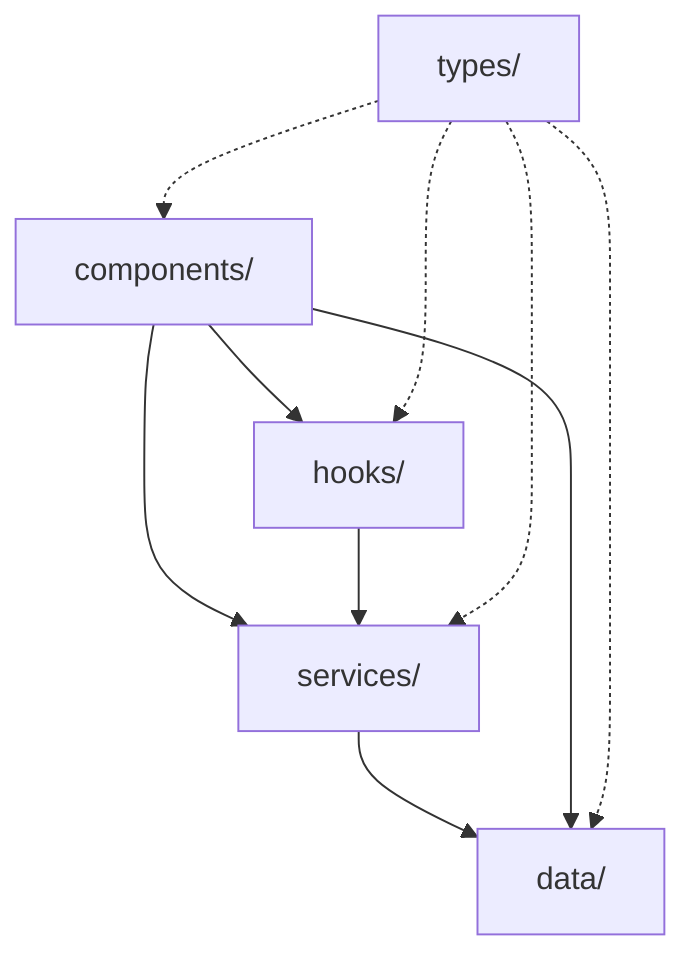
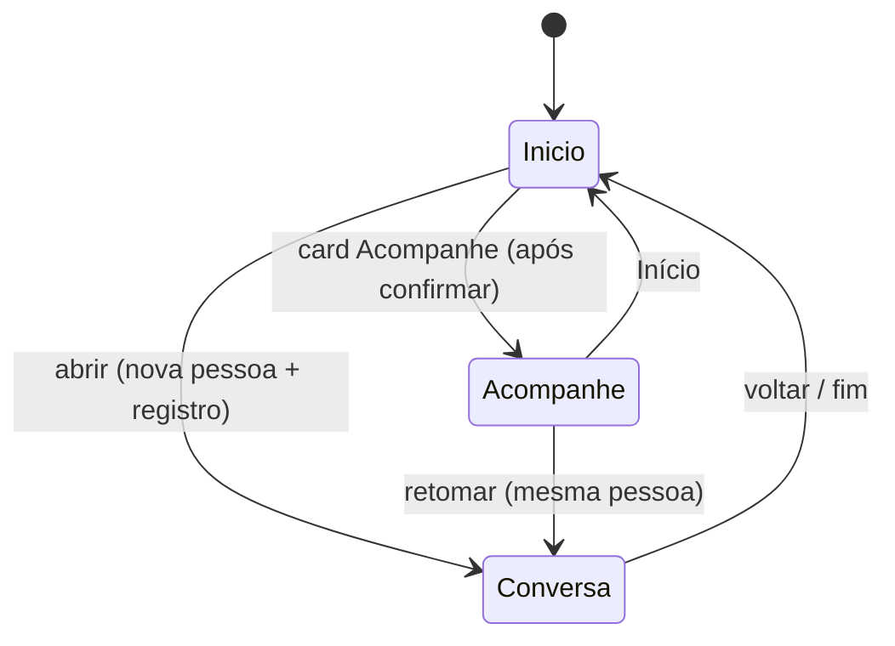

# Arquitetura do front i.agora

O front reproduz o protótipo `i-agora-codigo/i-agora-codigo/artifacts/i-agora-prototipo` (marcação, classes
CSS e textos iguais), reorganizado em camadas. Não há rotas de URL: `App.tsx` escolhe a tela pelo estado.

## Camadas e dependências

| Camada | Responsabilidade | Não pode |
| :--- | :--- | :--- |
| `types/` | Tipos do domínio (`Plan`, `Saved`, `Stage`, `Category`, `Message`, `Person`, `PersonRecord`) e de UI | Ter código |
| `data/` | Constantes: textos (`conversation.ts`), persona e nomes (`people.ts`), plano (`plan.ts`), navegação, rótulos | Ter lógica |
| `services/` | Regras puras: `planService` (cálculos, compromissos, frases), `personService` (pessoa calculada, saldo), `personRegistry` (registro de aberturas), `storageService` (localStorage + migração), `conversationService` (respostas ao texto livre), `exportCardService` (PNG 1080×1920) | Importar React |
| `hooks/` | Estado e efeitos: `usePlanConversation` (etapas, "digitando" de 650 ms), `useCardExport`, `useChatAutoScroll`, `useToast` | Desenhar |
| `components/` | Desenho e callbacks: `ui/`, `home/`, `chat/` (+ `stages/` um painel por etapa), `follow-up/`, `sheets/` | Guardar regra de negócio |

## Telas e transições

Etapas da conversa (`Stage`): `intro` → `invite` → `confirm` → `card` → `finish`. Cada etapa mostra um
bloco de ação em `components/chat/stages/StageActions.tsx`.

## Estado persistido

| Chave `localStorage` | Conteúdo | Dono |
| :--- | :--- | :--- |
| `i-agora-maria-janeiro-2026-v4` | `Saved` (pessoa, etapa, mensagens, rascunho, plano confirmado, índice da frase) | `storageService` |
| `i-agora-pessoas-v1` | `PersonRecord[]` — uma linha por abertura da conversa | `personRegistry` |

## Integração

Hoje não há `fetch`. O proxy do Vite já encaminha `/api/v1/context-agent` para `http://127.0.0.1:8000`.
Os pontos de troca estão em [integracao/pontos-de-conexao.md](integracao/pontos-de-conexao.md) e os
shapes em [integracao/contrato-api-i-agora.md](integracao/contrato-api-i-agora.md).
