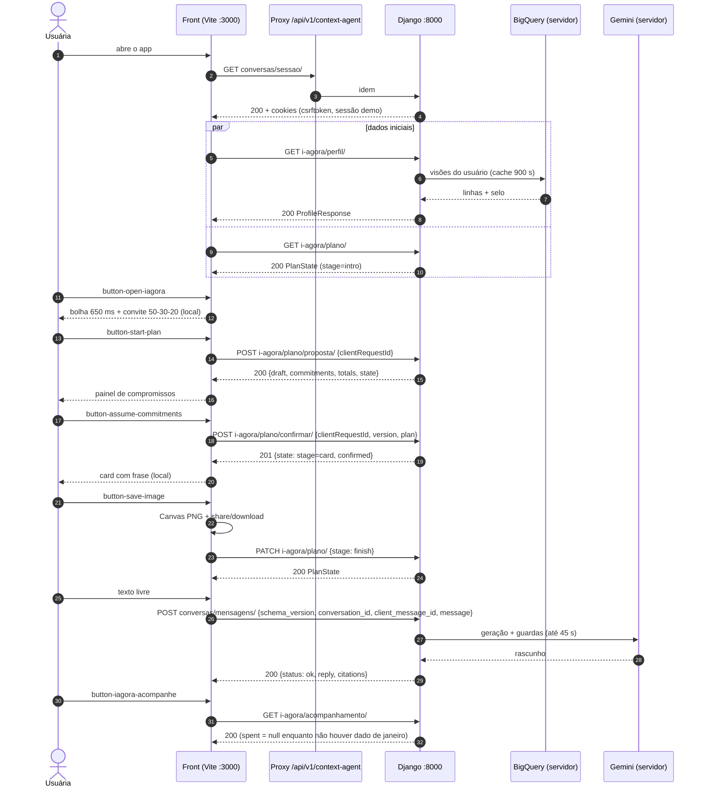

# Contrato de API — front i.agora ↔ backend Django

> Escrito em 2026-09-27 a partir da leitura do código e das docs listadas em §7 (Fontes). Nenhum endpoint foi chamado para produzir este documento: formas "existentes" vêm do código, não de uma medição HTTP. Onde as docs não definem uma regra, está escrito `NAO_DEFINIDO nas docs`. Tudo o que aparece em §3 é **proposta** até o dono aprovar.
>
> Convenções: `F:` = raiz deste repositório (o front vive em `src/` desde 2026-09-27; antes `frontend-agent-conversacional/`); `B:` = `backend-agente-conversacional/` (backend principal); `T2:` = `desafio-itau-batalha-de-agentes-time2/`.

> **Atualização 2026-09-27 12:31 BRT (front `c4a9ff3`).** Este documento é a proposta original; o estado real mudou:
> o front faz `fetch` por `F:src/services/backend.ts` contra **um só backend**, o Django de `Nova pasta/backend`
> (repo `batalha-agente-backend`, `84ead9b`) em `:8000`, onde as rotas `i-agora/*` de §3 já existem (`apps/i_agora`)
> e `conversas/*` correm no mesmo processo (não mais "processo separado", §2.5). Sequência: `POST perfil-usuario/definir/`
> `{"usuario": "<UUID>"}` → `GET conversas/sessao/?sessao_id=` → `X-Sessao-Id` em todo pedido → `i-agora/perfil/` →
> `i-agora/sessao/abertura/` → `conversas/mensagens/` → `i-agora/plano/`. Identidade só por UUID (índice → 400 desde
> 10:32); guard `F:src/services/idUsuario.test.ts`. Contrato vigente do lado do servidor:
> `backend/docs/contrato-api-frontend.md` §5.1–5.5. Validação: [../../validacao-front-back.md](../../validacao-front-back.md).

---

## 0. Resumo em cinco linhas

1. O front novo (`F:src/`) não faz nenhum `fetch`: todo dado e toda regra estão em `F:src/data/*.ts` e `F:src/services/*.ts`.
2. O backend já tem rotas reaproveitáveis: `primeira-chamada/`, `enviar-mensagem/`, `status-harness/`, `usuario-real/*` (B) e `conversas/sessao/` + `conversas/mensagens/` (só em T2, num **processo Django separado**).
3. **Não existe** no backend: persona "Maria", plano de janeiro, compromissos, confirmação, acompanhamento nem reset. Essas rotas estão em §3 como proposta.
4. Regras do estudo i.agora que existem no código: clusters por % de sobra (15%), segmentação T3 (Livre/Esbanjador/Vulnerável), diagnóstico "50/30/20" com limiares 53/33/10 e corte seguro 100% Nível 1 + 50% Nível 2. **Nenhuma delas produz os alvos do plano da Maria** (600→350, 450→250, 130, 200), que são `NAO_DEFINIDO nas docs`.
5. Conflitos a decidir: dinheiro como `number` (front) × `string`/Decimal (`T2:agent_backend`); envelope de erro `{erro}` (B) × `{status, reply}` (T2); `localStorage` (front) × "sem retenção em localStorage" (T2); identidade no corpo (`cliente_id`, B) × proibida no corpo (T2).

---

## 1. Mapa tela → dados

Legenda da coluna "Endpoint": **E** = existe hoje (§2); **P** = proposto (§3); **—** = continua local (não precisa de API).

### 1.1 Home "Meu Itaú" (`F:src/components/home/`)

| Parte da tela | Dado hoje (hardcoded) | Endpoint que deve fornecer |
| --- | --- | --- |
| Cabeçalho: nome, inicial, tipo de conta, saudação "Olá, Maria" | `CUSTOMER = {name:'Maria', initial:'M', account:'Conta pessoal'}` em `F:src/data/profile.ts:1`; usado em `F:src/components/home/HomeHeader.tsx:10` e `:17`, e no chat em `F:src/components/chat/ChatHeader.tsx:9` | **P** `GET i-agora/perfil/` → `customer`. A base real não tem nome nem gênero (`B:apps/context_agent_datadriven/services/usuario_real.py:6-7`); as 1.000 fichas sintéticas têm nome (`GET /api/v1/cliente/<id>/`, `B:apps/recomendacao/urls.py:34`), mas essa rota **não passa pelo proxy do Vite** (§5.1). Qual fonte identifica a "Maria": `NAO_DEFINIDO nas docs`. |
| Cartão de saldo: período "Dezembro/25", saldo −R$ 380,00, entradas R$ 5.000,00, saídas R$ 5.380,00 | `DECEMBER` (strings já formatadas) em `F:src/data/profile.ts:2`; `F:src/components/home/BalanceCard.tsx:6-8` | **P** `GET i-agora/perfil/` → `referencePeriod` com números (§3.2). Fonte candidata: `usuario-real/<ref>/` devolve `inflow_mensal`/`outflow_mensal`/`surplus_mensal` como **médias mensais jan–nov/2025** (`B:.../usuario_real.py:198-211`; janela em `B:docs/estudo-i-agora/t3-e-resposta.md:23`), **não o mês de dezembro**. Visão "saldo de dezembro" por usuário: não encontrada no código. |
| Olho "ocultar saldo" | estado React `hidden` (`F:src/App.tsx:22`), máscara `HIDDEN_VALUE` em `F:src/data/profile.ts:4` | — (preferência de UI) |
| Atalhos (Pix, Pagar, Cartão virtual, Planejar janeiro) | `SHORTCUTS` em `F:src/data/navigation.ts:6-11`; `F:src/components/home/ShortcutGrid.tsx:8` | — Só "Planejar" abre o chat (`F:src/App.tsx:43`); os outros abrem sheet "não conectada" (`F:src/components/sheets/PlanSheet.tsx:24-27`). Não há API bancária de Pix/pagamentos no backend. |
| Barra inferior (Início, Extrato, Pagamentos, Pra você, Menu) | `NAV_ITEMS` em `F:src/data/navigation.ts:5`; `F:src/components/home/BottomNav.tsx:5` | — Idem (sheet informativa, `F:src/App.tsx:42`). |
| Cartão "Acompanhe" (só com plano confirmado) | `hasPlan = !!saved.confirmed` (`F:src/App.tsx:49`), vindo do `localStorage` | **P** `GET i-agora/plano/` → `confirmed != null`. |
| Aviso "Um espaço para planejar" | texto fixo em `F:src/components/home/PlanNotice.tsx:4` | — |
| Sininho (toast de avisos) | `TOAST.notices` em `F:src/data/conversation.ts:18`, disparado em `F:src/App.tsx:51` | — (o texto diz "salvo neste navegador"; mudar se a persistência for para o servidor, §4.9). |
| "Recomeçar planejamento" | abre sheet `reset` (`F:src/components/home/HomeScreen.tsx:27`) | ver §1.4 (reset). |

### 1.2 Chat i.ai / i.agora (`F:src/components/chat/`, `F:src/hooks/usePlanConversation.ts`)

| Parte | Dado hoje | Endpoint |
| --- | --- | --- |
| Saudação inicial "Que bom ter você aqui, Maria!" | `INTRO` em `F:src/data/plan.ts:4`; mensagem fixa `id:'intro'` em `F:src/data/plan.ts:6`; render `F:src/components/chat/IntroBlock.tsx:7` | Nome vem de **P** `perfil/`. Texto: — (ou **P** `roteiro/`, opcional). |
| Carrossel de introdução (2 cards) | `INTRO_CARDS` em `F:src/data/conversation.ts:25-28`; `F:src/components/chat/IntroCarousel.tsx` | — (conteúdo editorial). Opcional **P** `roteiro/`. |
| Convite 50-30-20 (`stage='invite'`) | `INVITE_MESSAGE` em `F:src/data/conversation.ts:4`; disparado em `F:src/hooks/usePlanConversation.ts:25` | Texto: —. O texto promete "projetar quanto tempo pode levar" — **não existe** cálculo de prazo no backend (`NAO_DEFINIDO nas docs`). O diagnóstico 50/30/20 existe com outros limiares (§3.8). |
| Painel de compromissos (`stage='confirm'`): lista de compromissos | `DEFAULT_PLAN = {income:5000, expenses:5380, deliveryCurrent:600, deliveryTarget:350, shoppingCurrent:450, shoppingTarget:250, otherCut:130, reserveTarget:200, selected:[]}` em `F:src/data/plan.ts:5`; seleção inicial forçada `['delivery']` em `F:src/hooks/usePlanConversation.ts:27`; texto por categoria `commitmentText` em `F:src/services/planService.ts:27-34`; rótulos `LABELS` em `F:src/data/plan.ts:9-12` | **P** `POST i-agora/plano/proposta/` → `draft: Plan` + `commitments[]` + `totals`. Os valores atuais/alvo por categoria são `NAO_DEFINIDO nas docs`. |
| Métrica-resumo ("R$ X em gastos planejados a menos; R$ Y … reserva") | `calculations()` em `F:src/services/planService.ts:15-25`, usado em `F:src/components/chat/stages/CommitmentsPanel.tsx:10-14` | **P** `plano/proposta/` → `totals: PlanTotals` (servidor é a fonte; o front pode recalcular só para exibir, §3.4). |
| "Assumir meus compromissos" | copia `draft` para `confirmed` em `F:src/hooks/usePlanConversation.ts:30-33` | **P** `POST i-agora/plano/confirmar/` (idempotente, §5.5). |
| "Ajustar valores" | resposta fixa `BOT.adjust` em `F:src/data/conversation.ts:10`, `F:src/hooks/usePlanConversation.ts:34` | Hoje não ajusta nada. Endpoint de edição: `NAO_DEFINIDO nas docs` (§3.9, opcional). |
| Texto livre (composer) | `replyTo()` por palavra-chave (`saldo`, `ajust`/`valor`, `humano`/`atendimento`) em `F:src/services/conversationService.ts:7-13`; textos em `F:src/data/conversation.ts:10-14` | **E** `POST conversas/mensagens/` (T2) ou **E** `POST enviar-mensagem/` (B). Ver §2 e §4.7. |
| Card: frase e prévia (`stage='card'`) | `PHRASES`/`PHRASE_PRIORITY` em `F:src/data/plan.ts:8,13-18`; `phraseFor()` em `F:src/services/planService.ts:38-42`; período `PLAN_PERIOD='JANEIRO / 2026'` em `F:src/data/profile.ts:3`; prévia `F:src/components/chat/SharePreview.tsx:7-9` | — O card, por desenho, "não mostra seu saldo, sua renda nem os valores do plano" (`F:src/components/chat/stages/CardPanel.tsx:10`). Frases continuam locais; o backend não tem catálogo de frases. `phraseIndex` pode ir ao servidor via **P** `PATCH plano/`. |
| Salvar/baixar PNG | Canvas no navegador, `F:src/services/exportCardService.ts:23-61`; hook `F:src/hooks/useCardExport.ts:9-18` | — (nenhuma imagem sobe ao servidor). Ao concluir, `finish()` (`F:src/hooks/usePlanConversation.ts:35`) → **P** `PATCH plano/ {stage:'finish'}`. |
| Finalização (`stage='finish'`) | `BOT.finish` em `F:src/data/conversation.ts:9`; painel `F:src/components/chat/stages/FinishPanel.tsx:7` | — texto; estado via **P** `PATCH plano/`. |

### 1.3 Acompanhe (`F:src/components/follow-up/`)

| Parte | Dado hoje | Endpoint |
| --- | --- | --- |
| Cabeçalho "Janeiro / 2026", "Acompanhe seu janeiro" | literais em `F:src/components/follow-up/FollowUpScreen.tsx:24,27,35` (não usam `PLAN_PERIOD`) | **P** `perfil/` → `planPeriod.label`. |
| Lista de compromissos + contagem | `selectedCategories(plan)` sobre `saved.confirmed` (`F:src/components/follow-up/FollowUpScreen.tsx:13-14,36-40`); detalhe `commitmentText` em `F:src/components/follow-up/FollowUpItem.tsx:15` | **P** `GET i-agora/plano/` → `confirmed`, `commitments[]`. |
| Bloco "Seu plano, em evolução" / "As atualizações … aparecerão aqui" | textos fixos em `F:src/components/follow-up/FollowUpProgress.tsx:9-10`; **não há progresso real** | **P** `GET i-agora/acompanhamento/`. O que é "progresso" (gasto realizado em janeiro por categoria) é `NAO_DEFINIDO nas docs`; a base BigQuery tem janela até dez/2025 (`B:desafio_itau/settings.py:108`). |
| Botão "falar com i.ai" | abre chat (`F:src/components/follow-up/FollowUpCompanion.tsx:7`) | — |

### 1.4 Sheets, toast e reset

| Parte | Dado hoje | Endpoint |
| --- | --- | --- |
| Sheet "Meus compromissos financeiros" | `confirmed`, `DECEMBER.balance`, `calculations(confirmed)` em `F:src/components/sheets/PlanSheet.tsx:29-32` | **P** `GET plano/` + **P** `perfil/`. |
| Sheet "Recomeçar?" | `F:src/components/sheets/PlanSheet.tsx:19-23` | **P** `DELETE i-agora/plano/`. |
| Reset (limpa estado + `localStorage`) | `F:src/hooks/usePlanConversation.ts:39-44`; `F:src/App.tsx:27-38`; chave `STORAGE_KEY='i-agora-maria-janeiro-2026-v4'` em `F:src/data/plan.ts:3`; migração de versões antigas em `F:src/services/storageService.ts:10-34` | **P** `DELETE i-agora/plano/`, depois limpa a chave local. |
| Toasts | `TOAST` em `F:src/data/conversation.ts:17-24`; `F:src/components/ui/Toast.tsx:3` | — Novos textos de erro propostos em §4. |

---

## 2. Endpoints existentes reaproveitáveis

Todas as rotas de `apps.context_agent_datadriven` respondem em `/context-agent/` **e** `/api/v1/context-agent/` (`B:desafio_itau/urls.py:22-23`). As rotas de `apps.recomendacao` respondem em `/app/` e `/api/v1/` (`B:desafio_itau/urls.py:16-19`), mas o proxy do Vite só encaminha `/api/v1/context-agent` (`F:vite.config.ts:16-18`).

### 2.1 `GET /api/v1/context-agent/status-harness/[?validar=1]` — B

- Código: `B:apps/context_agent_datadriven/views.py:29-64`; rota `B:apps/context_agent_datadriven/urls.py:15`.
- Resposta 200: `{app, arquitetura, base_de_rotas{...}, agente_distribuidor{...}, llm_models_provedores{pastas_registradas, secret_gsconsole{status,...}}, pastas_raiz{...}}`. `status` da chave: `AUSENTE`/`CONFIGURADA` sem rede; com `?validar=1`, `VALIDADA`/`INVALIDA`/`NAO_MEDIDO` (`B:docs/architecture.md:127-130`). Não mede cota.
- Uso no front novo: **health-check opcional** antes de ligar a conversa com LLM (ex.: esconder o selo "resposta gerada por IA" se `AUSENTE`).

### 2.2 `POST /api/v1/context-agent/primeira-chamada/` — B

- Código: `B:apps/context_agent_datadriven/views.py:191-208`; contrato `B:docs/inteirações-cloud/27-09-2026/padrao-envio.json` / `padrao-retorno.json`.
- Envio: `{"texto_inicial": string}` — **exatamente** essa chave (`views.py:196`), 1–2.000 caracteres após `strip` (`views.py:199-203`).
- 200: `{sucesso: true, modelo, resposta, tempo_resposta_ms}` (`views.py:208`; `F:docs/architecture.md:54`).
- 400: `{erro, tempo_resposta_ms}` (corpo inválido/vazio/>2.000). 503: `{erro, tempo_resposta_ms}` (chave/provedor).
- Sem histórico nem dados do cliente. A doc T2 recomenda **não** restaurar a primeira-chamada no novo front (`T2:docs/i-agora.md:53`). Uso: nenhum no fluxo i.agora; só diagnóstico.

### 2.3 `POST /api/v1/context-agent/enviar-mensagem/` — B

- Código: `B:apps/context_agent_datadriven/views.py:66-120`; validação `:127-179`; contrato `B:docs/inteirações-cloud/27-09-2026/enviar-mensagem/`.
- Envio: `{mensagem: string (obrigatório), cliente_id?: int (padrão 42), cliente_nome?: string (padrão "Cliente Itaú"), score?: number, indice_corte?: string, segmento?: string, contexto?: {nome?, score?, indice_corte?, segmento?}}` (`views.py:135-176`).
- 200: `{sessao_id, cliente_id, mensagem_enviada, resposta_agente, origem_resposta:"modelo", categoria_negociada, protocolo_negociacao, temporalidade, eval_harness, sucesso:true, tempo_resposta_ms}` (`views.py:102-114`).
- 503 quando nenhum modelo respondeu: mesmo corpo com `sucesso:false`, `origem_resposta:"contingencia"`, `resposta_agente` = texto local rotulado, e `erro` (`views.py:115-119`).
- 400: `{erro, tempo_resposta_ms}` (`views.py:77-79`).
- Limites conhecidos: sessão por `cliente_id` com `get_or_create` (`views.py:86-95`); envia as **8 primeiras** mensagens do histórico, não as últimas; não valida `cliente_id` em 1..1000 (`F:handoff-2026-09-27T0418.local.md:44-45`). Não conhece o plano de janeiro.

### 2.4 `usuario-real/*` (BigQuery, ADC) — B

Rotas em `B:apps/context_agent_datadriven/urls.py:20-24`; views em `B:apps/context_agent_datadriven/views_usuario_real.py`. Erros comuns (`views_usuario_real.py:25-39`): 400 `{erro}` referência/data inválida · 404 `{erro}` usuário inexistente · 422 `{erro}` tópico/categoria/pergunta fora do catálogo · 503 `{erro, estado:"OFF"}` fonte desligada ou `{erro, estado:"NAO_MEDIDO"}` BigQuery indisponível. Todos com `tempo_resposta_ms`. O doc de contrato citado no código (`docs/contrato-api-frontend.md`) **não foi encontrado** em nenhum dos dois backends.

| Método e rota | Resposta 200 (código) |
| --- | --- |
| `GET usuario-real/status/[?validar=1]` | `{fonte, estado:"ON"/"OFF", projeto, tabela, data_corte_padrao:"2025-12-22", cache_segundos, topicos{}, categorias[], conexao:"NAO_MEDIDO"/"VALIDADA"/"FALHOU", total_usuarios?, selo?}` (`B:.../services/usuario_real.py:256-275`) |
| `GET usuario-real/?limite=20&offset=0` | `{total, limite, offset, usuarios:[{indice, id_usuario, movimentos, meses, primeiro_anomes, ultimo_anomes}], selo}` (`views_usuario_real.py:50-63`; SQL `usuario_real.py:28-39`) |
| `GET usuario-real/<ref>/[?data_corte=AAAA-MM-DD]` | `{usuario, data_corte, janela, resumo{segmento_t3, inflow_mensal, outflow_mensal, surplus_mensal, taxa_surplus_pct, meses_na_janela, saidas_sem_grupo, perfil_de_resposta{tom,foco}}, visoes{perfil_t3,renda,dividas,recorrencias,discricionario}, sql_sha256{}, selo}` (`usuario_real.py:214-233`) |
| `GET usuario-real/<ref>/visao/<topico>/[?categoria=Delivery]` | `{usuario, data_corte, topico, parametros, linha, sql_sha256, selo}` (`usuario_real.py:236-246`) |
| `POST usuario-real/<ref>/pergunta/` `{pergunta, data_corte?}` | `{pergunta, categoria, ...visão}` — roteia por palavra-chave, **sem LLM** (`usuario_real.py:249-253`; `views_usuario_real.py:81-90`) |

`<ref>` = índice 1..N na lista ordenada por `id_usuario` ou o UUID; **não é** o `cliente_id` sintético (`usuario_real.py:4-7`). `selo` = `{fonte, natureza_da_base:"sintetica", autenticacao:"ADC", medido_em, jobs, bytes_processados, tempo_consulta_ms, cache}` (`usuario_real.py:113-123`). Uso: fonte **servidor-a-servidor** para `perfil/` e `plano/proposta/` (§3); o front não deve chamar BigQuery direto (custo e latência: uma visão mede ~33 MB, `B:docs/estudo-i-agora/t3-e-resposta.md:114`).

### 2.5 `GET conversas/sessao/` e `POST conversas/mensagens/` — só T2, processo separado

- Rotas: `T2:agent_backend/conversation/urls.py:4`, montadas em `/api/v1/context-agent/conversas/` por `T2:agent_backend/harness/urls.py:4`. **Não** estão em `desafio_itau/urls.py`; os dois processos usam a porta 8000 e o mesmo prefixo (`T2:docs/estrutura.md:12-17`). Integrar num processo só: passos em `T2:docs/i-agora.md:35-42`.
- `GET sessao/` (`T2:agent_backend/conversation/http.py:74-90`): define cookie CSRF e, em modo demo **só de 127.0.0.1**, o cookie `i_agora_demo_session` (HttpOnly, SameSite Strict, 30 min). Corpo: envelope abaixo + `mode`.
- `POST mensagens/` (`http.py:93-105`), `Content-Type: application/json`, ≤ 16 KB, header `X-CSRFToken`. Envio estrito, extras rejeitados (`T2:agent_backend/conversation/schemas.py:10-14`):
  `{"schema_version":"1.0","conversation_id":null|string(≤64),"client_message_id":"^[a-zA-Z0-9_-]{1,80}$","message":string(1..2000)}`. `customer_id`, score, gênero, prompt são rejeitados (`T2:docs/i-agora.md:13`).
- Resposta (sucesso e erro): `{schema_version, conversation_id, message_id, request_id, status:"ok"|"needs_clarification"|"safe_redirect"|"unavailable", reply, citations:[{id,url,excerpt,limitations,status}]}` (`T2:agent_backend/conversation/service.py:43-58`), headers `Cache-Control: no-store` (`http.py:32-37`).
- HTTP: 400 protocolo · 401 autenticação/consentimento · 403 CSRF · 404 conversa inexistente/alheia · 409 `client_message_id` reutilizado com outro corpo · 429 limite · 503 dependência; recusa segura = 200 `safe_redirect` (`T2:docs/i-agora.md:17`). Textos de fallback em `service.py:19-29`.
- Limites: timeout total 45 s, SDK 15 s, **UI 50 s**; reenvio manual conserva corpo e ID (`T2:docs/i-agora.md:23`). Store em memória, TTL 30 min, 20 turnos/conversa, 6 turnos/min (`i-agora.md:25`). Modo padrão `demo` devolve resposta fixa (`T2:agent_backend/harness/settings.py:19`; `service.py:28`).
- Uso: **caminho recomendado para o texto livre** (§4.7), por ser o contrato que a doc T2 manda o front adotar (`T2:docs/i-agora.md:53`).

### 2.6 Rotas fora do proxy (referência)

`GET /api/v1/cliente/<id>/`, `cliente/random/`, `chat/variavel-1/<id>/`, `comunicacao/e-agora/<id>/`, `contexto-score/<id>/`, `planilha-fixa/`, `GET|POST chave-interacao-tela-iai/` (`B:apps/recomendacao/urls.py:30-49`; tabela em `B:docs/architecture.md:23-40`). Servem a demo antiga (Telas 1-3) e não correspondem a nenhuma tela do i.agora. Para usar qualquer uma, o proxy teria de encaminhar `/api/v1/` inteiro.

---

## 3. Endpoints que faltam (proposta)

Prefixo: `/api/v1/context-agent/i-agora/`. Nome de campo em **camelCase inglês** para casar 1:1 com `F:src/types/plan.ts`; isso **conflita** com o padrão snake_case pt-BR das rotas existentes (§6, decisão D4).

### 3.1 Tipos compartilhados (TypeScript)

```ts
// Reaproveita F:src/types/plan.ts sem mudar nada lá.
import type { Category, Message, Plan, PlanTotals, Saved, Stage } from '../types/plan';

/** Reais (BRL) como number com no máximo 2 casas. Ver conflito em §6 D1. */
export type Money = number;

export interface Seal {                       // selo "valor · fonte · data"
  source: string;                             // ex.: 'batalha-time-02-lxof.hackathon_dados.extrato_sintetico' ou 'FIXO_DEMO'
  nature: 'sintetica' | 'fixa_demo' | 'real';
  measuredAt: string;                         // ISO 8601 com fuso BRT
  cache: boolean;
}

export interface ApiError {                   // envelope de B (views_usuario_real.py:25-39)
  erro: string;
  tempo_resposta_ms: number;
  estado?: 'OFF' | 'NAO_MEDIDO';
  codigo?: 'schema' | 'auth' | 'not_found' | 'conflict' | 'limit' | 'stale' | 'technical';
}

export interface Customer { name: string; initial: string; account: string }

export interface ReferencePeriod {            // hoje DECEMBER em F:src/data/profile.ts:2
  label: string;                              // 'Dezembro/25'
  anomes: number;                             // 202512
  income: Money; expenses: Money; balance: Money;   // 5000.00 / 5380.00 / -380.00
  seal: Seal;
}

export interface PlanPeriod { label: string; anomes: number }   // 'JANEIRO / 2026', 202601

export interface Commitment { category: Category; label: string; text: string }

export interface PlanState {                  // espelho servidor de Saved
  planId: string | null;
  version: number;                            // controle de concorrência otimista
  stage: Stage;
  draft: Plan;
  confirmed: Plan | null;
  confirmedAt: string | null;
  phraseIndex: number;
  commitments: Commitment[];                  // de confirmed ?? draft
  totals: PlanTotals;                         // de confirmed ?? draft
}
```

### 3.2 `GET i-agora/perfil/`

- **Propósito:** cabeçalho da Home, cartão de saldo, nome no chat, período do plano.
- **Pedido:** sem corpo; identidade pela sessão (§5.3). Nada de `cliente_id` no corpo nem na URL no desenho alvo.
- **200:**
  ```ts
  export interface ProfileResponse {
    customer: Customer;                       // {name:'Maria', initial:'M', account:'Conta pessoal'}
    referencePeriod: ReferencePeriod;
    planPeriod: PlanPeriod;
    segmentT3: 'Vulnerável' | 'Esbanjador' | 'Livre' | null;   // t3.py:22-25; null = não medido
    tempo_resposta_ms: number;
  }
  ```
- **Erros:** 401 sem sessão · 404 usuário sem dados · 503 `{estado:'NAO_MEDIDO'}` fonte indisponível · 503 `{estado:'OFF'}` fonte desligada.
- **Regra:** `balance = income − expenses` (igual a `initial` em `F:src/services/planService.ts:20`). De onde vêm os R$ 5.000/5.380 da Maria: `NAO_DEFINIDO nas docs` (§6 D2).

### 3.3 `GET i-agora/plano/`

- **Propósito:** reidratar `Saved` ao abrir o app (substitui/valida `safeLoad`, `F:src/services/storageService.ts:10-34`), o cartão "Acompanhe" e a sheet do plano.
- **200:** `PlanState` + `tempo_resposta_ms`. Sem plano: `stage:'intro'`, `planId:null`, `confirmed:null`, `draft` = rascunho padrão.
- **Erros:** 401 · 503.
- **Mensagens do chat:** ficam fora de `PlanState`. Se o dono quiser o histórico no servidor, ele pertence a `conversas/` (T2), não a esta rota.

### 3.4 `POST i-agora/plano/proposta/`

- **Propósito:** gerar o rascunho da etapa `confirm` ("Topo o desafio").
- **Pedido:** `{ "clientRequestId": "prop-<uuid>" }` (mesmo padrão `^[a-zA-Z0-9_-]{1,80}$` de `T2:.../schemas.py:13`).
- **200:**
  ```ts
  export interface ProposalResponse {
    draft: Plan;                              // selected pré-marcado: hoje ['delivery'] (usePlanConversation.ts:27)
    commitments: Commitment[];
    totals: PlanTotals;
    basis: { rule: string; seal: Seal };      // qual regra gerou os alvos; 'FIXO_DEMO' enquanto não houver regra
    state: PlanState;                         // stage='confirm'
    tempo_resposta_ms: number;
  }
  ```
- **Erros:** 401 · 409 `codigo:'conflict'` (já há plano confirmado; o front mostra o plano) · 422 dados insuficientes para propor · 503.
- **Cálculo dos totais** (fonte de verdade no servidor, mesma fórmula de `F:src/services/planService.ts:15-25`, que o front já usa):
  - `deliveryCut = selected∋delivery ? max(0, deliveryCurrent − deliveryTarget) : 0`
  - `shoppingCut = selected∋shopping ? max(0, shoppingCurrent − shoppingTarget) : 0`
  - `otherCut = selected∋other ? otherCut : 0`
  - `released = deliveryCut + shoppingCut + otherCut`; `initial = income − expenses`; `available = initial + released`
  - `reserve = selected∋reserve ? reserveTarget : 0`; `after = available − reserve`; tudo arredondado a 2 casas.
- **Alvos por categoria** (`deliveryCurrent/Target`, `shoppingCurrent/Target`, `otherCut`, `reserveTarget`): `NAO_DEFINIDO nas docs`. O que existe e poderia servir de base, **se o dono decidir**:
  - Corte seguro: 100% do Nível 1 + 50% do Nível 2 (`B:.../estudos/i_agora/consultas.py:208-210`), com classificação por palavra-chave (`consultas.py:198-205`). Aviso: usa a taxonomia antiga (Casa/Essencial, Flexivel/Delivery…) que a base real não tem (`consultas.py:62-64`).
  - T3: o Esbanjador é quem volta a Livre cortando só o discricionário (`B:.../estudos/i_agora/t3.py:14-17,92-104`; `B:docs/estudo-i-agora/t3-e-resposta.md:17-21`). Delivery e Restaurantes são `discricionario` (`t3.py:35-57`).
  - Mapeamento categoria do front → macro da base: `delivery` ("Delivery e refeições fora") → `Delivery` + `Restaurantes`? `shopping` ("Compras por impulso") → `Lojas e sites`? `other` → resto do discricionário? `reserve` → sem macro. **Tudo isto é `NAO_DEFINIDO nas docs`.**

### 3.5 `POST i-agora/plano/confirmar/`

- **Propósito:** "Assumir meus compromissos" — grava `confirmed` (hoje só local, `F:src/hooks/usePlanConversation.ts:30-33`).
- **Pedido:**
  ```ts
  export interface ConfirmRequest {
    clientRequestId: string;                  // chave de idempotência, gerada 1x por clique e reusada nos reenvios
    version: number;                          // PlanState.version lido
    plan: Plan;                               // o draft mostrado; selected com ≥1 categoria
  }
  ```
- **200 / 201:** `{ state: PlanState /* stage:'card', confirmed != null */, replayed: boolean, tempo_resposta_ms }`. `replayed:true` quando o mesmo `clientRequestId` + mesmo corpo chega de novo (devolve a resposta guardada, sem gravar outra vez).
- **Erros:** 400 corpo inválido (valor negativo, `selected` vazio, >2 casas decimais) · 401 · 409 `codigo:'conflict'` mesmo `clientRequestId` com corpo diferente (padrão T2, `T2:docs/i-agora.md:17,23`) · 409 `codigo:'stale'` `version` desatualizada (devolve `state` atual) · 422 plano diverge da proposta e o servidor não aceita edição (enquanto §3.9 não existir) · 503.

### 3.6 `PATCH i-agora/plano/`

- **Propósito:** registrar avanço sem regra de negócio: `stage` (`card`→`finish` após salvar a imagem, `F:src/hooks/usePlanConversation.ts:35`; `showCard`, `:37`) e `phraseIndex` ("Gerar outra frase", `:36`).
- **Pedido:** `{ version: number, stage?: 'card'|'finish', phraseIndex?: number }`.
- **200:** `{ state: PlanState, tempo_resposta_ms }`. **Erros:** 400 · 401 · 409 `stale` · 422 transição inválida (ex.: `finish` sem `confirmed`).
- Pode ser "melhor esforço" (§4): falha não bloqueia a UI.

### 3.7 `DELETE i-agora/plano/`

- **Propósito:** "Recomeçar planejamento" (`F:src/App.tsx:27-38`).
- **Pedido:** sem corpo; header `If-Match: <version>` opcional.
- **200:** `{ state: PlanState /* stage:'intro' */, tempo_resposta_ms }`. Idempotente: apagar o que não existe também dá 200.
- **Erros:** 401 · 503. Se houver conversa em `conversas/`, o front descarta o `conversation_id` local (T2 pede reset do controller na troca de identidade, `T2:docs/i-agora.md:42`).
- **Perfil de dezembro não muda** (o saldo é histórico, `F:i-agora-codigo/i-agora-codigo/replit.md:26`).

### 3.8 `GET i-agora/acompanhamento/`

- **Propósito:** preencher "Seu plano, em evolução" (`F:src/components/follow-up/FollowUpProgress.tsx:9-10`).
- **200 (forma proposta):**
  ```ts
  export interface FollowUpResponse {
    planPeriod: PlanPeriod;
    items: Array<{ category: Category; label: string; text: string;
                   target: Money; spent: Money | null;   // null = NAO_MEDIDO, nunca 0
                   status: 'no_ritmo' | 'atencao' | 'acima' | 'NAO_MEDIDO' }>;
    updatedAt: string | null;
    seal: Seal | null;
    tempo_resposta_ms: number;
  }
  ```
- **Erros:** 401 · 404 sem plano confirmado · 503.
- **Regras de status e fonte do gasto de janeiro:** `NAO_DEFINIDO nas docs`. A base disponível termina em dez/2025 (`B:desafio_itau/settings.py:108`), então hoje `spent` seria sempre `null` e a tela deve continuar com o texto atual.

**Diagnóstico 50/30/20 (convite).** Existe `diagnostico_50_30_20(pct_fixo, pct_variavel, pct_investimento)` com limiares **53 / 33 / 10** e saídas "Alerta Fixo", "Oportunidade Variável", "Construção de Futuro", "Perfil Equilibrado" (`B:.../estudos/i_agora/consultas.py:213-221`). A doc avisa que o texto fala em "poupança abaixo de 20%" mas o código usa 10% (`B:docs/estudo-i-agora/consultas.md:86-89`). O mapeamento dos grupos T3 (essencial / compromisso / discricionário / não classificado) para fixo/variável/investimento é `NAO_DEFINIDO nas docs`. Enquanto isso, o convite continua com o texto local e **sem números**.

**Clusters do estudo** (para referência; não usados pelo front): Endividado (saldo < 0), Vulnerável (sobra < 15%), Saudável (≥ 15%) (`consultas.py:26-30,122-128`); produto por cluster em `consultas.py:39-43` (taxas digitadas no notebook, não vieram de RAG). T3 e tom de resposta por segmento: `t3.py:109-134`; `t3-e-resposta.md:83-95`.

### 3.9 Opcionais

- `PATCH i-agora/plano/rascunho/` para "Ajustar valores": `NAO_DEFINIDO nas docs` (hoje o bot diz que não ajusta, `F:src/data/conversation.ts:10`). Se existir, usa o mesmo `version` e responde `ProposalResponse`.
- `GET i-agora/roteiro/`: textos (`INTRO`, `INTRO_CARDS`, `INVITE_MESSAGE`, `BOT`, `PHRASES`) para editar sem deploy do front. Prioridade baixa; o front mantém os textos atuais como fallback.

### 3.10 `POST i-agora/sessao/abertura/` — uma pessoa por abertura (acrescentado depois da 1ª versão)

Comportamento já implementado no front (2026-09-27): cada abertura da conversa **a partir do início** calcula a próxima pessoa da sequência e grava um registro; retomar não cria pessoa. Hoje é local: `F:src/services/personService.ts` (`calculatePerson`, valores sintéticos, `NAO_DEFINIDO nas docs`) e `F:src/services/personRegistry.ts` (`localStorage["i-agora-pessoas-v1"]`). Tipos em `F:src/types/plan.ts` (`Person`, `PersonRecord`).

Request:
```json
{ "origem": "fab" | "cabecalho" | "conferir" | "planejar" | "folha" }
```
Response 201:
```json
{
  "abertura_id": "uuid",
  "aberto_em": "2026-09-27T05:30:00-03:00",
  "person": { "id": 1, "nome": "Alexandre Pereira", "primeiroNome": "Alexandre", "genero": "M",
              "plan": { "income": 4600, "expenses": 4740, "deliveryCurrent": 550, "deliveryTarget": 320,
                        "shoppingCurrent": 410, "shoppingTarget": 230, "otherCut": 120, "reserveTarget": 180, "selected": [] } }
}
```
Erros: 503 (fonte de clientes indisponível → o front usa `calculatePerson` local e avisa no toast), 429 (limite de aberturas). Quem escolhe a próxima pessoa (sequência, sorteio ou cliente real) é a decisão **D12**.

---

## 4. Comportamento e reação por etapa

Regras comuns:

- **Carregando:** a bolha "digitando" (`typing`, `F:src/hooks/usePlanConversation.ts:21-22`) fica visível **do envio até a resposta**, com mínimo de `TYPING_DELAY = 650 ms` (`F:src/data/conversation.ts:3`), para manter o ritmo atual quando o servidor responde rápido.
- **Botões** do painel ficam `disabled` enquanto houver chamada em voo (evita duplo clique; a idempotência de §5.5 cobre o resto).
- **Timeout** das rotas de plano: `NAO_DEFINIDO nas docs`; proposta 10 s (`AbortController`). Texto livre: 50 s, valor da doc T2 para a UI (`T2:docs/i-agora.md:23`).
- **Fallback:** em erro de rede/timeout/5xx nas etapas roteirizadas, o front usa o texto local atual e o toast indicado. Nunca inventa número: se `perfil/` falhar, o saldo mostra "Não foi possível carregar" em vez de −R$ 380,00 (instrumento que não mediu diz que não mediu).
- **Persistência:** a chave `i-agora-maria-janeiro-2026-v4` (`F:src/data/plan.ts:3`) passa a ser **cache** do servidor; a verdade é `PlanState`. Conflito com "sem retenção em localStorage" do T2 (`T2:docs/i-agora.md:25`) → §6 D5.

| Etapa | Gatilho na UI (`data-testid`) | Chamada | Carregando | Sucesso | Erro / timeout | Persistência |
| --- | --- | --- | --- | --- | --- | --- |
| Abertura do app | montagem de `App` | `GET perfil/` e `GET plano/` em paralelo (+ `GET conversas/sessao/` se T2 integrado) | skeleton no saldo e nome | preenche Home; `confirmed` liga o cartão Acompanhe | usa cache local se existir; senão saldo "indisponível" e nome genérico; toast: "Não foi possível atualizar seus dados. Mostrando a última versão salva." | cache local ← servidor |
| intro → invite | `button-open-iagora` (`AgoraTrigger.tsx:5`) | nenhuma (texto roteirizado) | bolha 650 ms | `INVITE_MESSAGE`, `stage='invite'` | — | local (e `PATCH` opcional) |
| invite → confirm | `button-start-plan` (`StageActions.tsx:19`) | `POST plano/proposta/` | bolha até resposta (≥650 ms) | mensagem do usuário "Topo o desafio", `BOT.confirm`, painel com `draft`, `commitments`, `totals` do servidor | 409 `conflict`: vai para `stage` do servidor. Outros: `DEFAULT_PLAN` local **rotulado "estimativa de exemplo"**; toast: "Não consegui buscar sua proposta agora. Mostrando um exemplo." | servidor (`stage='confirm'`) + cache |
| confirm → card | `button-assume-commitments` (`CommitmentsPanel.tsx:16`) | `POST plano/confirmar/` com `clientRequestId` fixo por tentativa | bolha; botão desabilitado | `confirmed` do servidor, `BOT.card`, painel do card | 409 `stale`: recarrega `state` e mostra painel de novo; toast "Seu plano mudou em outro lugar. Confira antes de confirmar." Rede/5xx/timeout: **não** avança; toast "Não foi possível registrar seus compromissos. Tente novamente." e o botão reenvia com o **mesmo** `clientRequestId` | **servidor obrigatório** (não confirmar só local) |
| confirm (ajustar) | `button-adjust-values` (`CommitmentsPanel.tsx:17`) | nenhuma hoje (§3.9) | bolha 650 ms | `BOT.adjust` | — | local |
| card | `button-change-phrase` (`CardPanel.tsx:14`) | `PATCH plano/ {phraseIndex}` (melhor esforço) | nenhum (troca imediata) | nova frase local | ignora erro; regrava na próxima chamada | cache local; servidor quando der |
| card → finish | `button-save-image` / `button-download-image` (`CardPanel.tsx:12-13`) | export local; depois `PATCH plano/ {stage:'finish'}` | "Preparando imagem..." (`CardPanel.tsx:12`) | toasts `TOAST.shared` / `TOAST.downloaded`; `BOT.finish` | export: `TOAST.cancelled` / `TOAST.exportFailed` (atuais, `useCardExport.ts:14-16`); `PATCH` falho não bloqueia | cache local + servidor |
| card (sair) | `button-return-without-image` (`CardPanel.tsx:15`) | nenhuma | — | fecha chat | — | — |
| finish | `button-back-home` (`FinishPanel.tsx:8`) | nenhuma | — | Home com cartão Acompanhe | — | — |
| Acompanhe | `button-iagora-acompanhe` (`FollowCard.tsx:5`) | `GET acompanhamento/` | lista já vem de `plano/`; bloco de progresso em skeleton | preenche itens | 404/503/`NAO_MEDIDO`: mantém "As atualizações sobre o seu plano aparecerão aqui." sem toast | servidor |
| Sheet do plano | `button-nav-*`, sheet `plan` | usa `plano/` já carregado | — | `PlanSheet.tsx:29-34` | — | — |
| Texto livre | `input-free-text` + `button-send-message` (`ChatComposer.tsx:12-13`) | `POST conversas/mensagens/` (T2) — alternativa `enviar-mensagem/` (B) | bolha até resposta, até 50 s | mostra `reply` como **texto puro** (T2 exige, `i-agora.md:15`); `status` `needs_clarification`/`safe_redirect` também são 200 e se mostram igual | 401/403: refaz `GET sessao/` 1x e reenvia com o mesmo `client_message_id`; 409: gera novo ID; 429: toast "Muitas mensagens seguidas. Aguarde um instante."; 503/timeout: mostra o `reply` do envelope se vier, senão `replyTo()` local (`conversationService.ts:7-13`) | servidor (conversa T2, 30 min) + mensagens em cache local |
| Reset | `button-reset-demo` → `button-confirm-reset` (`PlanSheet.tsx:22`); ou `button-restart-chat` (`ChatHeader.tsx:10`) | `DELETE plano/` | botão desabilitado | limpa cache, `INITIAL`, `TOAST.reset` | toast "Não foi possível recomeçar agora. Tente novamente."; **não** limpa o local (evita divergência) | servidor + remove chave local |

Observação: `button-restart-chat` hoje chama `reset` direto, sem sheet de confirmação (`F:src/App.tsx:55`).

---

## 5. Forma de conexão

### 5.1 Base URL e proxy

- Desenvolvimento: URLs relativas `/api/v1/context-agent/...`; o Vite (porta 3000, `F:package.json:7`) encaminha para `http://127.0.0.1:8000` (`F:vite.config.ts:16-18`). Assim o navegador fala só com a mesma origem.
- Produção/`dist/`: é preciso roteamento equivalente no servidor ou gateway (`F:docs/architecture.md:65-67`); T2 manda servir `/api` na mesma origem do front (`T2:docs/i-agora.md:42`).
- Se o front precisar de `/api/v1/cliente/...` (§2.6), o proxy tem de passar a encaminhar `/api/v1`.
- Sugestão: `VITE_API_BASE` com valor padrão `''` (relativo). `NAO_DEFINIDO nas docs`.

### 5.2 Headers

- Pedido: `Content-Type: application/json`, `Accept: application/json`; em POST/PATCH/DELETE para rotas T2 (e para as novas, se ficarem atrás de CSRF): `X-CSRFToken` lido do cookie `csrftoken` definido por `GET conversas/sessao/` (`T2:.../http.py:83`); `credentials: 'same-origin'`.
- Resposta: T2 devolve `Cache-Control: no-store` e `X-Content-Type-Options: nosniff` (`http.py:35-36`); recomendado igual nas novas rotas.
- Correlação: propor `X-Request-Id` gerado pelo front e ecoado; T2 já devolve `request_id` no corpo (`service.py:57`).

### 5.3 Identidade

- B hoje **não tem autenticação**: DRF sem classes de auth/permissão (`B:desafio_itau/settings.py:87-91`), `DEBUG=True`, `ALLOWED_HOSTS=['*']` (`:17,19`); a identidade vai no corpo (`cliente_id`, `views.py:144`). Adequado só para demo local (`B:docs/architecture.md:136-139`).
- T2 proíbe identidade no corpo e usa principal da sessão: cookie assinado em demo, só de loopback (`T2:.../http.py:44-66`); em produção, `IAGORA_PRINCIPAL_RESOLVER` (`T2:docs/i-agora.md:40`).
- Proposta: as rotas `i-agora/*` usam o **mesmo principal** de `conversas/` (cookie de sessão). O vínculo principal → usuário da base (índice/UUID de `usuario-real`, ou `cliente_id` sintético, ou a persona fixa "Maria") é `NAO_DEFINIDO nas docs` (§6 D2).

### 5.4 CORS e CSRF

- B: `CORS_ALLOW_ALL_ORIGINS = True` (`B:desafio_itau/settings.py:83`). T2: `CSRF_TRUSTED_ORIGINS = ['http://127.0.0.1:3000','http://localhost:3000']`, cookie CSRF `SameSite=Strict` (`T2:agent_backend/harness/settings.py:15-17`).
- Com o proxy do Vite a chamada é de mesma origem, então CORS não entra; CSRF continua valendo para T2. Atenção: o Vite sobe com `--host=0.0.0.0`; aceder pelo IP da rede quebra a origem confiável e o `is_local` do T2 (`http.py:44-46`).

### 5.5 Idempotência de "assumir compromissos"

- `clientRequestId` gerado **uma vez por clique** (ex.: `confirm-${crypto.randomUUID()}`), guardado em memória até a resposta final, reusado em todo reenvio manual.
- Servidor guarda `(principal, clientRequestId) → (hash do corpo, resposta)`: mesmo corpo → mesma resposta com `replayed:true`; corpo diferente → 409 `conflict`. É o mesmo desenho do cache de T2 (`T2:docs/i-agora.md:23`: "Cache liga principal + conversa + ID + hash do corpo").
- `version` (concorrência otimista) evita confirmar um rascunho velho (duas abas).
- Timeout é resultado **incerto**: o front não avança e oferece "Tentar novamente" com o mesmo ID; o replay resolve.

### 5.6 Diagrama do caminho feliz



---

## 6. Pendências e decisões do dono

| # | Decisão | Opções / o que está em jogo | Onde |
| --- | --- | --- | --- |
| D1 | **Formato do dinheiro** | Front usa `number` e formata com `Intl` (`F:src/services/planService.ts:4`); B devolve números; T2 usa `Decimal` a partir de **strings** (`T2:docs/i-agora.md:33`) e `Claim.value` é string (`T2:.../schemas.py:21`). Proposta: `number` com 2 casas nas rotas `i-agora/*`, arredondamento no servidor. | §3.1 |
| D2 | **Quem é a "Maria"** e de onde vêm R$ 5.000 / R$ 5.380 / −R$ 380 | Persona fixa de demo (`nature:'fixa_demo'`), um `cliente_id` sintético (1..1000) ou um usuário de `usuario-real` (índice/UUID). Nenhum vínculo foi medido (`B:docs/architecture.md:143-146`; `F:handoff-2026-09-27T0418.local.md:37-41`). | §3.2, §5.3 |
| D3 | **Regra que gera os alvos do plano** (delivery 600→350, compras 450→250, outros 130, reserva 200) e o mapeamento categoria → macro | `NAO_DEFINIDO nas docs`. Candidatas: corte seguro 100%/50% (`consultas.py:208-210`), T3 discricionário (`t3.py`). Limiar de 15% é "decisão de negócio" (`t3-e-resposta.md:67`). | §3.4 |
| D4 | **Convenção de nomes** | camelCase inglês (casa com `plan.ts`) × snake_case pt-BR (padrão de B). | §3 |
| D5 | **Persistência** | Servidor como verdade + `localStorage` como cache × "sem retenção em localStorage" (`T2:docs/i-agora.md:25`). E onde o plano mora: T2 é store em memória, TTL 30 min, um processo (`i-agora.md:25,41`) — plano confirmado some ao reiniciar. B tem SQLite. | §4 |
| D6 | **Qual backend recebe o texto livre** | `conversas/mensagens/` (T2, contrato novo, guardrails; exige unir os processos, `T2:docs/estrutura.md:15-17`) × `enviar-mensagem/` (B, já montado; bugs em `F:handoff-2026-09-27T0418.local.md:44-45`). | §2.3, §2.5 |
| D7 | **Envelope de erro** das rotas novas | `{erro, tempo_resposta_ms, estado?}` (B) × envelope T2 `{status, reply, request_id}`. Proposta: B + `codigo`. | §3.1 |
| D8 | **50/30/20 no convite** | Mostrar diagnóstico? Limiar 10% × texto 20% (`consultas.md:86-89`); mapeamento dos grupos T3 para 50/30/20 não definido. A promessa de "projetar quanto tempo" não tem cálculo no backend. | §3.8 |
| D9 | **Progresso do Acompanhe** | Fonte do gasto de janeiro e regra de status: `NAO_DEFINIDO nas docs`. | §3.8 |
| D10 | **Timeouts das rotas de plano** | Proposta 10 s; não definido nas docs. | §4 |
| D11 | **"Ajustar valores"** | Manter a recusa atual ou criar `plano/rascunho/`. | §3.9 |
| D12 | **Pessoa por abertura** | Front hoje: sequência 0 (Maria), 1, 2, … com valores sintéticos. Backend: manter a sequência, sortear entre os 1.000 sintéticos ou usar `usuario-real`; e se o registro de aberturas mora no servidor. | §3.10 |

Não encontrado / não medido:

- `docs/contrato-api-frontend.md`, citado em `B:apps/context_agent_datadriven/urls.py:19` e `views_usuario_real.py:2`: não existe em B nem em T2.
- Nenhuma rota foi chamada para escrever este documento; latências não foram medidas aqui. A única medição registrada nas docs do front é a de 2026-09-27 (primeira-chamada 200 em 707 ms; `F:handoff-2026-09-27T0418.local.md:91`).
- `api-server` do Replit só tem `GET /api/healthz` (`F:i-agora-codigo/i-agora-codigo/lib/api-spec/openapi.yaml:14-26`; `artifacts/api-server/src/routes/health.ts:6-9`); o protótipo não usa API (`F:i-agora-codigo/i-agora-codigo/replit.md:9,35`). Nada reaproveitável além do padrão de health-check.
- `F:docs/bcb-8/*.json` (Resoluções Conjuntas 8/2023 e 20/2026): são a base normativa que o T2 também carrega (`T2:agent_backend/conversation/knowledge/`); não definem rota.

---

## 7. Fontes

Front (`F:` = raiz deste repositório):

- `src/types/plan.ts`; `src/data/conversation.ts`, `plan.ts`, `profile.ts`, `navigation.ts`
- `src/services/planService.ts`, `storageService.ts`, `conversationService.ts`, `exportCardService.ts` (trechos)
- `src/hooks/usePlanConversation.ts`, `useCardExport.ts`; `src/App.tsx`
- `src/components/home/HomeScreen.tsx` e demais (grep de `data-testid` e de dados); `src/components/chat/stages/*.tsx`; `src/components/follow-up/FollowUpScreen.tsx`, `FollowUpItem.tsx`, `FollowUpProgress.tsx`; `src/components/sheets/PlanSheet.tsx`; `src/components/ui/SummaryMetric.tsx`
- `src/archive/2026-09-27/components/DjangoArchitectureDrawer.tsx` (grep: `fetch` em `:60`)
- `vite.config.ts`, `package.json`, `README.md`, `docs/INDICE.md`, `docs/architecture.md`, `handoff-2026-09-27T0418.local.md`, lista de `docs/bcb-8/`
- `i-agora-codigo/i-agora-codigo/replit.md`, `lib/api-spec/openapi.yaml`, `artifacts/api-server/src/routes/*.ts`, `artifacts/api-server/src/app.ts` (grep), `lib/db/src/schema/index.ts`

Backend principal (`B:` = `C:\Users\ACER\Desktop\hackton-1-itau\backend-agente-conversacional\`):

- `desafio_itau/urls.py`, `desafio_itau/settings.py` (grep: DEBUG, CORS, REST_FRAMEWORK, USUARIO_REAL)
- `apps/context_agent_datadriven/urls.py`, `views.py`, `views_usuario_real.py`, `services/usuario_real.py`
- `apps/context_agent_datadriven/pastas_raiz/estudos/i_agora/consultas.py`, `t3.py`, `visoes.py` (linhas 24-100)
- `apps/recomendacao/urls.py`
- `docs/INDICE.md`, `docs/architecture.md`, `docs/estudo-i-agora/t3-e-resposta.md`, `docs/estudo-i-agora/consultas.md` (linhas 80-100), `docs/inteirações-cloud/27-09-2026/INDICE.md`, `docs/fluxos-de-conversacao.md` (grep), `docs/CHANGELOG-semantica.md` (grep)

Backend time2 (`T2:` = `C:\Users\ACER\Desktop\hackton-1-itau\desafio-itau-batalha-de-agentes-time2\`):

- `desafio_itau/urls.py`, `apps/context_agent_datadriven/urls.py`, `apps/recomendacao/urls.py`
- `agent_backend/conversation/urls.py`, `http.py`, `schemas.py`, `service.py` (grep + linhas 19-29), `agent_backend/harness/urls.py`, `agent_backend/harness/settings.py`
- `docs/INDICE.md`, `docs/i-agora.md`, `docs/estrutura.md` (grep)
- `docs/CHANGELOG-semantica.md` e `docs/fluxos-de-conversacao.md`: idênticos aos de B (`diff -q` sem diferença)
