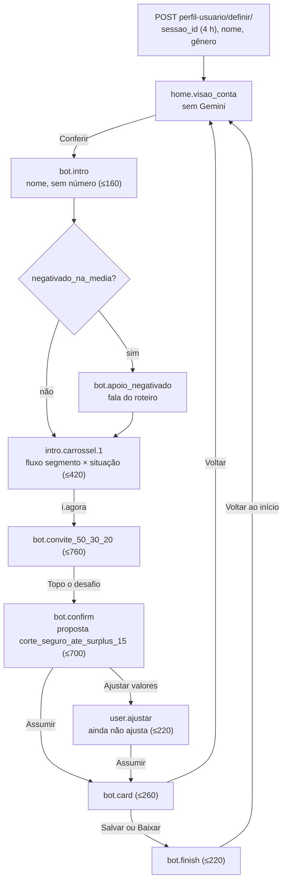

# Fluxo de atendimento

Etapas, transições, o que o modelo recebe em cada passo, guardas e encaminhamento. Convenções de caminho:
[README](README.md#dois-códigos-uma-convenção).

---

## 1. Publicado: estados do plano

O plano de cada pessoa é uma máquina de estados persistida ([`planning/store.py`](../../agent_backend/planning/store.py),
GCS em produção). Cada transição sobe `version`; pedido com versão velha dá **409**.

```mermaid
stateDiagram-v2
  [*] --> intro: GET perfil/ ou POST sessao/abertura/ (from_snapshot)
  intro --> confirm: conversa produz caso válido (prepare_case)
  invite --> confirm: novo caso na conversa
  confirm --> invite: withdraw_case (nova mensagem ou DELETE proposta/)
  confirm --> card: POST plano/confirmar/ (201; repetido = 200)
  card --> finish: PATCH plano/ {stage}
  finish --> card: PATCH plano/ {stage}
  intro --> intro: DELETE plano/ (reset) ou abertura next=true (nova pessoa)
  card --> intro: DELETE plano/
```

- `from_snapshot` cria `stage='intro'`, `version=1` ([`domain.py:78`](../../agent_backend/planning/domain.py)).
- `prepare_case` → `stage='confirm'` ([`store.py:33-43`](../../agent_backend/planning/store.py)).
- `withdraw_case` → `stage='invite'`; é chamado **em cada mensagem** ao montar o contexto
  ([`planning/http.py:114`](../../agent_backend/planning/http.py)): o caso anterior é retirado e só volta se a conversa o
  produzir de novo.
- `confirm` → `stage='card'` ([`store.py:81`](../../agent_backend/planning/store.py)); `progress` só aceita `card` e
  `finish` depois de confirmado ([`store.py:85-93`](../../agent_backend/planning/store.py)).

## 2. Publicado: um turno de conversa

`ConversationService._send` e `_pipeline` ([`conversation/service.py:102-224`](../../agent_backend/conversation/service.py)).

| Passo | O que acontece | Linha |
| --- | --- | --- |
| 1. Autorização | sem principal (cookie assinado + host local ou demo sintética pública) → 401 | `http.py:53-70`, `service.py:67` |
| 2. Schema | `MessageV1` estrito; mensagem vazia ou > 2.000 caracteres → 400 | `schemas.py:10-14`, `service.py:69-74` |
| 3. Concorrência | um turno de cada vez no processo; ocupado → 429 | `service.py:75-77` |
| 4. Idempotência | mesmo `client_message_id` + mesmo corpo → mesma resposta; corpo diferente → 409 | `service.py:107-113` |
| 5. Limites | 6/min por pessoa; 5 conversas por pessoa, 100 no total; 20 turnos | `service.py:114-124` |
| 6. Minimização | CPF, cartão, e-mail, chaves → `[DADO_REMOVIDO]` | `rules.py:7-17`, `service.py:125` |
| 7. Guard de entrada | Gemini recebe `{message, history[-4:]}` e devolve `allow/constrain/deny/clarify` | `gateway.py:121-123`, `service.py:144` |
| 8. Desvios | `deny` → `safe_redirect` (texto `denied`); `clarify` → `needs_clarification`; exceção: contra-argumento de igualdade salarial | `service.py:146-150`, `fairness.py` |
| 9. Contexto | fontes normativas com sha256, fatos `BQ:*` da pessoa, `financial_profile.situation`, `goal_state`, histórico como relato, `user_statements` numeradas | `planning/http.py:112-125`, `service.py:153-157` |
| 10. Geração | agente ADK, 1 chamada, sem ferramentas, JSON `AgentDraftV1`, ≤ 1.800 tokens | `gateway.py:129-165` |
| 11. Projeção | se o rascunho traz `projection_proposal`: valida contra falas reais e pede confirmação; o turno "sim" seguinte calcula `n_5`/`n_8` em código | `service.py:162-173, 193-205` |
| 12. Compromisso | se traz `commitment_proposal`: `validate_case` (≥ 2 falas, trechos literais, mês de referência, categoria) e `draft_for_case` (limites do fluxo observado); falha → pergunta por ação viável | `service.py:176-192`, `commitments.py:20-42`, `domain.py:49-61` |
| 13. Regras determinísticas | `safe_text` e `valid_evidence` | `service.py:206-207` |
| 14. Guard de saída | Gemini recebe `{question, draft, evidence}`; diferente de `release` → 503 `technical` | `gateway.py:125-127`, `service.py:208-213` |
| 15. Gravação do caso | só depois dos dois guards: `offer_case` → `prepare_case` | `service.py:217-219` |
| 16. ReleaseGate | único ponto que monta o envelope; citações resolvidas pelo servidor | `service.py:49-64, 220-224` |

**O que o modelo recebe** ([`prompts/system.liquid`](../../agent_backend/conversation/prompts/system.liquid) e partials):
política e data de referência, capacidades, distinções financeiras (entradas ≠ renda), política institucional,
regras de projeção; mensagem, histórico e documentos marcados como **dados não confiáveis**; proibição de cálculo
mental, de URLs e de inferir personalidade, religião, saúde ou propensão por gênero.

**Não existe no publicado:** `proximas_acoes`, `encaminhamento`, tom por perfil, `coerencia.sentido`,
`alucinacao.periodo`, fallback de modelo. Os botões da tela vêm do `stage` do plano.

---

## 3. `-32`: conversa guiada por etapa (`conversas/interacao/`)

`POST conversas/interacao/` com header `X-Sessao-Id` e corpo `{etapa, escolha?, mensagem?}`
(`-32: apps/conversas/views_interacao.py:34-40`). Etapas em `ETAPAS` (`-32: apps/conversas/interacao.py:47-107`).

| Etapa | O modelo é pedido a | Exige | `proximas_acoes` |
| --- | --- | --- | --- |
| `home.visao_conta` | nada (servidor formata médias) | — | Conferir → `bot.intro` |
| `bot.intro` | cumprimentar pelo primeiro nome; nenhum número | nome | O seu momento · i.agora |
| `intro.carrossel.1` | dizer se em média sobrou ou faltou, citar a janela, reescrever a ação do fluxo no tom | situação · tom · fluxo | i.agora → `bot.convite_50_30_20` |
| `bot.convite_50_30_20` | necessidades/desejos/futuro ao lado do 50/30/20 (referência, não norma) | tom | Topo o desafio |
| `bot.confirm` | apresentar os compromissos como vieram; em `CORTE_INSUFICIENTE` dizer quanto falta e renegociar | tom | Assumir meus compromissos · Ajustar valores |
| `user.ajustar` | dizer que ainda não dá para ajustar | — | Assumir meus compromissos |
| `bot.card` | frase do card vem do roteiro, gênero no servidor | — | Salvar imagem · Baixar PNG · Gerar outra frase · Voltar |
| `bot.finish` | parabenizar pelo nome | nome | Voltar ao início |
| `livre.respostas` | responder só com `DADOS` a partir do esqueleto do cenário | cenário | nenhum; em consolidação, "Falar com um especialista" |

- **Entrada do modelo** (`instrucao`, `-32: interacao.py:325-359`): objetivo da etapa, artigos da Resolução
  Conjunta 8/2023, perfil T3 com tom e palavras, linha de situação ("FALTOU… nunca diga que sobrou"), fluxo,
  cenário e bloco de contexto com os únicos meses/categorias citáveis; `DADOS` já formatados, só médias da janela
  (`:285-322`); em turno livre, `MENSAGEM_DO_CLIENTE` minimizada (`:478-480`).
- **`proximas_acoes`:** `ETAPAS[etapa]['proximas']`, mais `handoff.consolidacao` no cenário de consolidação de dívida
  (`-32: interacao.py:617-619, 634`). A tela reconhece-se pela `etapa`, nunca pelo texto.
- **Mensagem livre em qualquer etapa** vira turno livre (`-32: interacao.py:533-545`), com cenário por ordem fixa:
  extremo → fora do contexto (fala fixa, sem modelo) → `consolidacao_divida` → `inclinacao_gasto` → `financeiro_geral`.
- **Modelo e contingência:** `gemini-flash-latest`, depois `gemini-3.5-flash-lite`
  (`-32: desafio_itau/modelos_llm.py`); reprovado ou 429 → texto do roteiro, também avaliado; reprovado → 503
  (`-32: interacao.py:589-597, 651-653`).

### Guardas do `-32`

| Guarda | O que reprova | Onde |
| --- | --- | --- |
| Guard de entrada | `deny`/`clarify` pelo modelo viram FALLBACKS; erro cai no roteiro. Desligável por `INTERACAO_GUARD_ENTRADA_MODELO=0` | `-32: interacao.py:505-513, 583-587`; flag em `views_interacao.py:54` |
| `coerencia.sentido` | FALTOU nunca diz "sobrou", nem as duas coisas no mesmo texto | `-32: apps/conversas/interacao_avaliacao.py:141-154` |
| `alucinacao.periodo` | só a janela, o dia do corte e janeiro/2026 (períodos permitidos em `interacao.py:225-242`) | `-32: interacao_avaliacao.py:316-327` |
| `numeros`, `situacao`, `nome`, `politica`, `regra_50_30_20`, `ortografia`, `tom_t3`, `fluxo`, `cenario`, `alucinacao.datas/.categorias/.produto/.normativo` | pipeline completo | `-32: interacao_avaliacao.py:342-361` |

Falas fixas do roteiro (incluindo `extremo.*` e `bot.apoio_negativado`) não passam pelos guards de produto nem de
emoji. Ver [falas-e-roteiro.md](falas-e-roteiro.md).

---

## 4. Encaminhamento e extremos

Existe **só no `-32`** (`-32: apps/conversas/extremos.py`). O publicado responde a extremos com `safe_redirect`
genérico e sem encaminhamento (medido 27/09 08:19 BRT, ver README §9).

| Item | Regra | Linha |
| --- | --- | --- |
| Detecção | regex sobre texto normalizado, **antes** do modelo; abuso com ≥ 2 insultos ou insulto dirigido | `:42-71` |
| Prioridade | `autolesao > ameaca > abuso > flerte > extremo_financeiro` | `:24` |
| Destino | `ameaca` → `seguranca`; demais → `humano` | `:25-26` |
| Fala | `extremo.<motivo>`; `extremo_financeiro` → `extremo.encaminhamento_humano`; do roteiro, senão texto `PROVISORIO` | `:27-37, 85-95` |
| Registo | motivo + sha256 da mensagem, nunca o texto | `:102-109` |
| Envelope | `encaminhamento: null` ou `{destino, motivo, fala_id, visivel:false, detectado_por}`; também no cenário `consolidacao_divida` | `-32: interacao.py:604-605, 636` |

O front **não mostra** o objeto: quando não é nulo, deve abrir o atendimento. Hoje o destino é
`NAO_IMPLEMENTADO` — não há humano nem segurança do outro lado.
