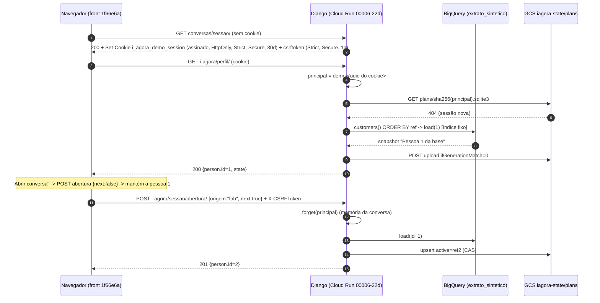

# Perfil "Pessoa 1 da base" e registro da sessão

**Selo:** app `https://i-agora-7iv6efsgrq-uc.a.run.app`, revisão Cloud Run `i-agora-00006-22d`. Backend = este
repositório no PR#4, head `91f9344`. Front = `frontend-agent-conversacional` `1f66e6a`. Observação ao vivo em
27/09/2026, das **09:35:31 às 09:35:48 BRT** (cabeçalho `Date` 12:35 GMT), com 3 sessões novas feitas por curl. Só
dados sintéticos. Investigação só de leitura, sem checkout e sem deploy. Cookies redigidos.

Na página publicada, o resumo deste caso está na secção `#perfil-sessao` de
[`docs/artefatos/paginas/batalha-agentes-unificado.html`](../artefatos/paginas/batalha-agentes-unificado.html).
Este documento guarda o detalhe completo (ver a regra de páginas públicas em
[docs/artefatos/README.md](../artefatos/README.md#caso-de-27092026-publicação-em-a-recusada-como-delta-sensível)).

## 1. Sintoma

Todo visitante, e todo jurado, abre o app e vê a mesma "conta": "Olá, Pessoa 1 da base", o cartão "VISÃO DA CONTA"
e "suas saídas". A cópia sugere que os dados são de quem visita, mas são os mesmos para todos.

Liga-se ao achado da auditoria de acesso a dados **"Visão da conta" num perfil partilhado** (MÉDIA na auditoria,
27/09 09:10 BRT, rev `i-agora-00006-22d`). Na página publicada o achado está em
[`#achado-visao-conta`](https://claude.ai/artifact/98dNfUXcSrCzcudqDwpTcX#achado-visao-conta); na conclusão da
mesma página o defeito aparece como ALTA. A auditoria já tinha visto também que `perfil/?indice=5` é ignorado.

## 2. Causa raiz: o índice 1 está fixo no código

Não existe nenhuma escolha de pessoa por sessão.

| Onde | O que faz |
| --- | --- |
| `agent_backend/planning/http.py:49` (`profile`) | `if not state: state=store().open(principal, from_snapshot(source().load(1)))`. Toda sessão sem estado recebe **o índice 1 literal**. |
| `agent_backend/planning/http.py:57` (`opening`) | `index=current['profile']['person']['id'] if current else 1`. Sem estado, o valor padrão também é 1. |
| `agent_backend/planning/http.py:58-61` | Com `next is True`, chama `forget(principal)` e faz `index+=1`. O contador é **por sessão**, derivado do estado da própria sessão; não é global nem fica em memória partilhada. |
| `agent_backend/planning/bigquery.py:75` | A lista vem de `SELECT DISTINCT customer ... ORDER BY ref LIMIT 1001` (no máximo 1000 clientes). A "Pessoa 1" é o cliente com o **menor `ref`** em ordem lexicográfica: sempre o mesmo. |
| `agent_backend/planning/bigquery.py:80-83` (`load`) | `index=(index-1)%len(users)+1; ref=users[index-1]`. O índice é circular sobre a lista. |
| `agent_backend/planning/bigquery.py:105` | `'alias': f'Pessoa {index} da base'`. O apelido nasce aqui; a tabela não tem coluna de nome. |

Os números de linha valem para o PR#4 head `91f9344`, lido a 27/09/2026.

**No front (`1f66e6a`):**

1. No mount, `usePlanConversation.ts:32` chama `bootstrap()` e depois `profile()`, que cai no `load(1)`.
2. "Abrir conversa" (`App.tsx:28`) chama `startWith()`, que envia `POST abertura {next:false}` e mantém a pessoa.
3. Só o botão **"Testar próximo perfil da base sintética"** (`App.tsx:79`) chama `startWith(true)` e avança para a
   pessoa +1.
4. "Perfil sintético · hackathon" vem de `src/data/profile.ts:1` (`ACCOUNT_LABEL`), usado em
   `src/components/home/HomeHeader.tsx:10`.
5. "VISÃO DA CONTA" vem de `src/components/home/BalanceCard.tsx:10`.
6. "Pessoa 1 da base" chega por `planning/domain.py:74-75` (`nome`, `primeiroNome`; comentário *"Alias only: no
   fabricated real name"*) e aparece em `HomeScreen.tsx:20` → `HomeHeader.tsx:10` e em `ChatScreen.tsx:19,22`.
   O `src/services/personService.ts:14-22` ainda gera nomes inventados, mas esse caminho não alimenta a tela
   publicada.

**Candidatos descartados:**

- contador em memória ou no GCS: não existe;
- reset por worker único: `maxScale=1` e `containerConcurrency=4` não participam da escolha do índice;
- front que nunca manda `next`: o botão manda `next: true`.

**Design ou defeito?** É uma decisão de design de demo: o servidor começa determinístico na pessoa 1 e o visitante
percorre a base pelo botão. Para o produto é um defeito, porque a cópia atribui ao visitante dados que são de todos.

## 3. Registro da sessão: anónimo, sem login

`principal_for` (`conversation/http.py:53-62`) só aceita o modo `demo_live` quando `IAGORA_PUBLIC_SYNTHETIC_DEMO` e
`IAGORA_SYNTHETIC_DATA_ONLY` são verdadeiros (`is_local`, `:46-50`). O principal é `demo:<uuid4>`, e o uuid vem do
cookie assinado. Não há utilizador, senha nem consentimento; `deploy/settings.py:1` diz *"not bank/customer
authentication"*.

| # | Chamada | Resposta | Cookies e efeitos |
| --- | --- | --- | --- |
| 1 | `GET /api/v1/context-agent/conversas/sessao/` (`conversation/http.py:78-94`) | 200 `{status:"needs_clarification", reply, mode:"demo_live"}` | Emite `i_agora_demo_session` e `csrftoken` (tabela abaixo). Só emite o cookie de sessão se o atual faltar ou for inválido. Nada é gravado no servidor. |
| 2 | `GET /api/v1/context-agent/i-agora/perfil/` (`planning/http.py:45-50`) | 200 `{...person, state}` | Nenhum cookie. Sem estado, lê o BigQuery e cria no GCS o plano da **Pessoa 1**. |
| 3 | `POST /api/v1/context-agent/i-agora/sessao/abertura/` `{origem:"fab", next:bool}` (`planning/http.py:52-63`) | 201 `{person, state}` | Nenhum cookie. Exige `X-CSRFToken` (`CsrfViewMiddleware`); aceita só `origem` e `next`. Com `next:true` esquece a conversa em memória e troca `active` para a pessoa +1. |

### Cookies e flags

| Cookie | Valor | Flags | Duração | Origem |
| --- | --- | --- | --- | --- |
| `i_agora_demo_session` | `signing.dumps(uuid4, salt=COOKIE)`, assinado com `DJANGO_SECRET_KEY` (secret `i-agora-signing`) | `HttpOnly; SameSite=Strict; Secure; Path=/` | `Max-Age=2592000` (30 dias, `IAGORA_SESSION_AGE`, `deploy/settings.py:16`); o `max_age` é conferido também na leitura (`http.py:59`) | `conversas/sessao/` |
| `csrftoken` | `get_token` do Django | `SameSite=Strict; Secure; Path=/`, **sem HttpOnly** (`CSRF_COOKIE_HTTPONLY=False`), porque o JS o lê | `Max-Age=31449600` (1 ano, padrão do Django) | `conversas/sessao/` |

Nenhuma rota de `i-agora/` emite cookie.

## 4. Onde fica cada coisa, e por quanto tempo

- **Cookie de sessão:** no navegador, 30 dias.
- **Plano e perfil:** um SQLite por sessão, objeto privado no GCS em
  `gs://iagora-state-951291470271/plans/<sha256("demo:<uuid>")>.sqlite3` (`planning/gcs_store.py:21`). Escrita com
  CAS por `ifGenerationMatch`, teto de 5 MB por objeto. Tabelas `plans(owner, ref, state)`, `active(owner, ref)` e
  `replay` (`planning/store.py:13`).
  - **Sem expiração.** A regra de lifecycle do bucket só apaga versões não atuais quando há 5 versões mais novas;
    o soft-delete é de 7 dias. O objeto atual fica para sempre.
  - **51 objetos em `plans/`** perto das 09:40 BRT de 27/09/2026. Cada visitante novo cria um objeto que nunca é
    limpo.
  - O bucket tem `public_access_prevention: enforced` e UBLA.
- **Conversa (turnos do Gemini):** em memória do processo (`conversation/service.py:37`), `ttl=1800` s,
  `max_sessions=100`, no máximo 5 conversas por principal. Com `maxScale=1` e `minScale=0`, perde-se quando a
  instância escala para zero.
- **Cache do BigQuery:** em memória por 900 s; guarda a lista de clientes e os snapshots por `ref`
  (`bigquery.py:72,85`).

## 5. Observação ao vivo (27/09/2026 09:35 BRT, revisão `i-agora-00006-22d`)

| Sessão (jar novo) | Chamadas | Pessoa |
| --- | --- | --- |
| 1, 09:35:31 | `GET sessao/` e depois `GET perfil/` | **id=1** "Pessoa 1 da base", Dezembro / 2025 |
| 2, 09:35:35 | `GET sessao/` e depois `POST abertura {next:false}` (201) | **id=1** |
| 3, 09:35:43 | `GET sessao/`, `GET perfil/` → id=1, **`POST abertura {next:true}`** (201) → **id=2** "Pessoa 2 da base", `GET perfil/` → id=2 | 1 e depois 2 |

`Set-Cookie`, igual nas 3 sessões:

- `i_agora_demo_session=<REDIGIDO>; expires=…27 Oct 2026; HttpOnly; Max-Age=2592000; Path=/; SameSite=Strict; Secure`
- `csrftoken=<REDIGIDO>; expires=…26 Sep 2027; Max-Age=31449600; Path=/; SameSite=Strict; Secure`

A troca para a pessoa 2 fica gravada no GCS, por isso o `GET perfil/` seguinte já devolve a pessoa 2. Resultado:
**3/3 sessões novas caíram na id=1**, o que confirma o achado da auditoria.

## 6. Comparação com o `-32` (`backend-agente-conversacional`, local, fora de git)

| Tema | i.agora publicado | `-32` |
| --- | --- | --- |
| Quem escolhe a pessoa | Ninguém: índice 1 fixo; só `next:true` avança | **O chamador**: `POST perfil-usuario/definir/ {"usuario": "<índice 1..N ou UUID>"}` → 201 `{sessao_id, usuario, expira_em_segundos: 14400}` (`-32: apps/context_agent_datadriven/views_perfil_usuario.py:54-59`, `services/perfil_usuario.py:107-112`). Sem o campo, 400 `ReferenciaInvalida` (`perfil_usuario.py:83-98`). Não há sorteio, round-robin nem `?ref=`. |
| Onde fica a sessão | Cookie assinado de 30 dias + SQLite no GCS sem expiração | Dicionário em memória `_sessoes[uuid4().hex]`, TTL de 4 h aplicado na leitura (`:27`, `:115-123`); `models.py:66` indica persistência em SQLite |
| Como viaja o id | Cookie `i_agora_demo_session` | `sessao_id` no corpo ou em `X-Sessao-Id` (`apps/conversas/views.py:6-7`); o cookie assinado `conversa_sessao` vale só na rota de conversas |
| Nome | Só o apelido `Pessoa N da base` | `pessoa` e `genero` **inventados** no CSV `data/usuarios_verdade.csv` (`perfil_usuario.py:6-7`) |

O `-32` não serve estas rotas e não precisa mudar; o `definir/` dele serve de referência de contrato para a opção B.

## 7. Correção recomendada (dono: **Henrique**)

| Opção | Mudança | Ficheiros | Prós | Contras |
| --- | --- | --- | --- | --- |
| **A. Pessoa aleatória por sessão nova, guardada no servidor** (recomendada) | Em `profile()` e `opening()` sem estado, trocar o `1` por `secrets.randbelow(len(users))+1` ou por `int(sha256(principal))%N+1` (determinístico por sessão). `store().open` já persiste a escolha no GCS. | `agent_backend/planning/http.py:49,57`; talvez `BigQuerySource.count()` em `bigquery.py`. Mais um teste: duas sessões diferentes não caem sempre na id 1. | ≈ 3 linhas; escolha estável por 30 dias; o botão "próximo" continua. | Deixa de ser reprodutível para o roteiro; perfis com `SourceUnavailable` pedem novo sorteio ou salto. |
| A2. Round-robin global | Contador num objeto do GCS com CAS | `http.py` + `gcs_store.py` | Cobertura uniforme | Uma escrita a mais por sessão, conflito 412 sob concorrência; complexidade demais para demo |
| B. Tela "escolher perfil de demonstração" | Aceitar `indice` em `abertura` (hoje só `origem` e `next`, `http.py:56`) + seletor no front | Back `planning/http.py:56-62`; front `App.tsx`, `usePlanConversation.ts:34`, `services/backend.ts:21` e tela nova | Reprodutível para o júri; honesto; alinha com o `definir` do `-32` | Um passo a mais antes do valor; validar 1..N |
| C. Só a cópia: "Perfil de demonstração N de {total}" | Trocar `ACCOUNT_LABEL` e "VISÃO DA CONTA"; expor `total` do back | Front `data/profile.ts:1`, `home/HomeHeader.tsx:10`, `home/BalanceCard.tsx:10`; back `planning/bigquery.py:105` | Barato; resolve a desonestidade apontada pela auditoria | Não resolve "todos veem a mesma pessoa"; o total tem de ser medido (`len(users)`), não escrito à mão |

**Recomendação:** **A + C**. Pessoa aleatória por sessão, guardada no GCS, e a cópia "Perfil de demonstração N de
{total medido}". Para o roteiro do júri, um override explícito (B-lite: `abertura {indice}`). O deploy publicado
inteiro (back PR#4 e front) é do **Henrique**.

**Tarefa colateral:** regra de lifecycle para `plans/` (por exemplo, apagar objetos com mais de 30 dias, alinhado
ao cookie), porque hoje os objetos acumulam sem limite.

## Fontes

- Leitura do código do PR#4 (`91f9344`) e do front (`1f66e6a`), 27/09/2026 09:35 BRT.
- Log das 3 sessões por curl, 09:35:31–09:35:48 BRT (fora do repositório, cookies redigidos).
- Contagem de objetos em `plans/`, perto das 09:40 BRT.
- Auditoria de acesso a dados, 27/09 09:09–09:11 BRT (achados em `#achado-visao-conta` da página publicada).
