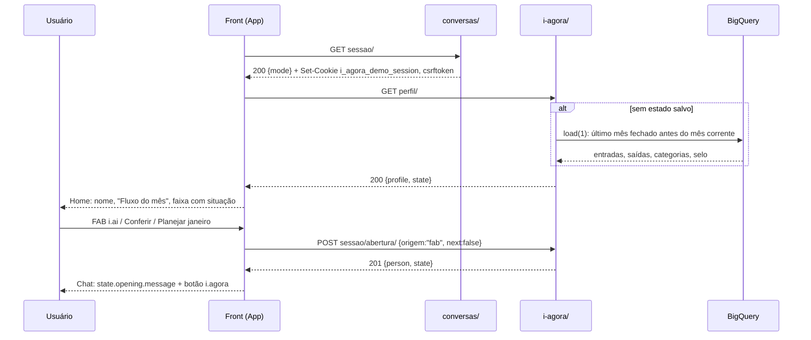
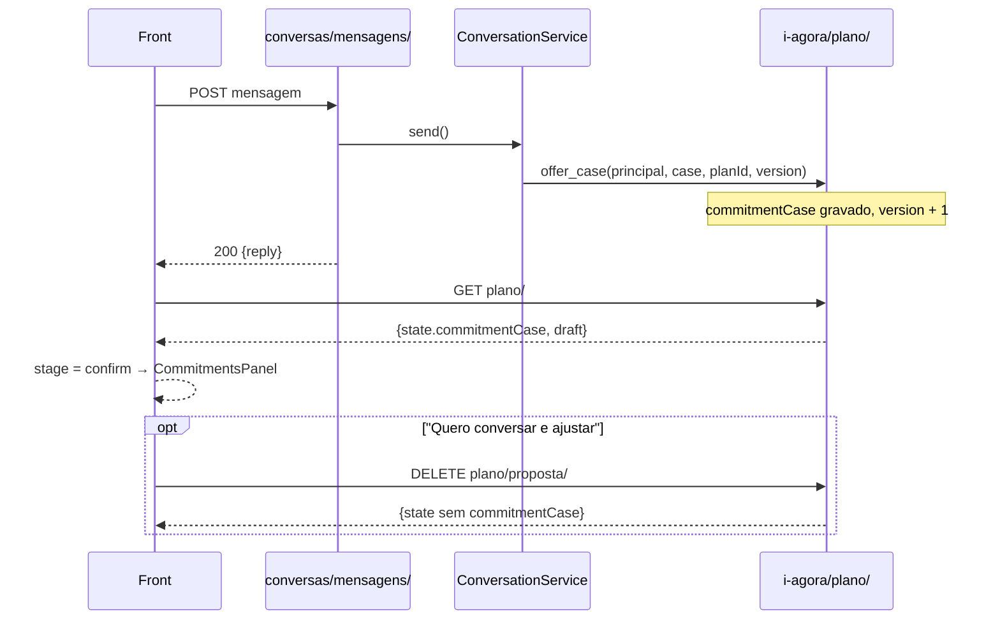
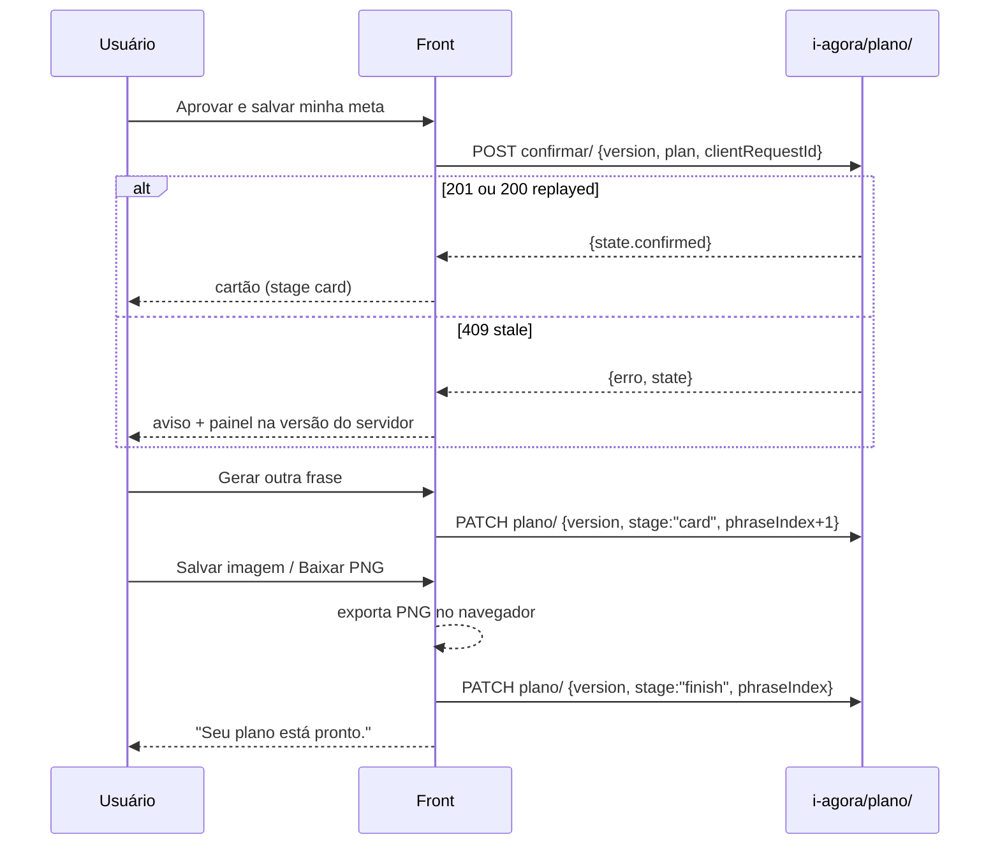
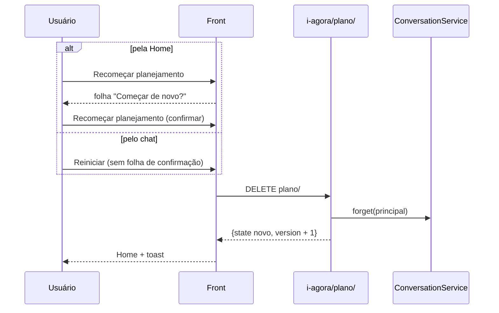

# Rota integrada do projeto batalha-agentes — parte front

Levantado em **2026-09-27 12:13 BRT**, só por leitura de git (`git show <commit>:<arquivo>`, `git grep`), sem checkout
e sem chamar nenhuma rota. Os números de tempo e de saldo citados vêm dos documentos de origem, com a data deles.

**Par no backend:** [`backend-agente-conversacional/docs/rota-integrada-batalha-agentes-backend.md`](../../backend-agente-conversacional/docs/rota-integrada-batalha-agentes-backend.md)
(levantado às 09:02 BRT, pasta sem git). Os ids de divergência **D1–D13** são os de lá (§8). As divergências que só
existem do lado do front levam o prefixo **DF**.

**Selo das fontes**

| Peça | Repositório | Ref | Data do commit |
| --- | --- | --- | --- |
| Front neste repositório (desde 2026-09-27 10:50 BRT) | `src/` = `47ee715` (`1f66e6a` + timer `51bec4b` + erro de abertura), branch `feat/front-consolidado-2026-09-27` | `47ee715` | 2026-09-27 |
| Front publicado (Cloud Run, revisão `i-agora-00006-22d`) | `frontend-agent-conversacional` (arquivado), branch `feat/i-agora-gcp-integrado` | `1f66e6a` | 2026-09-27 08:47:41 −03:00 |
| Front arquivado | mesmo repositório, `main` | `2daa5c7` | 2026-09-27 09:02:36 −03:00 |
| Servidor das rotas `i-agora/` e `conversas/` do Cloud Run | este repositório (`agente-app-mobile`) | `c0a71c7` | 2026-09-27 09:05:00 −03:00 |
| Contrato-alvo §5.4 | `backend-agente-conversacional/docs/contrato-api-frontend.md` | sem git | lido 2026-09-27 12:13 BRT |

**NAO_MEDIDO:** que a imagem da revisão `i-agora-00006-22d` tenha sido construída a partir de `c0a71c7` deste
repositório. O README (§3, §12 item 9) ainda cita a revisão `00004-zhd`; a revisão `00006-22d` com front `1f66e6a` vem
do commit `2daa5c7` do front ("corrige a revisao no ar").

**Como ler as citações.** `front:<arquivo>:<linha>` é o arquivo em `src/` do front no commit `1f66e6a`, salvo
quando se diz `main`. `usePlanConversation.ts` e `useCardExport.ts` estão na pasta de estado React do front
(`git ls-tree -r --name-only 1f66e6a -- src`). Caminhos sem prefixo são deste repositório em `c0a71c7`.

---

## 0. Estado atual (2026-09-27 12:31 BRT, front `c4a9ff3`)

O levantamento abaixo é das 12:13 BRT, por leitura de git. Desde então, medido pela `:3000`:

- **Backend único** local: Django DRF de `Nova pasta/backend` (`batalha-agente-backend@84ead9b`) em `127.0.0.1:8000`;
  `agent_backend/` deste repo não sobe junto (dois processos na `:8000`). Proxy `/api/v1` → `DJANGO_URL`.
- **Sequência** (`src/services/backend.ts`): `POST perfil-usuario/definir/ {"usuario":"<UUID>"}` (201) →
  `GET conversas/sessao/?sessao_id=` (200; cookies `csrftoken` + `conversa_sessao`) → `X-Sessao-Id` em todo pedido →
  `GET i-agora/perfil/` (200) → `POST i-agora/sessao/abertura/` (201) → `POST conversas/mensagens/` → `GET i-agora/plano/` (200).
- **Degradações:** `definir/` 404/405 → identidade por cookie (agent_backend); chat 404 com sessão → reabre a sessão uma
  vez e reenvia como conversa nova; `i-agora/perfil` 404 → modo só-chat, sem inventar valores nem abertura.
- **Chat:** 11:52 BRT 200 `needs_clarification` em 14,5 s; 12:31 BRT 503 por provedor (flash-lite falhou em 515 ms,
  contingência `gemini-3.5-flash` timeout 15 s), sem rejeição determinística. Classificação e script:
  [validacao-front-back.md](validacao-front-back.md) e `skills/integracao-front-back/`.

## 1. Mapa de montagem (o que o navegador alcança)

| Onde roda | Prefixo que o front chama | Quem responde | Onde |
| --- | --- | --- | --- |
| Cloud Run (mesma origem) | `/api/v1/context-agent/conversas/` | `agent_backend.conversation.urls` (`mensagens/`, `sessao/`) | `deploy/urls.py:14`; `agent_backend/conversation/urls.py:4` |
| Cloud Run (mesma origem) | `/api/v1/context-agent/i-agora/` | `agent_backend.planning.urls` (7 rotas) | `deploy/urls.py:14`; `agent_backend/planning/urls.py:3-8` |
| Cloud Run | qualquer outro caminho | `front_dist/` (SPA); `index.html` com `no-store` | `deploy/urls.py:7-14` |
| Dev local (Vite) | `/api/v1` | proxy para `DJANGO_URL` ou `http://127.0.0.1:8000` | front:`vite.config.ts:19` |

O cliente único do front é a classe `Backend` (front:`services/backend.ts:6-28`), com prefixo fixo
`/api/v1/context-agent/` (front:`services/backend.ts:5`). Não há URL absoluta: tudo é mesma origem.

Convenções do cliente (front:`services/backend.ts:8-17`):

- `credentials: 'same-origin'`: o navegador manda os cookies `i_agora_demo_session` e `csrftoken`.
- **Todo** pedido, até GET, leva `Content-Type: application/json` e `X-CSRFToken` = valor do cookie `csrftoken`
  lido de `document.cookie` (linha 10). O cookie é legível porque `CSRF_COOKIE_HTTPONLY = False`
  (`agent_backend/harness/settings.py:17`).
- **Não** envia `X-Sessao-Id`. A identidade é só o cookie assinado (`agent_backend/conversation/http.py:53-62`).
- Timeout de **50 s** por `AbortController` (linha 9).
- Qualquer `!r.ok` vira `ApiError(mensagem, status, body.state)`, com mensagem = `body.erro` > `body.reply` >
  `"Servidor indisponível."` (linha 14). **Não há ramo por status**: 401, 404, 409, 429 e 503 seguem o mesmo caminho.

---

## 2. Catálogo de chamadas

### 2.1 Front publicado (`1f66e6a`): 10 métodos, 9 ligados a botões

| # | Método e caminho | Corpo | Resposta esperada (campos lidos) | Erros do servidor | Disparo (tela · botão) | O que é renderizado |
| --- | --- | --- | --- | --- | --- | --- |
| F1 | `GET conversas/sessao/` | — | `{mode}` (o envelope 1.0 também vem: `schema_version`, `conversation_id: null`, `message_id`, `status`, `reply`, `citations`, `request_id`). Grava `i_agora_demo_session` (se não houver) e `csrftoken` | 401 fora de loopback sem demo pública · 405 | ao montar o `App` (`usePlanConversation.ts:32-33`) e no botão **"Tentar carregar"** do aviso de erro (front:`App.tsx:55`) | nada: `mode` é guardado (`usePlanConversation.ts:32`) mas nenhum componente o lê |
| F2 | `GET i-agora/perfil/` | — | `{...profile, state}`; o front lê `state` (`PlanState`: `opening`, `commitmentCase`, `planId`, `version`, `stage`, `draft`, `confirmed`, `phraseIndex`, `profile`, `totals`) | 401 `auth` · 503 `source` (`estado: NAO_MEDIDO`) · 503 `technical` · 405 | logo após F1 (`usePlanConversation.ts:32`) | `apply(state, true)`: nome, cartão "Fluxo do mês", faixa do topo com `referenceLabel` e frase da `situation` (front:`App.tsx:54`), 1ª mensagem = `state.opening.message` (front:`services/backend.ts:3`) |
| F3 | `POST i-agora/sessao/abertura/` | `{origem: "fab", next: false\|true}` | 201 `{person, state}` | 400 `schema` (campo extra) · 401 · 503 | **FAB i.ai** `button-open-iai` (front:`components/home/AssistantFab.tsx:4`), **Conferir** `button-conferir` e ícone `button-header-chat` (front:`components/home/HomeHeader.tsx:18`, `:14`), atalho **Planejar janeiro** `button-shortcut-planning` (front:`data/navigation.ts:10`, `App.tsx:51`), `button-info-chat` / `button-empty-plan-chat` (front:`components/sheets/PlanSheet.tsx:28`, `:38`) → `startChat` (front:`App.tsx:27-32`) com `next:false`. **"Testar próximo perfil"** `button-next-client` (front:`App.tsx:79`) com `next:true` | `apply(state, true)`; zera `conversation_id` (`usePlanConversation.ts:34`). Com `next:true` o servidor apaga a conversa em memória (`agent_backend/planning/http.py:57-60`) |
| F4 | `POST conversas/mensagens/` | `{schema_version: "1.0", conversation_id, client_message_id: uuid, message}` (front:`services/backend.ts:27`) | 200 `{reply, conversation_id, status}`; o front lê só `reply` e `conversation_id` | 400 `schema` · 401 · 403 CSRF · 404 `not_found` (conversa expirada ou desconhecida) · 409 `conflict` · 429 `limit` · 503 `technical` (`agent_backend/conversation/service.py:100-125`, `:135`, `:207`) | **Enviar** `button-send-message` ou Enter em `input-free-text` (front:`components/chat/ChatComposer.tsx:12-13`) → `sendText` (`usePlanConversation.ts:47-50`) | bolha do usuário **antes** da chamada; bolha do bot com `reply` (front:`components/chat/MessageItem.tsx:10`). Em seguida chama F5 |
| F5 | `GET i-agora/plano/` | — | `{state}` (ou `state: null`) | 401 · 503 | após cada F4 com sucesso (`usePlanConversation.ts:49`) | se `state.commitmentCase` existe e não há `confirmed`, a etapa vira `confirm` e aparece o painel da proposta (`usePlanConversation.ts:21`; front:`components/chat/stages/StageActions.tsx:17`) |
| F6 | `POST i-agora/plano/confirmar/` | `{version, plan: draft, clientRequestId}`; o id é reaproveitado enquanto o corpo não muda (`usePlanConversation.ts:38-39`) | 201 (novo) ou 200 (`replayed: true`) `{state, replayed, ...}` | 400 `schema` (chaves ≠ as 3, id inválido, `plan` ≠ `draft`) · 409 `stale` com `state` (versão mudou, já confirmado, id reusado, sem proposta) · 401 · 503 (`agent_backend/planning/http.py:92-100`; `agent_backend/planning/store.py:59-72`) | **"Aprovar e salvar minha meta"** `button-assume-commitments` (front:`components/chat/stages/CommitmentsPanel.tsx:19`) | etapa `card`; duas bolhas fixas ("Aprovar e salvar minha meta" / "Seus objetivos foram registrados…") (`usePlanConversation.ts:40`) |
| F7 | `DELETE i-agora/plano/proposta/` | — | `{state}` sem `commitmentCase` | 401 · 503 | **"Quero conversar e ajustar"** `button-adjust-values` (front:`components/chat/stages/CommitmentsPanel.tsx:20`) | duas bolhas fixas de ajuste (`usePlanConversation.ts:42`) |
| F8 | `PATCH i-agora/plano/` | `{version, stage: "card"\|"finish", phraseIndex}` | `{state}` | 409 `stale` "Plano desatualizado." (`agent_backend/planning/store.py:89`) · 400 · 401 · 503 | **"Gerar outra frase"** `button-change-phrase` (`card`, `phraseIndex+1`); **"Salvar imagem"** `button-save-image` e **"Baixar PNG"** `button-download-image` (`finish`, depois da exportação local) (front:`components/chat/stages/CardPanel.tsx:12-14`; `useCardExport.ts:13-15`; `usePlanConversation.ts:43-45`) | nova frase no cartão ou painel "Seu plano está pronto." (front:`components/chat/stages/FinishPanel.tsx:7`) |
| F9 | `DELETE i-agora/plano/` | — | `{state}` novo, `version + 1`; o servidor também apaga a conversa em memória (`agent_backend/planning/http.py:67-70`; `store.py:103-109`) | 401 · 503 | **"Recomeçar planejamento"** `button-reset-demo` (front:`components/home/HomeScreen.tsx:28`) → folha → `button-confirm-reset` (front:`components/sheets/PlanSheet.tsx:23`); **"Reiniciar"** `button-restart-chat` no chat, **sem confirmação** (front:`components/chat/ChatHeader.tsx:9`, `App.tsx:65`) | `apply(state, true)`, volta à home, toast de reinício (front:`App.tsx:35-46`) |
| F10 | `POST i-agora/plano/proposta/` | `{clientRequestId}` | `{state, basis}` | 409 sem caso da conversa | **nenhum**. Só `fetchProposal` usa (front:`services/planApi.ts:8-15`), e `fetchProposal` não é importado em lugar nenhum de `src/` | nada (código morto, DF5) |

Rotas do servidor que o front publicado **não** chama: `PATCH i-agora/plano/rascunho/` (sempre 409,
`agent_backend/planning/http.py:86-89`) e `GET i-agora/acompanhamento/` (`agent_backend/planning/http.py:102-109`).
A tela Acompanhe é montada só com o `state.confirmed` já em memória (DF6).

### 2.2 Tratamento de erro no front publicado

Todas as falhas passam por `run` (`usePlanConversation.ts:25-31`):

| Status | O que o servidor devolve | O que o front faz | Lacuna |
| --- | --- | --- | --- |
| 401 | `{erro: "Sessão não autorizada. Reabra a conversa.", codigo: "auth"}` (planejamento) ou envelope com `reply` de `auth` (conversa) | aviso vermelho com a mensagem e "Tentar carregar" (front:`App.tsx:55`), que refaz F1+F2 | F1 recria o cookie se ele expirou; nada diz ao usuário que o plano pode ter ficado em outra sessão |
| 404 (F4) | `reply` "Conversa indisponível para esta sessão. Inicie uma nova conversa." (`service.py:24`) | aviso vermelho. **`conversation_id` não é zerado** (`usePlanConversation.ts:48` só grava no sucesso) | toda mensagem seguinte repete o 404 até F3 ou F9 (DF2, efeito de D3) |
| 409 (F6, F8) | `{erro, codigo: "stale", state}` | `apply(e.state)` e aviso (`usePlanConversation.ts:28`) | correto; o painel volta à versão do servidor |
| 409 (F4) | `reply` de `conflict` | aviso | não acontece no uso normal: cada envio gera um `crypto.randomUUID()` novo |
| 429 (F4) | `reply` "Limite temporário da conversa atingido…" | aviso | sem espera sugerida nem bloqueio do botão; a bolha do usuário fica sem resposta |
| 503 | `{erro, estado: "NAO_MEDIDO", codigo: "source"}` ou `technical` | aviso; o cartão mostra "Não disponível" quando `sourceAvailable === false` (front:`components/home/BalanceCard.tsx:8`) | nenhum encaminhamento; nenhuma distinção provedor × fonte |
| timeout 50 s | — | `AbortError` com a mensagem do navegador no aviso | texto técnico em inglês na tela (**NAO_MEDIDO** o texto exato por navegador) |
| corpo não-JSON (ex.: 502 do balanceador) | — | `r.json()` lança `SyntaxError`; a mensagem do parser vai para o aviso | idem |

### 2.3 Front arquivado (`main`, `2daa5c7`): 2 chamadas, **arquivado**

Estas chamadas apontam para o **outro** backend (`backend-agente-conversacional`, rotas U5 e U7 do par). No Cloud
Run deste repositório `usuario-real/` não existe e `i-agora/plano/proposta/` tem outro contrato (README §12 item 1).

| # | Método e caminho | Headers | Corpo | Resposta lida | Erros | Disparo | Código |
| --- | --- | --- | --- | --- | --- | --- | --- |
| A1 | `POST i-agora/plano/proposta/` | só `Content-Type`; **sem** cookie de sessão útil, **sem** CSRF | `{ref: person.id + 1}` | `usuario {indice, primeiro_anomes}`, `estado`, `regra`, `segmento_t3`, `data_corte`, `apresentacao`, `compromissos[]`, `totais`, `selos` | qualquer `!ok` vira `Error("proposta HTTP <status>")`; 503 = NAO_MEDIDO, nunca zero. Timeout 10 s | `main:usePlanConversation.ts:54` | `main:src/services/planApi.ts:4`, `:34-46` |
| A2 | `GET usuario-real/<ref>/saldo-mes/` | nenhum | — | `data_corte`, `periodo.rotulo`, `saldo`, `negativado`, `media_mensal {inflow_mensal, outflow_mensal, surplus_mensal, meses_na_janela}`, `negativado_na_media`, `selo` | `!ok` ou `negativado_na_media === "NAO_MEDIDO"` → falha tratada como `null`. Timeout 20 s | `main:usePlanConversation.ts:23` | `main:src/services/balanceApi.ts:17-37` |

**O navegador escolhe o `ref`.** Em A1 e A2 o índice do cliente sai de `backendRef = person.id + 1`
(`main:src/services/planApi.ts:34`) e vai no corpo ou na URL. Qualquer pessoa troca o número e lê outro cliente.
No front publicado isso foi retirado: a identidade é a sessão assinada e `backendRef` só devolve `person.id`
(front:`services/planApi.ts:5-7`).

---

## 3. Headers, cookies e sessão (lado do navegador)

| Item | Valor real no Cloud Run | Onde |
| --- | --- | --- |
| Cookie `i_agora_demo_session` | UUID assinado (salt = nome do cookie), HttpOnly, **SameSite=Strict**, `secure` em HTTPS, `max_age = IAGORA_SESSION_AGE` = **30 dias** | `agent_backend/conversation/http.py:14`, `:91-93`; `deploy/settings.py:16` |
| Validade da assinatura na leitura | a mesma `IAGORA_SESSION_AGE` (30 dias) | `agent_backend/conversation/http.py:59` |
| Cookie `csrftoken` | `get_token` em F1; `CSRF_COOKIE_SECURE=True`, SameSite=Strict, legível por JS | `agent_backend/conversation/http.py:87`; `deploy/settings.py:10-11`; `agent_backend/harness/settings.py:15-17` |
| `X-CSRFToken` | exigido pelo `CsrfViewMiddleware` em POST/PATCH/DELETE; o front manda em todo pedido | `agent_backend/harness/settings.py:10-13`; front:`services/backend.ts:12` |
| `CSRF_TRUSTED_ORIGINS` | Cloud Run: `https://` + cada host de `IAGORA_HOSTS`. Harness local: só `http://127.0.0.1:3000` e `http://localhost:3000` | `deploy/settings.py:8`; `agent_backend/harness/settings.py:16` |
| `X-Sessao-Id` | **não enviado** e não lido por este servidor | front:`services/backend.ts:12` |
| Conversa (`conversation_id`) | memória do processo, `ttl=1800` s (**30 min**) desde a criação; máx. 20 turnos, 6 pedidos/min, 5 conversas por sessão, 100 no processo, 1 pedido de cada vez no processo | `agent_backend/conversation/service.py:37`, `:47`, `:75-76`, `:89-92`, `:114-124` |
| Plano | GCS com `ifGenerationMatch` quando `IAGORA_STATE_BUCKET` existe; senão SQLite em `/tmp` | `agent_backend/planning/http.py:11-16`; `agent_backend/planning/gcs_store.py:38` |

---

## 4. Fluxos

### 4.1 Abertura



Código: `usePlanConversation.ts:32-34`; front:`App.tsx:27-32`; `agent_backend/planning/http.py:44-62`;
`agent_backend/planning/bigquery.py:80-108`.

### 4.2 Conversa

```mermaid
sequenceDiagram
  participant U as Usuário
  participant F as Front (ChatScreen)
  participant C as conversas/mensagens/
  participant P as i-agora/plano/
  U->>F: texto + Enviar
  F-->>U: bolha do usuário
  F->>C: POST {schema_version, conversation_id, client_message_id, message} + X-CSRFToken
  alt 200
    C-->>F: {reply, conversation_id, status}
    F-->>U: bolha do bot (reply)
    F->>P: GET plano/
    P-->>F: {state}
  else 404 / 409 / 429 / 503
    C-->>F: envelope com reply de fallback
    F-->>U: aviso vermelho; conversation_id mantido
  end
```

Código: `usePlanConversation.ts:47-50`; `agent_backend/conversation/http.py:97-109`;
`agent_backend/conversation/service.py:100-125`.

### 4.3 Proposta

A proposta nasce **dentro** de F4: quando o modelo devolve `commitment_proposal` validado, o servidor grava o caso
no plano (`on_commitment_proposed` → `prepare_case`). O front só descobre pelo F5 seguinte.



Código: `agent_backend/conversation/service.py:176-192`, `:217-219`; `agent_backend/planning/http.py:128-129`;
`usePlanConversation.ts:21`, `:42`.

### 4.4 Confirmação e cartão



Código: `usePlanConversation.ts:36-45`; `useCardExport.ts:9-20`; `agent_backend/planning/http.py:64-74`, `:91-100`.

### 4.5 Acompanhe

```mermaid
sequenceDiagram
  participant U as Usuário
  participant F as Front
  U->>F: Home → card "Acompanhe" (só se há plano confirmado)
  F-->>U: FollowUpScreen com state.confirmed em memória
  Note over F: nenhuma chamada; GET i-agora/acompanhamento/ existe e não é usado
  U->>F: seta "Quer retomar a conversa?"
  F-->>U: volta ao chat sem chamada
```

Código: front:`components/home/FollowCard.tsx:5`, `components/home/HomeScreen.tsx:26`, `App.tsx:48`, `:56-57`,
`components/follow-up/FollowUpCompanion.tsx:7`.

### 4.6 Reset



Código: front:`App.tsx:35-46`, `components/sheets/PlanSheet.tsx:20-24`, `components/chat/ChatHeader.tsx:9`;
`agent_backend/planning/http.py:67-70`.

### 4.7 Tabela de estados: tela × chamada × próxima tela

| Tela (etapa) | Ação | Chamada | Próxima tela |
| --- | --- | --- | --- |
| Carregando | montar o app | F1 → F2 | Home |
| Home | FAB, Conferir, ícone de chat, Planejar janeiro | F3 `next:false` | Chat `intro` |
| Home | Testar próximo perfil | F3 `next:true` | Home com outra pessoa (conversa zerada) |
| Home | Acompanhe (só com `confirmed`) | — | Acompanhe |
| Home | Recomeçar planejamento → confirmar | F9 | Home + toast |
| Home | Extrato, Pix, Cartões, Busca… | — | folha "ainda não está conectada" → Conversar com i.ai = F3 |
| Chat `intro` | botão i.agora | — (só foco no campo) | Chat `invite` |
| Chat `intro`/`invite` | Enviar | F4 → F5 | mesma etapa, ou `confirm` se veio `commitmentCase` |
| Chat `confirm` | Aprovar e salvar minha meta | F6 | Chat `card` |
| Chat `confirm` | Quero conversar e ajustar | F7 | Chat `invite` |
| Chat `card` | Gerar outra frase | F8 `card` | Chat `card` |
| Chat `card` | Salvar imagem / Baixar PNG | exportação local → F8 `finish` | Chat `finish` |
| Chat `card` | Voltar ao início sem salvar | — | Home |
| Chat `finish` | Voltar ao início | — | Home |
| Chat (qualquer) | Reiniciar | F9 | Home + toast |
| Acompanhe | Início / retomar conversa | — | Home / Chat |
| qualquer | "Tentar carregar" no aviso de erro | F1 → F2 | a etapa que o `state` indicar |

A etapa é derivada em `apply`: `commitmentCase && !confirmed` → `confirm`; abertura → `intro`; resto → `invite`
(`usePlanConversation.ts:21`). `card` e `finish` são postas pelo front depois de F6 e F8 (`:40`, `:43`).

---

## 5. Contrato-alvo (§5.4 do par)

O texto está em [`contrato-api-frontend.md` §5.4](../../backend-agente-conversacional/docs/contrato-api-frontend.md#54-campos-novos-no-envelope-aditivos-2026-09-27-contrato-e-erro_api).
Resumo do que o front precisa: `conversas/mensagens/` devolve sempre `contrato {estado, acoes_permitidas,
evidence_ids, periodo, racional, regras}` e `erro_api` (null sem erro). **O front escolhe a tela por
`contrato.estado` (e `acoes_permitidas`), nunca pelo texto de `reply`.** No código do par o campo chama-se
`regras_aplicadas` (D5).

**Situação hoje:** o servidor do Cloud Run (este repositório) **não emite** `contrato` nem `erro_api`: o envelope é
`schema_version, conversation_id, message_id, status, reply, citations, request_id`
(`agent_backend/conversation/service.py:59-64`). E o front publicado lê só `reply` e `conversation_id`
(`usePlanConversation.ts:48`); ignora até `status`. Logo, **nenhum estado é escolhido por contrato** no ar.

| `contrato.estado` | `acoes_permitidas` (política do par) | Tela / comportamento que o front deve mostrar | Front publicado hoje | Situação |
| --- | --- | --- | --- | --- |
| `ENCAMINHAMENTO` | `encaminhar_humano` | bolha fixa + botão de atendimento humano; campo de texto travado para o assunto extremo | só a bolha com `reply`; nenhum botão (a rota de handoff é NAO_IMPLEMENTADO no par) | **lacuna** |
| `RECUSA_SEGURA` | `oferecer_alternativa_segura` | bolha + sugestões de pergunta segura; sem painel de proposta | bolha com `reply` (o servidor daqui manda `status: safe_redirect`, ignorado) | **lacuna** (só texto) |
| `ESCLARECIMENTO` | `perguntar` | bolha + foco no campo; sem números novos | bolha com `reply`; o campo segue aberto | **parcial** (comportamento padrão coincide) |
| `IDENTIFICACAO` | `informar_identidade_da_sessao` | bolha + nome e selo do cadastro de demonstração | não existe; o nome vem de F2 (`Pessoa N da base`) | **lacuna** |
| `DADOS_INSUFICIENTES` | `educacao_geral`, `perguntar` | bolha + aviso "sem dados medidos" e "Tentar carregar" | não distingue; só o cartão mostra "Não disponível" quando F2 falha | **lacuna** |
| `EDUCACAO_GERAL` | `educacao_geral`, `perguntar` | bolha simples, sem números do titular | bolha com `reply` | **parcial** (comportamento padrão coincide) |
| `ANALISE_DESCRITIVA` | `descrever_fatos_medidos`, `educacao_geral`, `perguntar` | bolha + "de onde vem" com `evidence_ids`, `periodo` e `racional` | bolha com `reply`; `citations` ignoradas | **lacuna** |
| `SIMULACAO` | `apresentar_simulacao_com_premissas`, `perguntar` | painel da proposta com premissas e botões aprovar/ajustar | painel `CommitmentsPanel`, mas decidido por `state.commitmentCase` de F5, não por `estado` | **parcial** (outra fonte de decisão) |
| `INDISPONIVEL` | nenhuma | bolha fixa de indisponibilidade; se `erro_api.encaminhar_humano`, oferecer atendimento; espera `tentar_novamente_em_s` | aviso vermelho genérico com "Tentar carregar" (refaz F1+F2, não reenvia) | **lacuna** |

`erro_api` por `acao_cliente`, o que o front deve fazer:

| `acao_cliente` | Comportamento esperado | Hoje |
| --- | --- | --- |
| `reformular` (400) | manter o texto no campo e pedir reformulação | o campo já foi limpo (front:`components/chat/ChatComposer.tsx:7`) |
| `reiniciar_sessao` (404) | zerar `conversation_id` e reenviar com `null` | não zera (DF2) |
| `aguardar_e_tentar_novamente` (429) | travar o envio por `tentar_novamente_em_s` (30 s) | não trava |
| `aguardar_ou_encaminhar` (503/504) | espera + oferta de humano | só o aviso |

---

## 6. Dependências e configuração do front

| Item | Valor | Onde |
| --- | --- | --- |
| Proxy de dev | `/api/v1` → `DJANGO_URL` ou `http://127.0.0.1:8000` | front:`vite.config.ts:19` |
| Timeout do cliente | 50 s (publicado); 10 s proposta e 20 s saldo (arquivado) | front:`services/backend.ts:9`; `main:src/services/planApi.ts:5`; `main:src/services/balanceApi.ts:6` |
| Rótulos fixos | "Dezembro/25" e "JANEIRO / 2026" ainda existem como constantes; o cartão usa `referenceLabel` do servidor | front:`data/profile.ts:2-3`; `components/home/BalanceCard.tsx:10` |
| Rodapé do chat | "Base sintética do BigQuery · confirme antes de registrar objetivos" | front:`components/chat/ChatComposer.tsx:15` |

---

## 7. PUBLICADO vs ARQUIVADO

| Peça | Front publicado `1f66e6a` | Front `main` `2daa5c7` (arquivado) |
| --- | --- | --- |
| Identidade | cookie assinado da sessão; sem `ref` do navegador | `ref = person.id + 1` escolhido no navegador |
| Backend alvo | este repositório (`i-agora/`, `conversas/`) | `backend-agente-conversacional` (U5, U7) |
| CSRF | `X-CSRFToken` em todo pedido | nenhum |
| Proposta | caso nascido da conversa, confirmado por F6 | regra de corte do par (`corte_seguro_ate_surplus_15`, README §12 item 1) |
| Saldo mostrado | mês fechado mais recente de F2 | saldo até 22/12 (A2) e média jan–nov para a mensagem de apoio |
| Rodapé | "Base sintética do BigQuery · confirme antes de registrar objetivos" | "Planejamento para janeiro · sem acesso aos dados da conta" (`main:src/components/chat/ChatComposer.tsx:15`) |

---

## 8. Divergências

### 8.1 D1–D13 do par, vistas do front

| # | Resumo (texto completo no par §8) | Efeito no front |
| --- | --- | --- |
| D1 | Três "saldos" para a mesma tela: `saldo-mes` cobre 01–22/12; a conversa do par usa a média jan–nov | O front publicado mostra uma **quarta** leitura: F2 pega o último mês antes do mês corrente (`agent_backend/planning/bigquery.py:84-98`), dezembro/2025 inteiro, Pessoa 1 = −2.212,89 contra +1.072,11 até 22/12 (README §12 item 2, 27/09 08:13 e 06:35 BRT). O `data-testid` ainda se chama `text-december-balance` (front:`components/home/BalanceCard.tsx:11`). O front arquivado usava A2 (01–22/12) no cartão e a média na mensagem |
| D2 | `perfil_t3` sai sem guard contra o rótulo no texto | não se aplica ao publicado (F2 não traz T3); o arquivado lia `segmento_t3` (`main:src/services/planApi.ts:59`) |
| D3 | Sessão 4 h (par), cookie 30 dias (daqui), conversa 30 min | Aqui: cookie e assinatura valem 30 dias (`deploy/settings.py:16`; `agent_backend/conversation/http.py:59`, `:92`), a conversa 30 min (`service.py:37`). Depois de 30 min o F4 dá 404 com a sessão viva, e o front **não** reenvia com `conversation_id: null` (DF2) |
| D4 | `csrftoken` 52 semanas × sessão 4 h (par) | aqui o `csrftoken` não tem idade definida em `deploy/settings.py` nem no harness; **NAO_MEDIDO** o valor efetivo |
| D5 | §5.4 diz `regras`, o código emite `regras_aplicadas` | quem implementar §5 deve ler os dois nomes |
| D6 | `erro_api` null também em 401/403/405/409 | o front precisa de ramo por HTTP além de `erro_api` |
| D7 | falha de provedor sem código sai com `origem: "api"` | não mudar a tela por `origem` |
| D8 | versão do roteiro divergente | o front publicado não consome `controle-conversa/` (README §12 item 5) |
| D9 | campos de `interacao/` fora do contrato | o front publicado não chama `interacao/` |
| D10 | `interacao/` dita "em construção" | idem |
| D11 | `lock` global de C2: 429 para outro usuário simultâneo | o mesmo acontece aqui: `lock.acquire(blocking=False)` → 429 (`service.py:75-76`), por instância Cloud Run. O front mostra o aviso genérico |
| D12 | `CSRF_TRUSTED_ORIGINS` só na porta 3000 | Aqui também, no harness local (`agent_backend/harness/settings.py:16`). Um Vite servido em outra porta (ex.: 3001, 5173) faz POST/PATCH/DELETE darem 403 `auth`, e o front mostra a mensagem de autenticação, que engana. No Cloud Run vale a lista `https://` de `IAGORA_HOSTS` (`deploy/settings.py:8`). **NAO_MEDIDO**: porta real usada no dev e o `Origin` repassado pelo proxy. Às 12:13 havia, fora de commit, uma
mudança no harness que lê as origens de `IAGORA_DEV_ORIGINS`; este documento descreve `c0a71c7` |
| D13 | `TABELA` fixa no par | o servidor daqui também usa `TABLE` fixa em `bigquery.py`; sem efeito no front |

### 8.2 Só do lado do front

| # | Divergência | Evidência |
| --- | --- | --- |
| DF1 | **Rodapé "sem acesso aos dados da conta" — em auditoria.** O front `main` afirma "Planejamento para janeiro · sem acesso aos dados da conta", mas o mesmo front lê saldo e proposta por cliente (A1, A2). No publicado o texto mudou para "Base sintética do BigQuery · confirme antes de registrar objetivos", e o servidor lê movimentos por cliente no BigQuery. A frase antiga continua no inventário de falas e no protótipo versionado. A auditoria da afirmação está aberta | `main:src/components/chat/ChatComposer.tsx:15`; front:`components/chat/ChatComposer.tsx:15`; `main:docs/integracao/falas-fixas.md:154`; `agent_backend/planning/bigquery.py:80-108` |
| DF2 | 404 de conversa expirada deixa o chat preso: `conversation_id` só muda no sucesso | `usePlanConversation.ts:48`; `service.py:104-106` |
| DF3 | "Reiniciar" no chat apaga o plano sem a folha de confirmação que a Home exige | front:`components/chat/ChatHeader.tsx:9`, `App.tsx:65`; compare `components/sheets/PlanSheet.tsx:20-24` |
| DF4 | `status` e `mode` chegam e são ignorados; `citations` também | `usePlanConversation.ts:32`, `:48` |
| DF5 | `propose()` / `fetchProposal` é código morto | front:`services/backend.ts:22`, `services/planApi.ts:8-15` |
| DF6 | Acompanhe não chama `acompanhamento/`; mostra o `confirmed` em memória | front:`App.tsx:56-57`; `agent_backend/planning/http.py:102-109` |
| DF7 | A bolha do usuário entra antes do F4; em erro fica sem resposta, e o texto já saiu do campo | `usePlanConversation.ts:48`; front:`components/chat/ChatComposer.tsx:7` |

---

## 9. NAO_MEDIDO

- Se a imagem `i-agora-00006-22d` foi construída de `c0a71c7` deste repositório (o README ainda cita `00004-zhd`).
- Nenhuma chamada foi feita nesta revisão: status, latência e corpos reais ficaram fora.
- Texto do `AbortError` e do `SyntaxError` exibidos no aviso, por navegador.
- Idade efetiva do `csrftoken` no Cloud Run (D4).
- Porta real do Vite em dev e o `Origin` repassado pelo proxy (D12).
- Se o mês de dezembro/2025 da base é completo ou termina em 22/12: o par diz corte `2025-12-22`, o README daqui
  diz "mês completo" e mede saídas diferentes nas duas leituras (D1).
- Resultado da auditoria do rodapé (DF1).
